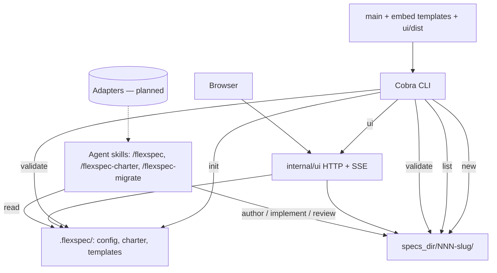

# FlexSpec

> **Charter status**: active · **Version**: 0.1 · **Last updated**: 2026-05-31

## 1. Product overview

**One-liner:** A spec-driven development CLI (Go) for generating and tracking feature specifications via markdown templates, with optional adapters for external issue trackers.

**Problem:** Most spec-driven development tools cause prompt and context fatigue by introducing too many files, which erodes token efficiency over time. FlexSpec keeps workflows simple — a single file per spec for simple tasks, and a more expanded multi-file structure for complex tasks, but only expanded enough to add the context that complexity demands. Users keep the "flexibility": they can override which spec structure is created and freely modify templates and configuration so the system fits how they work.

**Intended outcome:** Teams adopt a full spec-driven workflow that documents changes across an ever-evolving project. As features are added, the spec corpus and charter stay current, keeping humans and AI agents informed and aligned. FlexSpec skills ensure agents update only the charter, never external files outside the system.

## 2. Vision and goals

**North star:** Keep humans and AI agents aligned on intent without context fatigue.

**Success criteria:**

- **Adoption** — installs, `flexspec init` runs, and GitHub stars trend up.
- **Reduced agent drift** — fewer off-spec edits per implementation.
- **Retention** — projects keep adding specs after 30 days.

## 3. Users and stakeholders

FlexSpec serves both solo developers and teams, but the desired outcome is **adoption within teams**.

| Persona | Role | Primary needs |
| --- | --- | --- |
| Solo developer | Builds with AI coding agents | Quick spec creation, focused implementation |
| Development team | Shared spec discipline | Consistent specs, living docs, agent alignment |
| AI coding agent | Consumer of specs (Cursor, Codex, Claude, Pi, Zed, etc.) | Clear, structured context to stay on-track during implementation |
| Engineering leads / Product managers | Oversight & process | Visibility into what is being built and why |

**Jobs to be done:**

- Quick spec creation for a new feature.
- Focused implementation that stays within the spec's intent.
- Keep documentation and charter current as the project evolves.

## 4. Capabilities

**Available today:**

- Spec scaffolding — simple (single-file) and expanded (multi-file) templates.
- Charter management — product-wide context authored via `/flexspec-charter`.
- CLI — `flexspec init`, `flexspec new`, `flexspec config` (read table/JSON; `config set` to update), `flexspec list` (`--json`; task counts from spec `task_count` frontmatter, with computed fallback from §3.2 bullets or `tasks/` files), `flexspec validate` (warns on `task_count` drift), `flexspec update` (upgrade CLI, reinstall skills, run migrations including `task-count` backfill; `--dry-run`, `--check`), `flexspec ui` (local management dashboard), `flexspec status set` (update spec/task status in frontmatter). Human-readable output for `list`, `config`, `validate`, and `update` uses aligned column tables with headers; `--json` on list/config for scripts and agents.
- Management UI — `flexspec ui` serves an embedded React app: kanban/table board by spec status (all lifecycle columns fit the viewport with a per-user column-visibility picker), spec browser with markdown rendering, structured settings for UI prefs and `.flexspec/config.yaml`; live refresh via filesystem watch (SSE).
- Spec lifecycle statuses — `draft`, `planned`, `in_progress`, `in_review`, `complete` (the board normalizes legacy `refined`/`initial` for display).
- Agent skills — `/flexspec` (spec lifecycle), `/flexspec-charter` (application charter), and `/flexspec-migrate` (convert specs from other SDD tools into FlexSpec format), including structured multiple-choice interviews for UI-heavy specs and UI standards.
- Configuration and template overrides — users control spec structure via config (`spec_template`) and a per-spec skill flag (`--template`); templates are freely editable.

**Planned:**

- Adapters for external systems (Jira, Shortcut, GitHub Issues, and more).

## 5. Technical context

- **Language/runtime:** Go 1.26.2.
- **CLI framework:** `spf13/cobra`.
- **Config/data:** YAML (`gopkg.in/yaml.v3`); markdown-first spec and charter files.
- **Templates:** bundled via `embed.FS` and scaffolded on `init`.
- **Distribution:** `go install github.com/joshk418/flexspec@latest`; skills installed via `npx skills`.

**Constraints agents must respect:**

- Go ≥ 1.26 floor (CI uses the `go.mod` version).
- Minimal dependencies — Cobra, `yaml.v3`, and `fsnotify` (UI file watch); avoid heavy new deps. React UI is embedded at build time; end users do not need Node at runtime. The `flexspec update --skills` step invokes `npx` and requires Node on PATH for that command only.
- Skills write only inside `.flexspec/` and the configured spec directory; agents may modify code files during implementation but must not touch `README`, `AGENTS.md`, or related docs unless explicitly instructed.
- `init` never clobbers user edits unless `--force` is passed.
- Cross-platform — build paths with `filepath`.
- CI gate: `go test -race`, `gofmt`, `go vet`, `golangci-lint`.

## 6. Architecture

`main` embeds templates and the built web UI (`ui/dist`). The Cobra CLI scaffolds, lists, validates, and optionally serves the management UI (`flexspec ui` → `internal/ui` HTTP server on localhost). Agent skills read the charter and drive the spec lifecycle. Future adapters sit behind a spec-source interface.

**Boundaries:** the CLI scaffolds, lists, validates, and serves a **local** UI; skills handle authoring, implementation, and review. The UI is visibility and convenience, not a hosted PM product.

## 7. Standards and conventions

- **Testing:** table-driven tests, one test file per source file, and a single table-driven test per tested function (e.g. `config_test.go`, `metadata_test.go`).
- **CI must pass:** `go test -race`, `gofmt` clean, `go vet`, `golangci-lint`.
- **Code conventions:** one Cobra command per file under `cmd/`; wrap errors with `%w`; document exported functions; no narrating comments.

## 8. Product boundaries

FlexSpec is a tool for managing specifications to keep AI coding agents (Cursor, Codex, Claude, Pi, Zed, etc.) on-track during implementation via the provided skills. It will **not**:

- Be a project-management tool or issue tracker itself.
- Be an AI agent or LLM runtime.
- Modify `README`, `AGENTS.md`, or related documentation files unless explicitly instructed (it does modify code files during implementation).
- Run as a hosted service.

**Exception:** `flexspec update` may upgrade its own installed binary and reinstall agent skills (global skill directories) when the user runs that command explicitly.

## 9. Domain glossary

| Term | Definition |
| --- | --- |
| Charter | Product-wide context (this file) used by every spec. |
| Spec | A feature specification, simple or expanded, under the configured specs directory. |
| Simple spec | A single-file markdown spec for small, focused features. |
| Expanded spec | A multi-file specification for complex features, with linked task files. |
| Task file | A per-task file within an expanded spec. |
| Adapter | Pluggable connector to an external issue tracker (planned). |
| Phase | A stage in the `/flexspec` lifecycle: author, implement, or review. |
| Spec status | Lifecycle stage in spec frontmatter: `draft` (authoring), `planned`, `in_progress`, `in_review`, `complete`. Legacy `refined`/`initial` map to `planned`/`draft`. |
| Update | `flexspec update` — upgrades the CLI, reinstalls skills, and runs in-project migrations. |
| Migration | A detect/apply upgrade registered in `flexspec update` (e.g. status rename, template re-sync). |
| Self-update | The CLI or skills install steps within `flexspec update` (outside `.flexspec/`). |
| One-shot | Running all `/flexspec` phases back-to-back without stopping (`always_one_shot` / `--one-shot`). |
| Config | `flexspec config` — read `.flexspec/config.yaml` as a table or JSON (`--json`); `flexspec config set <key> <value>` updates a known key. The UI settings page edits the same fields through structured controls. |
| Validate | `flexspec validate` — read-only structural checks on `.flexspec/`, templates, and specs (exit 1 on errors). |
| Management UI | `flexspec ui` — local dashboard (board, spec browser, settings) with live filesystem sync. |
| SSE | Server-sent events from `flexspec ui` when spec files change on disk. |
| Migrate skill | `/flexspec-migrate` — agent skill that detects specs from other SDD tools (Spec Kit, OpenSpec, LeanSpec, etc.), maps content into FlexSpec templates via the CLI, and leaves specs at `draft` for `/flexspec` to finish. |

## 10. Assumptions and open questions

**Assumptions:**

- Users run AI coding agents that support skills.
- Specs and the charter live in git.
- One charter per repository.

**Open questions (blocking):**

- None.

**Open questions (non-blocking):**

- Which issue-tracker adapter ships first.

## 11. Revision history

| Date | Summary | Source |
| --- | --- | --- |
| 2026-05-30 | Initial charter authored — product overview, vision, users, capabilities, technical context, architecture, standards, boundaries, glossary. | /flexspec-charter |
| 2026-05-30 | §4/§6/§9 — document full CLI (`init`, `new`, `list`, `validate`); architecture diagram updated. | 001-cli-validate |
| 2026-05-30 | §4/§5/§6/§9 — management UI (`flexspec ui`), `list --json`, `status set`; architecture + glossary. | 002-management-ui |
| 2026-05-30 | §4 — compact list output by default; `--json` still has full detail. | 003-simplify-list-command |
| 2026-05-31 | §4 — agent skills use structured multiple-choice interviews for UI-heavy specs and UI standards. | 004-enhance-ui-interviews |
| 2026-06-01 | §4/§9 — `flexspec config` (`--json`) to read project settings without opening YAML. | 005-config-command |
| 2026-06-01 | §4/§9 — `flexspec config set` and structured UI settings for updating `.flexspec/config.yaml`. | 006-config-update-command-and-ui |
| 2026-06-01 | §4/§9 — board fit-viewport kanban + column-visibility picker; simplified spec statuses (`draft`…`complete`, dropped `refined`/`initial`). | 007-board-page-ui-overhaul |
| 2026-06-01 | §4/§5/§8/§9 — `flexspec update` (CLI + skills + migrations); §8 carve-out for self-update. | 008-update-command |
| 2026-06-03 | §4/§6/§9 — `/flexspec-migrate` skill to convert specs from other SDD tools into FlexSpec format. | 009-flexspec-migrate-skill |
| 2026-06-03 | §4 — consistent aligned table output with column headers for `list`, `config`, `validate`, and `update`. | 011-cli-table-output |
| 2026-06-03 | §4 — spec `task_count` frontmatter and metadata header; accurate `list` counts for simple specs; validate drift warning; `task-count` migration. | 012-task-count-metadata |
