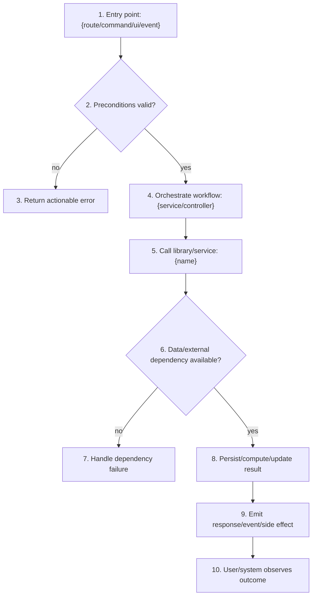
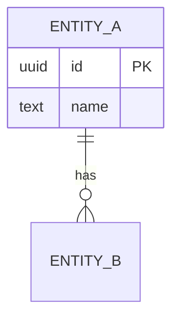

# {name}

> **Status**: {status} · **Priority**: {priority} · **Created**: {date} · **Tasks**: 0

<!--
EXPANDED SPEC - root document. Each implementation task lives as a focused file
under `tasks/`. Keep this README under ~4000 tokens and push execution detail
into task files instead of bloating the root spec.

Layout:
  NNN-feature-spec/
    README.md
    tasks/
      T-001-<slug>.md
      T-002-<slug>.md
-->

## 1. Summary

<!--
State the problem, target outcome, who/what is affected, and boundaries. For an
expanded spec, explain the major capabilities and how they fit the wider system.
-->

- **Problem**: {problem}
- **Target outcome**: {target outcome}
- **Affected users/systems**: {users, roles, systems, commands, routes}
- **In scope**: {included behavior}
- **Out of scope**: {excluded behavior}

## 2. Reasons For Change

<!--
Explain why this change is worth doing now. Include the driver, observed pain,
expected value, consequences of not changing, and any charter/glossary updates.
Open questions must be resolved before `planned`.
-->

- **Driver**: {request, bug, product need, technical debt, compliance, etc.}
- **Value**: {user/business/engineering value}
- **If unchanged**: {cost, risk, broken workflow, missed opportunity}
- **Assumptions**: {confirmed assumptions or "None"}
- **Risks**: {known risks or "None"}
- **Charter updates applied automatically**: {updates or "None"}
- **Glossary updates**: {terms added or "None"}
- **Open questions**: {must be "None" before planned}

## 3. Intended Use Case

<!--
Describe how the change is used in practice. Include all actors, triggers,
preconditions, happy paths, alternate paths, negative paths, permissions, data
boundaries, and UX/state expectations.
-->

- **Actor(s)**: {who or what starts the flow}
- **Entry point(s)**: {routes, commands, UI actions, events, jobs, APIs}
- **Preconditions**: {required state, config, auth, data}
- **Primary flow**: {step-by-step user/system behavior}
- **Alternate flows**: {empty/loading/error/retry/disabled/permission states}
- **Security and abuse cases**: {authorization, validation, injection, rate limits}
- **Data edge cases**: {missing, duplicate, stale, invalid, concurrent, large inputs}
- **Operational cases**: {migration, rollback, observability, partial failure}

## 4. Expected Result (bugs only)

<!-- For non-bug work, write: Not applicable - this is not a bug fix. -->

{expected result}

## 5. Actual Result (bugs only)

<!-- For non-bug work, write: Not applicable - this is not a bug fix. -->

{actual result}

## 6. Workflow Graph

<!--
High-level concept flow from entry point to outcome. This is not a whole-file
architecture map. Show the entry point, decision points, services/libraries/data
stores/external systems called, success outcome, and material failure outcomes.
For multiple major paths, add one diagram/table pair per path.
-->

### 6.1 Primary Path

| Step | Boundary | What Happens | Input / Condition | Outcome | FR/NF |
| --- | --- | --- | --- | --- | --- |
| 1 | `{entry point}` | {starts workflow} | {trigger} | {request/event accepted} | FR-001 |
| 2 | `{validation/auth}` | {checks preconditions} | {state/input/user} | {continue or reject} | FR-001, NF-001 |
| 3 | `{error path}` | {handles invalid request} | {failed precondition} | {safe/actionable error} | NF-001 |
| 4 | `{orchestration}` | {coordinates core flow} | {validated input} | {calls service/library} | FR-002 |
| 5 | `{service/library}` | {performs core work} | {domain input} | {intermediate result} | FR-002 |
| 6 | `{data/external}` | {reads or calls dependency} | {lookup/call} | {data or unavailable branch} | FR-002, NF-002 |
| 7 | `{fallback}` | {handles dependency failure} | {missing/unavailable data} | {safe fallback/error} | NF-002 |
| 8 | `{state change}` | {writes/computes final result} | {valid data} | {state updated/result ready} | FR-003 |
| 9 | `{integration boundary}` | {emits response/event/side effect} | {completed work} | {observable output} | FR-003 |
| 10 | `{outcome}` | {user/system receives result} | {output} | {expected result} | FR-003 |

## 7. Implementation Plan

<!--
Step-by-step instructions for how changes should be made and in what order.
Reference concrete files, symbols, interfaces, migrations, and task files. Each
step should be executable without unresolved design decisions.
-->

### 7.1 Files and Interfaces

| File / Component | Type | Role in this spec |
| --- | --- | --- |
| `path/to/file` | new / modified / reference | What changes or why it must be read |

### 7.2 Data Model / Persistence

<!-- If no persistent data changes, write: None - no persistent data changes. -->

| Table / Entity | Change | Key fields | Migration / Index Notes |
| --- | --- | --- | --- |
| `table_name` | new / altered / none | `id`, `...` | {migration or none} |

### 7.3 External Interfaces

<!-- Include APIs, CLI commands, routes, events, UI surfaces, integrations. -->

| Interface | Type | Contract / Shape | Auth / Errors / Notes |
| --- | --- | --- | --- |
| `METHOD /path` | endpoint / event / CLI / UI | request -> response | {auth, validation, errors} |

### 7.4 Ordered Steps

| Step | Action | Files / Symbols | Depends on | Requirements |
| --- | --- | --- | --- | --- |
| 1 | {implementation action} | `path/to/file :: symbol` | - | FR-001 |
| 2 | {implementation action} | `path/to/file :: symbol` | Step 1 | FR-002, NF-001 |
| 3 | {integration action} | `path/to/file :: symbol` | Step 2 | FR-003 |
| 4 | {test/documentation action} | `path/to/test` | Step 3 | TC-001 |

## 8. Test Plan

<!--
Define tests and manual checks that prove each requirement. Include command(s),
test location, key assertions, edge cases, expected failure behavior, and which
task implements the coverage.
-->

| Test ID | Verifies | Implemented by | Type | Location / Command | Assertion |
| --- | --- | --- | --- | --- | --- |
| TC-001 | FR-001 | T-001 | unit / integration / e2e / manual | `{command or file}` | {what must be true} |
| TC-002 | NF-001 | T-002 | unit / integration / e2e / manual | `{command or file}` | {what must be true} |

## 9. Functional and Non-Functional Requirements

<!--
Requirements must be specific, testable, and mapped to workflow steps, tasks, and
tests. Avoid vague verbs like "improve" without measurable behavior.
-->

**Functional**

- **FR-001** - {observable behavior}
- **FR-002** - {observable behavior}
- **FR-003** - {observable behavior}

**Non-Functional**

- **NF-001** - {security, performance, accessibility, reliability, compatibility, etc.}
- **NF-002** - {security, performance, accessibility, reliability, compatibility, etc.}

## 10. Tasks

<!--
One entry per task file under `tasks/`. Each task must name the work, describe
exactly what changes, state dependency relationships, and map to requirements.
Use `-` when nothing blocks or is blocked.
-->

| Task | File | Name | Description | Blocks | Blocked by | Requirements |
| --- | --- | --- | --- | --- | --- | --- |
| **T-001** | `tasks/T-001-<slug>.md` | {task name} | {specific implementation work} | T-002 | - | FR-001 |
| **T-002** | `tasks/T-002-<slug>.md` | {task name} | {specific implementation work} | T-003 | T-001 | FR-002, NF-001 |
| **T-003** | `tasks/T-003-<slug>.md` | {task name} | {specific verification work} | - | T-002 | FR-003, TC-001, TC-002 |
