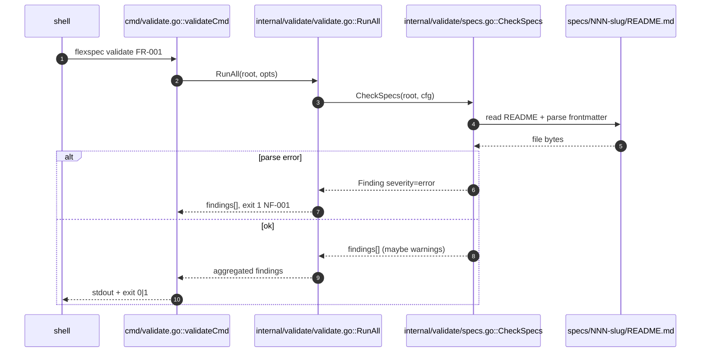
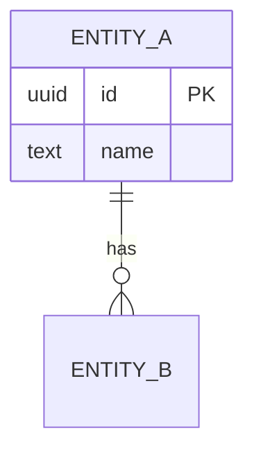

# {name}

> **Status**: {status} · **Priority**: {priority} · **Created**: {date} · **Tasks**: 0

<!--
EXPANDED SPEC — root document.
This file is written as `README.md` inside the spec directory. Each task in the
implementation plan lives as its own markdown file under `tasks/`, so large
features are broken into focused, self-contained units of work.

Layout:
  NNN-feature-spec/
    README.md            <- this file (the spec)
    tasks/
      T-001-<slug>.md    <- one file per task (from flexspec-expanded-task.md)
      T-002-<slug>.md
      ...

Keep this README under ~3500 tokens; push working detail into the task files
(each <~1000 tokens) rather than bloating the root spec.
-->

## 1. Summary

<!--
Detailed, high-level overview of what this spec delivers and why.
Cover: the problem, the intended outcome, who/what it affects, and the scope
boundaries (what is explicitly out of scope). For an expanded spec this is a
large feature — state the major capabilities it introduces and how they fit the
wider system.
-->

{summary}

## 2. Design

<!-- All moving parts and flows of the feature, detailed end to end. -->

### 2.1 Architecture / Technical Plan

<!--
Detailed description of how the feature will be implemented across the system.
Reference concrete files, packages, services, and components an implementer
(human or LLM) must touch or read. List every relevant file/component below.
-->

{architecture_overview}

| File / Component | Type | Role in this spec |
| --- | --- | --- |
| `path/to/file` | new / modified / reference | What it does / why it matters |

### 2.2 Code Map

<!--
CODE EXECUTION MAP — runtime path(s) through this feature across subsystems.

Reviewers (human or LLM) must be able to follow execution step-by-step: call order,
symbols invoked, data in/out, and branch points. Not an architecture overview.

Required per path (happy + material error/async paths):
1. Mermaid with ordered execution (`sequenceDiagram` + `autonumber` preferred;
   extra `flowchart` OK for one subsystem). Use `alt`/`opt`/`par` for branches.
2. Execution trace table — one row per numbered step (split tables if >15 steps).

Diagram: `path/to/file :: symbol`; label edges with verb + payload; FR/NF on steps.
Large features: multiple diagram+table pairs (e.g. CLI path, worker path).

Avoid: generic nodes; diagram without matching trace rows.

Replace below; add diagrams for additional execution paths as needed.
-->

| Step | Location | Executes | Input / condition | Output / side effect | FR/NF |
| --- | --- | --- | --- | --- | --- |
| 1 | `cmd/validate.go :: validateCmd` | Cobra RunE | argv, cwd | invokes RunAll | FR-001 |
| 2 | `internal/validate/validate.go :: RunAll` | orchestrate checks | root, opts | calls CheckSpecs | — |
| 3 | `internal/validate/specs.go :: CheckSpecs` | spec validation | specs dir config | reads each README | FR-001 |
| 4 | `specs/NNN-slug/README.md` | filesystem read | path | bytes / missing file | — |
| 5 | `CheckSpecs` | emit findings | parse result | `[]Finding` | NF-001 |
| 6 | `validateCmd` | exit process | findings | code 0 or 1 | NF-001 |

### 2.3 Data Model

<!--
Schemas, tables, and entities this feature creates or changes. Include columns,
types, keys, relationships, and migrations. Omit only if the feature touches no
persistent data (state that explicitly if so).
-->

| Table / Entity | Change | Key fields | Notes |
| --- | --- | --- | --- |
| `table_name` | new / altered | `id`, `...` | Migration / index notes |

### 2.4 External Interfaces

<!--
Public surfaces the feature exposes or consumes: API endpoints, CLI commands,
events/queues, UI routes/components, and third-party integrations. Omit only if
none apply.
-->

| Interface | Type | Contract / Shape | Notes |
| --- | --- | --- | --- |
| `METHOD /path` | endpoint / event / CLI / UI | request → response | auth, errors |

### 2.5 Requirements

<!--
Functional requirements (what the system must do) and non-functional
requirements (performance, security, reliability, UX constraints).
Use stable IDs so other sections, tasks, and tests can reference them.
-->

**Functional**

- **FR-001** — {requirement}
- **FR-002** — {requirement}

**Non-Functional**

- **NF-001** — {requirement}
- **NF-002** — {requirement}

## 3. Implementation Plan

<!--
Built off the technical plan. Every task is authored under `tasks/` (T-001...).
Keep tasks small enough that an LLM can complete one without losing context.

§3.2 Task List is required. §3.1 Implementation Code Map is optional — add only
for highly complex work. See skills/flexspec/SKILL.md → §3.1 complexity heuristic.

When §3.1 is omitted: the task index must still show depends_on, files, and §2.2
step ownership; record omission in §5 Other.

When §3.1 is included: add ### 3.1 with mermaid + task execution table per the
skill Code Map Quality Bar (place before §3.2 if map-first reads better).
-->

### 3.2 Task List

<!--
One entry per task. Each links to its task file under `tasks/` and cites the
requirement(s) it satisfies, depends_on, and §2.2 steps when §3.1 is omitted.
The task file holds full working detail; this list is the index.
-->

| Task | File | Satisfies | Depends on | Summary |
| --- | --- | --- | --- | --- |
| **T-001** | `tasks/T-001-<slug>.md` | FR-001 | — | {one-line summary} |
| **T-002** | `tasks/T-002-<slug>.md` | FR-002, NF-001 | T-001 | {one-line summary} |
| **T-003** | `tasks/T-003-<slug>.md` | FR-002 | T-001 | {one-line summary} |

## 4. Testing Criteria

<!--
Every piece of functionality must be testable. Define the tests that prove each
requirement is met. If something cannot be tested, rework the implementation
plan (Section 3) until it can. Each test maps to the requirement it verifies and
the task(s) that implement it.
-->

| Test ID | Verifies | Implemented by | Description | Type |
| --- | --- | --- | --- | --- |
| TC-001 | FR-001 | T-001 | {what is asserted} | unit / integration / e2e |
| TC-002 | NF-001 | T-002 | {what is asserted} | unit / integration / e2e |

## 5. Other

<!--
Open questions, assumptions, risks, rollout/migration notes, thoughts, and
observations. Open questions MUST be resolved before status moves to `planned`
and implementation begins.
-->

- {open question / note / assumption / risk}
