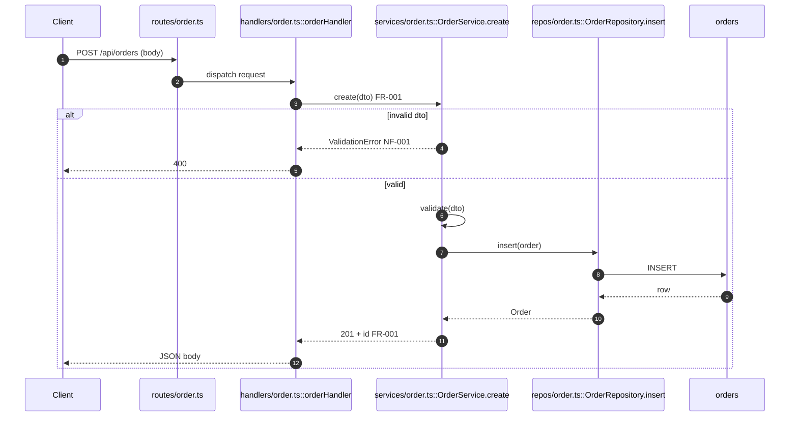

# {name}

> **Status**: {status} · **Priority**: {priority} · **Created**: {date} · **Tasks**: 0

<!--
SIMPLE SPEC — keep this file under ~2000 tokens. If it won't fit, the work is
likely too large for a simple spec; use the expanded template instead.
-->

## 1. Summary

<!--
Detailed, high-level overview of what this spec delivers and why.
Cover: the problem, the intended outcome, who/what it affects, and the scope
boundaries (what is explicitly out of scope). Write so a reader unfamiliar with
the feature understands the goal before reading the design.
-->

{summary}

## 2. Design

<!-- All moving parts and flows of the feature, detailed end to end. -->

### 2.1 Architecture / Technical Plan

<!--
Detailed description of how the spec will be implemented. Reference concrete
files, packages, and components an implementer (human or LLM) must touch or read.
List every relevant file in the table below.
-->

{architecture_overview}

| File / Component | Type                       | Role in this spec             |
| ---------------- | -------------------------- | ----------------------------- |
| `path/to/file`   | new / modified / reference | What it does / why it matters |

### 2.2 Code Map

<!--
CODE EXECUTION MAP — how the running program moves through this feature.

A human or LLM reviewer should be able to step through execution like a debugger:
who runs first, what each symbol does, what data crosses each boundary, and where
control branches (success vs error). Do not restate §2.1 as a box diagram.

Required (diagram + trace table):
1. Mermaid showing ordered execution (prefer `sequenceDiagram` with `autonumber`
   for call order; use `flowchart` when loops/branches are clearer). Include
   `alt`/`opt`/`else` (or labeled branch edges) for non-happy paths when they
   exist.
2. Execution trace table below the diagram — one row per step, same numbering.

Diagram rules:
- Every step: `path/to/file :: symbol` (or route/CLI/event if symbol TBD).
- Edge/participant labels: verb + payload (`calls create(dto)`, `returns 201`,
  `throws ValidationError`, `reads row`).
- `subgraph` or sequence participants for boundaries (client, app, data, external).
- Map FR-XXX / NF-XXX on steps where behavior is satisfied or constrained.

Trace table columns (required): Step | Location | Executes | Input / condition |
Output / side effect | FR/NF

Avoid: generic nodes; steps with no executable symbol; diagram without matching
trace rows. Note uncertain symbols in §5 Other.

Replace examples below with repo-accurate execution.
-->

| Step | Location | Executes | Input / condition | Output / side effect | FR/NF |
| --- | --- | --- | --- | --- | --- |
| 1 | `routes/order.ts` | route match | `POST` + JSON body | dispatches to handler | — |
| 2 | `handlers/order.ts :: orderHandler` | handler entry | request DTO | calls `create` | — |
| 3 | `services/order.ts :: OrderService.create` | business logic | dto | validates or errors | FR-001, NF-001 |
| 4 | `repos/order.ts :: OrderRepository.insert` | persistence | `Order` entity | SQL INSERT | FR-001 |
| 5 | `orders` (table) | store row | INSERT | row returned | — |
| 6 | `handlers/order.ts :: orderHandler` | response | `Order` | `201` + JSON to client | FR-001 |

### 2.3 Requirements

<!--
Functional requirements (what the system must do) and non-functional
requirements (performance, security, reliability, UX constraints).
Use stable IDs so other sections and tasks can reference them.
-->

**Functional**

- **FR-001** — {requirement}
- **FR-002** — {requirement}

**Non-Functional**

- **NF-001** — {requirement}
- **NF-002** — {requirement}

## 3. Implementation Plan

<!--
Built off the technical plan. Each task gets a stable internal ID (T-001...).

§3.2 Task List is required. §3.1 Implementation Code Map is optional — add only
for highly complex work (auth, large refactors, cross-cutting changes, parallel
task tracks). See skills/flexspec/SKILL.md → §3.1 complexity heuristic.

When §3.1 is omitted: each task must list files touched, depends_on (if any), and
which §2.2 steps it implements; record omission in §5 Other (e.g. §3.1 omitted:
linear 3-task change).

When §3.1 is included: add ### 3.1 before or after this list with mermaid +
task execution table per the skill Code Map Quality Bar.
-->

### 3.2 Task List

<!--
Each task: description, satisfies FR/NF, files touched, depends_on, §2.2 steps.
Example:
- **T-001** — Add config loader _(satisfies: FR-001; files: `internal/config.go`;
  §2.2 steps: 2–3)_
-->

- **T-001** — {task description} _(satisfies: FR-001)_
- **T-002** — {task description} _(satisfies: FR-002, NF-001)_
- **T-003** — {task description}

## 4. Testing Criteria

<!--
Every piece of functionality must be testable. Define the tests that prove each
requirement is met. If something cannot be tested, rework the implementation
plan (Section 3) until it can. Map tests back to requirement/task IDs.
-->

| Test ID | Verifies | Description        | Type                     |
| ------- | -------- | ------------------ | ------------------------ |
| TC-001  | FR-001   | {what is asserted} | unit / integration / e2e |
| TC-002  | NF-001   | {what is asserted} | unit / integration / e2e |

## 5. Other

<!--
Open questions, assumptions, risks, thoughts, and observations. Open questions
MUST be resolved before status moves to `planned` and implementation begins.
-->

- {open question / note / assumption}
