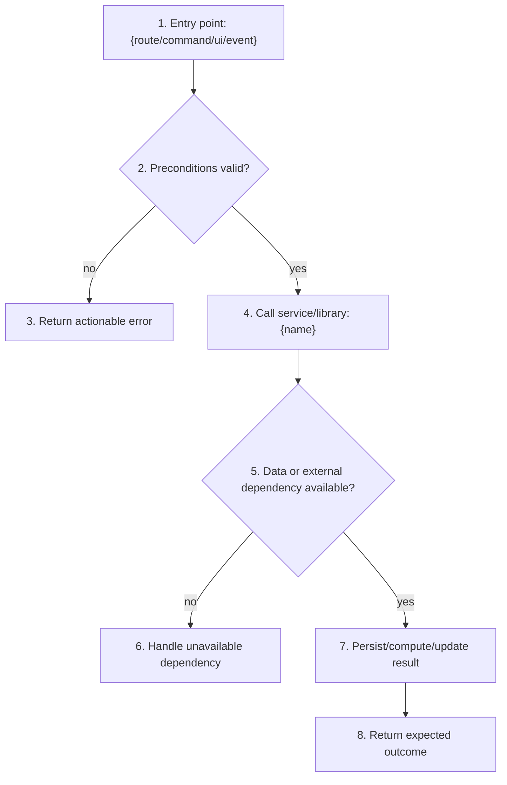

# {name}

> **Status**: {status} · **Priority**: {priority} · **Type**: {type} · **Created**: {date} · **Tasks**: 0

<!--
SIMPLE SPEC - keep this file under ~2500 tokens (advisory, not enforced). If
the workflow graph, implementation plan, or task table needs more detail than
fits here, use the expanded template instead.

The `type` field (feature | bug | chore | refactor | docs | infra | spike |
research) drives which sections are required. See the /flexspec skill's per-type
section matrix. Sections 4/5 are bug-only; Section 6 is optional for chore/docs/
spike; Sections 8/9 may be light or omitted for spike/research. The agent omits
inapplicable sections rather than leaving placeholder text.
-->

## 1. Summary

<!--
State the problem, target outcome, who/what is affected, and boundaries. Make it
clear what is in scope and what is explicitly out of scope so an LLM implementer
does not invent adjacent work.
-->

- **Problem**: {problem}
- **Target outcome**: {target outcome}
- **Affected users/systems**: {users, roles, systems, commands, routes}
- **In scope**: {included behavior}
- **Out of scope**: {excluded behavior}

## 2. Reasons For Change

<!--
Explain why this change is worth doing now. Include the driver, observed pain,
expected value, consequences of not changing, and any charter/glossary updates.
Open questions must be resolved before `planned`.
-->

- **Driver**: {request, bug, product need, technical debt, compliance, etc.}
- **Value**: {user/business/engineering value}
- **If unchanged**: {cost, risk, broken workflow, missed opportunity}
- **Assumptions**: {confirmed assumptions or "None"}
- **Risks**: {known risks or "None"}
- **Charter updates applied automatically**: {updates or "None"}
- **Glossary updates**: {terms added or "None"}
- **Open questions**: {must be "None" before planned}

## 3. Intended Use Case

<!--
Describe how the change is used in practice. Include the primary actor, trigger,
preconditions, happy path, alternate paths, negative paths, permissions, data
boundaries, and any UX/state expectations.
-->

- **Actor(s)**: {who or what starts the flow}
- **Entry point(s)**: {route, command, UI action, event, job, API}
- **Preconditions**: {required state, config, auth, data}
- **Primary flow**: {step-by-step user/system behavior}
- **Alternate flows**: {empty/loading/error/retry/disabled/permission states}
- **Security and abuse cases**: {authorization, validation, injection, rate limits}
- **Data edge cases**: {missing, duplicate, stale, invalid, concurrent, large inputs}

## 4. Expected Result (bugs only)

<!-- For non-bug work, write: Not applicable - this is not a bug fix. -->

{expected result}

## 5. Actual Result (bugs only)

<!-- For non-bug work, write: Not applicable - this is not a bug fix. -->

{actual result}

## 6. Workflow Graph

<!--
High-level concept flow from entry point to outcome. This is not a whole-file
architecture map. Show the entry point, decision points, services/libraries/data
stores/external systems called, success outcome, and material failure outcomes.
Keep it useful to both humans and LLMs.

Required:
1. Mermaid graph or sequence diagram with branches for key success/failure paths.
2. Matching table that explains each numbered step and ties it to requirements.
-->

| Step | Boundary | What Happens | Input / Condition | Outcome | FR/NF |
| --- | --- | --- | --- | --- | --- |
| 1 | `{entry point}` | {starts workflow} | {trigger} | {request/event accepted} | FR-001 |
| 2 | `{validation/auth}` | {checks preconditions} | {state/input/user} | {continue or reject} | FR-001, NF-001 |
| 3 | `{error path}` | {handles invalid request} | {failed precondition} | {safe/actionable error} | NF-001 |
| 4 | `{service/library}` | {performs core work} | {validated input} | {intermediate result} | FR-002 |
| 5 | `{data/external}` | {reads or calls dependency} | {lookup/call} | {data or unavailable branch} | FR-002, NF-002 |
| 6 | `{fallback}` | {handles dependency failure} | {missing/unavailable data} | {safe fallback/error} | NF-002 |
| 7 | `{state change}` | {writes/computes final result} | {valid data} | {state updated/result ready} | FR-002 |
| 8 | `{outcome}` | {returns visible result} | {completed work} | {user/system observes success} | FR-003 |

## 7. Implementation Plan

<!--
Step-by-step instructions for how changes should be made and in what order.
Reference concrete files and symbols. Each step should be small enough for an LLM
to execute without inventing missing design decisions.
-->

### 7.1 Files and Interfaces

| File / Component | Type | Role in this spec |
| --- | --- | --- |
| `path/to/file` | new / modified / reference | What changes or why it must be read |

### 7.2 Ordered Steps

| Step | Action | Files / Symbols | Depends on | Requirements |
| --- | --- | --- | --- | --- |
| 1 | {implementation action} | `path/to/file :: symbol` | - | FR-001 |
| 2 | {implementation action} | `path/to/file :: symbol` | Step 1 | FR-002, NF-001 |
| 3 | {test/documentation action} | `path/to/test` | Step 2 | TC-001 |

## 8. Test Plan

<!--
Define tests and manual checks that prove each requirement. Include command(s),
test location, key assertions, edge cases, and expected failure behavior.
-->

| Test ID | Verifies | Type | Location / Command | Assertion |
| --- | --- | --- | --- | --- |
| TC-001 | FR-001 | unit / integration / e2e / manual | `{command or file}` | {what must be true} |
| TC-002 | NF-001 | unit / integration / e2e / manual | `{command or file}` | {what must be true} |

## 9. Functional and Non-Functional Requirements

<!--
Requirements must be specific, testable, and mapped to workflow steps, tasks, and
tests. Avoid vague verbs like "improve" without measurable behavior.
-->

**Functional**

- **FR-001** - {observable behavior}
- **FR-002** - {observable behavior}

**Non-Functional**

- **NF-001** - {security, performance, accessibility, reliability, compatibility, etc.}
- **NF-002** - {security, performance, accessibility, reliability, compatibility, etc.}

## 10. Tasks

<!--
Each task must name the work, describe exactly what changes, state dependency
relationships, and map to requirements. Use `-` when nothing blocks or is blocked.
-->

| Task | Name | Description | Blocks | Blocked by | Requirements |
| --- | --- | --- | --- | --- | --- |
| **T-001** | {task name} | {specific implementation work} | T-002 | - | FR-001 |
| **T-002** | {task name} | {specific implementation work} | T-003 | T-001 | FR-002, NF-001 |
| **T-003** | {task name} | {specific verification work} | - | T-002 | TC-001, TC-002 |
