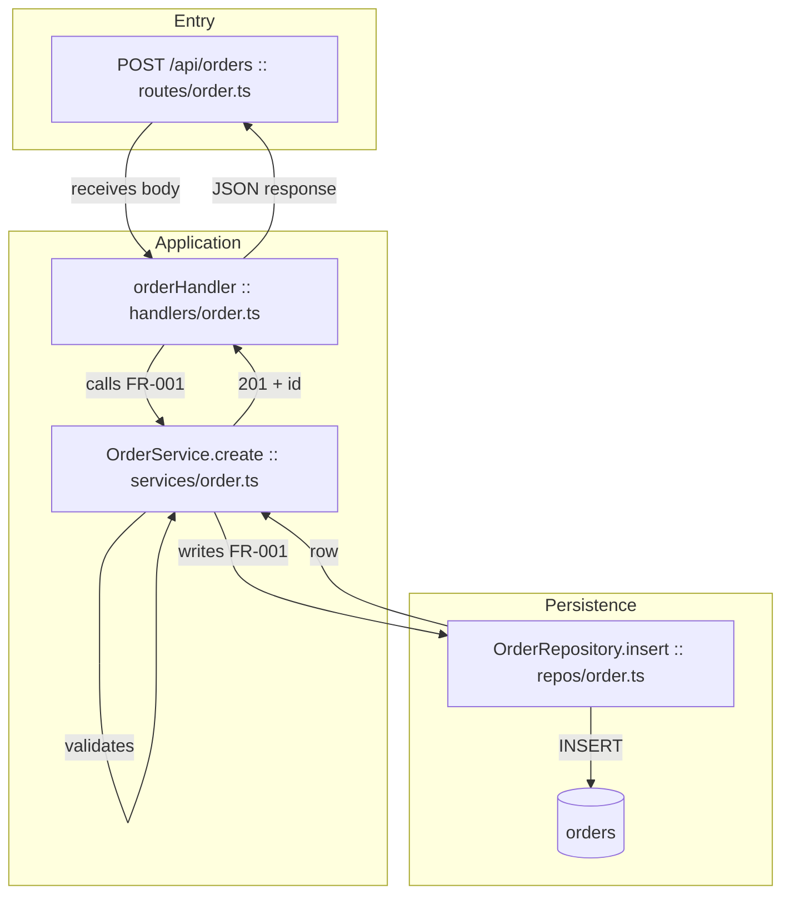
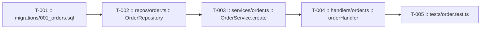

# {name}

> **Status**: {status} · **Priority**: {priority} · **Created**: {date}

<!--
SIMPLE SPEC — keep this file under ~2000 tokens. If it won't fit, the work is
likely too large for a simple spec; use the expanded template instead.
-->

## 1. Summary

<!--
Detailed, high-level overview of what this spec delivers and why.
Cover: the problem, the intended outcome, who/what it affects, and the scope
boundaries (what is explicitly out of scope). Write so a reader unfamiliar with
the feature understands the goal before reading the design.
-->

{summary}

## 2. Design

<!-- All moving parts and flows of the feature, detailed end to end. -->

### 2.1 Architecture / Technical Plan

<!--
Detailed description of how the spec will be implemented. Reference concrete
files, packages, and components an implementer (human or LLM) must touch or read.
List every relevant file in the table below.
-->

{architecture_overview}

| File / Component | Type                       | Role in this spec             |
| ---------------- | -------------------------- | ----------------------------- |
| `path/to/file`   | new / modified / reference | What it does / why it matters |

### 2.2 Code Map

<!--
EXECUTABLE FLOW MAP (not an architecture bubble chart).

Show how this feature runs start-to-finish when implemented. A reader should
trace the trigger through every file/function that executes, including errors
and external I/O, without re-reading §2.1 prose.

Required:
- Node label format: `path/to/file :: symbol` (handler, class.method, route,
  CLI command, or event name when no function exists yet).
- Ordered flow: trigger → validation/auth → domain logic → persistence/external
  → response or side effect.
- Labeled edges: what happens (`calls`, `reads`, `writes`, `returns`,
  `publishes`, `handles error`).
- At least one `subgraph` for boundaries (entry, app, data, external).
- Map each FR-XXX on a node or edge label where it is satisfied at runtime.

Avoid: generic nodes (`Component`, `Service`, `Handler`) with no file/symbol.
If a symbol is uncertain, use the nearest concrete name and note it in §5 Other.

Replace the example below with repo-accurate paths and symbols.
-->

### 2.3 Requirements

<!--
Functional requirements (what the system must do) and non-functional
requirements (performance, security, reliability, UX constraints).
Use stable IDs so other sections and tasks can reference them.
-->

**Functional**

- **FR-001** — {requirement}
- **FR-002** — {requirement}

**Non-Functional**

- **NF-001** — {requirement}
- **NF-002** — {requirement}

## 3. Implementation Plan

<!--
Built off the technical plan. Enumerate everything that will be created or
modified to complete the spec. Each task gets a stable internal ID (T-001...)
so the FlexSpec system can reference, track, and order it.
-->

### 3.1 Implementation Code Map

<!--
BUILD / EXECUTION ORDER MAP.

Show task dependency order AND which files/functions each task touches. Task IDs
alone are not enough — link T-XXX to concrete symbols from §2.2.

Required:
- Tasks in dependency order (left-to-right or top-to-bottom).
- Each task node cites T-XXX plus primary file(s)/symbol(s) changed.
- Edges show build order; optional dotted edges for shared dependencies.
- Every file in §2.1 table should appear on at least one task node.

Replace the example below.
-->

### 3.2 Task List

- **T-001** — {task description} _(satisfies: FR-001)_
- **T-002** — {task description} _(satisfies: FR-002, NF-001)_
- **T-003** — {task description}

## 4. Testing Criteria

<!--
Every piece of functionality must be testable. Define the tests that prove each
requirement is met. If something cannot be tested, rework the implementation
plan (Section 3) until it can. Map tests back to requirement/task IDs.
-->

| Test ID | Verifies | Description        | Type                     |
| ------- | -------- | ------------------ | ------------------------ |
| TC-001  | FR-001   | {what is asserted} | unit / integration / e2e |
| TC-002  | NF-001   | {what is asserted} | unit / integration / e2e |

## 5. Other

<!--
Open questions, assumptions, risks, thoughts, and observations. Open questions
MUST be resolved before status moves past `refined` and implementation begins.
-->

- {open question / note / assumption}
