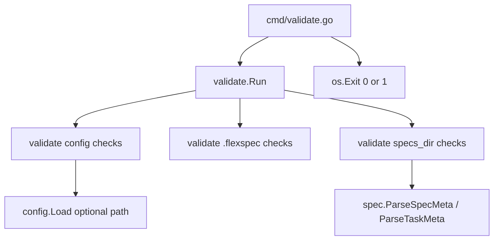
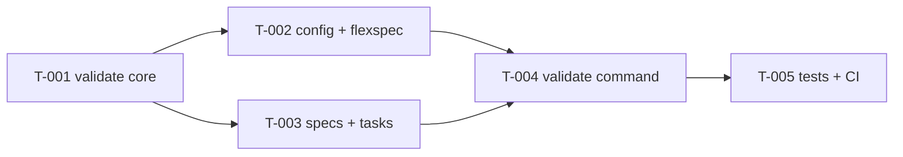

# CLI validate command

> **Status**: complete · **Priority**: high · **Created**: 2026-05-30 · **Tasks**: 5

## 1. Summary

FlexSpec projects can reach a **structurally broken** state: missing `.flexspec/` files, invalid `config.yaml`, unreadable spec frontmatter, or expanded-spec task layout that does not match what `list` / `new` assume. Today those problems surface only when a command runs (`list` errors on bad frontmatter; `new` errors on missing templates) with little aggregation or CI-friendly signaling.

This spec adds **`flexspec validate`**: a read-only CLI command that walks the project root, runs a fixed set of structural checks, prints every issue with path and severity, and exits non-zero when any **error**-severity finding exists. Goal: catch misconfiguration and corrupt specs **before** agents or humans rely on `list`, `new`, or skills.

**In scope:** `.flexspec/config.yaml`, `.flexspec/charter.md`, required files under `.flexspec/templates/`, the configured `specs_dir` tree (spec folders, `README.md` frontmatter, expanded `tasks/` files). Checks mirror failure modes of existing `config.Load`, `spec.List`, `spec.ParseSpecMeta`, and `spec.Create`.

**Out of scope (v1):** Markdown body semantics (FR/T/TC cross-refs, mermaid validity), charter “active vs template” content heuristics (unless `--strict` is chosen — see §5), remote adapters, fixing issues automatically, validating agent skills or `README.md` at repo root.

## 2. Design

### 2.1 Architecture / Technical Plan

New package `internal/validate` holds check functions and a small result model. `cmd/validate.go` wires Cobra, loads config when possible, calls `validate.Run(root, cfg, opts)`, prints findings, maps exit code. Reuse `internal/config` and `internal/spec` parsers where checks overlap with `list` / `new` (do not fork frontmatter logic).

| File / Component | Type | Role in this spec |
| --- | --- | --- |
| `internal/validate/validate.go` | new | `Finding`, `Severity`, `Run`, orchestration |
| `internal/validate/config.go` | new | Config file + field checks |
| `internal/validate/flexspec.go` | new | `.flexspec/` layout, charter presence, template files |
| `internal/validate/specs.go` | new | Specs dir naming, README/tasks frontmatter |
| `internal/validate/*_test.go` | new | Table-driven tests per source file |
| `cmd/validate.go` | new | Cobra command, flags, stdout/stderr output, exit codes |
| `cmd/root.go` | modified | Register `validateCmd` |
| `internal/config/config.go` | reference | Existing load/parse rules |
| `internal/spec/spec.go` | reference | `ParseSpecMeta`, `ParseTaskMeta`, list conventions |

### 2.2 Code Map

### 2.3 Data Model

No persistent data. Validation is ephemeral: `[]Finding` with `Severity` (`error` | `warning`), `Path`, `Rule` (stable code e.g. `config.missing`), `Message`.

### 2.4 External Interfaces

| Interface | Type | Contract / Shape | Notes |
| --- | --- | --- | --- |
| `flexspec validate` | CLI | `flexspec validate [flags]` → stdout findings; exit 0 if no errors | Run from project root (same as `list`) |
| `--strict` | CLI flag | Reserved for future semantic checks | v1: flag present, no extra checks |

### 2.5 Requirements

**Functional**

- **FR-001** — When `.flexspec/config.yaml` is missing, `validate` reports an error finding and does not panic; other checks may be skipped or best-effort as documented in T-002.
- **FR-002** — When config exists but is invalid YAML or `specs_dir` is empty, report error with file path (same rules as `config.Load`).
- **FR-003** — When `spec_template` is non-empty and not `simple` or `expanded`, report error.
- **FR-004** — Verify `.flexspec/charter.md` exists and has parseable YAML frontmatter (opening/closing `---`).
- **FR-005** — Verify required template files exist under `.flexspec/templates/` (same set `init` scaffolds: `README.md`, `flexspec-simple.md`, `expanded/flexspec-expanded.md`, `expanded/flexspec-expanded-task.md`).
- **FR-006** — For each `NNN-slug` directory under `specs_dir` that looks like a spec folder (`^\d{3}-`), require `README.md` with parseable frontmatter via `spec.ParseSpecMeta`; report error on parse failure.
- **FR-007** — For `spec_type: expanded` (case-insensitive), require `tasks/` directory; for each `T-*.md` file, parse frontmatter via `spec.ParseTaskMeta`; warn on missing `tasks/` if empty expanded spec, error on parse failure.
- **FR-008** — Warn on spec directories under `specs_dir` that do not match `NNN-slug` or lack `README.md` (orphan/junk dirs `list` silently skips).
- **FR-009** — Warn on duplicate numeric spec prefixes among `NNN-*` directories.
- **FR-010** — Print all findings grouped by severity; summary line with error/warning counts.
- **FR-011** — Exit code 0 when there are no error-severity findings; exit code 1 when one or more errors (warnings alone do not fail).

**Non-Functional**

- **NF-001** — No new third-party dependencies; use stdlib + existing `yaml.v3` / `internal/spec` only.
- **NF-002** — Table-driven tests, one `_test.go` per validate source file; `go test -race` clean.
- **NF-003** — Human-readable output suitable for CI logs (one finding per line: `severity`, `path`, `rule`, `message`).

## 3. Implementation Plan

### 3.1 Implementation Code Map

### 3.2 Task List

| Task | File | Satisfies | Depends on | Summary |
| --- | --- | --- | --- | --- |
| **T-001** | `tasks/T-001-validate-core.md` | FR-010, FR-011, NF-001 | — | Finding model and `Run` orchestration |
| **T-002** | `tasks/T-002-config-flexspec.md` | FR-001–FR-005 | T-001 | Config and `.flexspec/` checks |
| **T-003** | `tasks/T-003-specs-tasks.md` | FR-006–FR-009 | T-001 | Specs dir and task file checks |
| **T-004** | `tasks/T-004-validate-cmd.md` | FR-010, FR-011, NF-003 | T-002, T-003 | Cobra command and exit codes |
| **T-005** | `tasks/T-005-validate-tests.md` | NF-002 | T-004 | Table-driven tests for all rules |

## 4. Testing Criteria

| Test ID | Verifies | Implemented by | Description | Type |
| --- | --- | --- | --- | --- |
| TC-001 | FR-001, FR-002 | T-002 | Temp dir without config → error finding `config.missing` | unit |
| TC-002 | FR-002, FR-003 | T-002 | Invalid YAML and bad `spec_template` values | unit |
| TC-003 | FR-004, FR-005 | T-002 | Missing charter; missing template file | unit |
| TC-004 | FR-006 | T-003 | Spec README with broken frontmatter → error | unit |
| TC-005 | FR-007 | T-003 | Expanded spec: bad task frontmatter → error | unit |
| TC-006 | FR-008, FR-009 | T-003 | Orphan dir warning; duplicate `001-*` warning | unit |
| TC-007 | FR-010, FR-011 | T-004 | Golden stdout + exit 0 vs 1 via `cmd` test or `os/exec` helper | integration |
| TC-008 | NF-002 | T-005 | Full package `go test -race` | unit |

## 5. Other

**Assumptions**

- Command name is `validate` (not `check` / `doctor`).
- Default mode is **structural** only; charter placeholder / `status: draft` checks deferred unless `--strict` is confirmed.
- `validate` does not create missing dirs (read-only); message may suggest `flexspec init`.

**Resolved decisions (v1)**

1. **`--strict`** — Structural-only for v1; flag reserved, no extra checks yet.
2. **`--json`** — Not implemented; human tab-separated lines only.
3. **Orphan spec dirs** — Warnings (`specs.orphan_dir`).
4. **Uninitialized project** — Config error only; skip flexspec/specs checks when config does not load.

**Charter follow-up**

- Done — charter §4/§6/§9, `skills/flexspec/SKILL.md`, `README.md`, and template READMEs updated for `init`, `new`, `list`, and `validate`.

**Risks**

- Duplicating frontmatter parsing in validate vs spec package — mitigated by calling `spec.ParseSpecMeta` / `ParseTaskMeta` directly.
