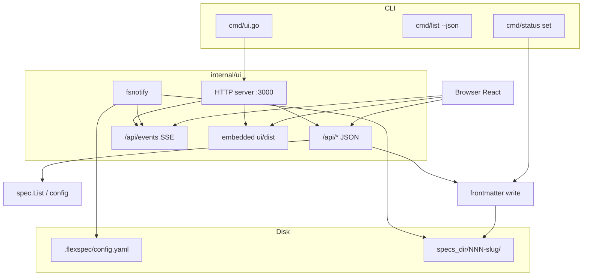
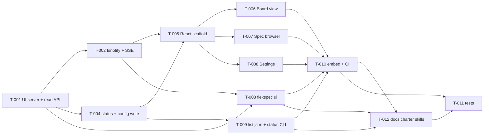

# Management UI

> **Status**: planned · **Priority**: high · **Created**: 2026-05-30 · **Tasks**: 12

## 1. Summary

FlexSpec today is CLI- and skill-driven: specs live as markdown on disk and agents update `status` in YAML frontmatter. The charter lists a **management UI** as planned; engineering leads and solo developers need **visibility** into spec lifecycle without running `flexspec list` in a terminal or opening many files.

This spec delivers a **local web dashboard** started with **`flexspec ui`**, served from the same Go binary (embedded production build). Three primary views:

1. **Board** — Kanban columns keyed by FlexSpec **spec** lifecycle statuses (`initial` … `complete`), with a user-toggleable **table** layout showing the same data.
2. **Spec browser** — Select a spec to read rendered markdown; for **expanded** specs, show tasks in a **collapsible** list with per-task status and links to task files.
3. **Settings** — Persist **UI preferences** (e.g. default board mode, theme) and edit **`.flexspec/config.yaml`** with validation feedback before save.

**Live updates:** When frontmatter or spec files change on disk (agent, editor, or UI), the board and detail views refresh without restarting the server — via filesystem watch + server-push (SSE), not a separate `flexspec update` poll command.

**Related CLI (v1):**

| Command | Purpose |
| --- | --- |
| `flexspec ui` | Start HTTP server, serve UI, optional browser open |
| `flexspec list --json` | Machine-readable spec list (scripts, tests) |
| `flexspec status set` | Set spec or task status from terminal / CI |

**In scope:** Project-root detection, read/write of `config.yaml` and spec/task frontmatter `status`, embedded React app, dev workflow (Vite proxy → Go API), minimal new Go deps (`fsnotify` only beyond stdlib + existing modules), **in-repo charter/skills/README updates** (T-012) so agents and users discover new commands.

**Documentation in scope (T-012):** `templates/charter.md`, `.flexspec/charter.md`, `skills/flexspec/SKILL.md`, `skills/flexspec-charter/SKILL.md`, root `README.md`, `templates/README.md` (and synced `.flexspec/templates/README.md`).

**Out of scope (v1):** Hosted/multi-tenant service, auth, editing full spec markdown body in the UI, drag-and-drop status (optional stretch — API supports PATCH; UI may ship read-only status first), issue-tracker adapters, charter WYSIWYG editor, `flexspec update` as a sync daemon.

## 2. Design

### 2.1 Architecture / Technical Plan

A new `internal/ui` package owns the HTTP server, JSON API, filesystem watcher, and frontmatter write helpers. `cmd/ui.go` registers the Cobra command. React lives under `ui/` (Vite + TypeScript); production assets are embedded in `main.go` via `//go:embed` (separate FS from templates). `flexspec ui` blocks until SIGINT (foreground server); default port **3000**, next free port if busy.

| File / Component | Type | Role in this spec |
| --- | --- | --- |
| `internal/ui/server.go` | new | HTTP server, route registration, graceful shutdown |
| `internal/ui/handlers.go` | new | REST handlers: specs, spec detail, config, status |
| `internal/ui/watch.go` | new | `fsnotify` on `specs_dir` + `.flexspec/config.yaml` |
| `internal/ui/events.go` | new | SSE broadcast on file changes |
| `internal/ui/frontmatter.go` | new | Read/write `status` in spec README / task files |
| `internal/ui/embed.go` | new | Serve embedded `ui/dist` with SPA fallback |
| `cmd/ui.go` | new | `flexspec ui` flags: `--port`, `--open` / `--no-open`, `--host` |
| `cmd/list.go` | modified | `--json` output |
| `cmd/status.go` | new | `flexspec status set` subcommand |
| `cmd/root.go` | modified | Register `uiCmd`, `statusCmd` |
| `main.go` | modified | `//go:embed ui/dist`, wire `cmd.UIFS` |
| `ui/` | new | React app (board, browser, settings) |
| `ui/package.json` | new | Build scripts; dev dependency on Node |
| `Makefile` or `scripts/build-ui.sh` | new | `npm ci && npm run build` before `go build` |
| `.github/workflows/ci.yml` | modified | Build UI before tests / release |
| `.goreleaser.yaml` | modified | `before` hook builds `ui/dist` |
| `internal/spec/spec.go` | reference | `List`, `ParseSpecMeta`, `ParseTaskMeta` |
| `internal/config/config.go` | reference | `Load`; extend with `Save` for settings page |
| `templates/charter.md` | modified | §4/§6/§9/§10/§11 — UI shipped, new CLI |
| `.flexspec/charter.md` | modified | Live charter aligned with template |
| `skills/flexspec/SKILL.md` | modified | CLI table + optional `flexspec ui` workflow |
| `skills/flexspec-charter/SKILL.md` | modified | View charter via UI when running |
| `README.md` | modified | Usage + contributor build instructions |
| `templates/README.md` | modified | CLI table for `init` scaffold |

### 2.2 Code Map

### 2.3 Data Model

No database. **Source of truth** remains files on disk.

| Entity | Storage | Fields used by UI |
| --- | --- | --- |
| Project config | `.flexspec/config.yaml` | `specs_dir`, `always_one_shot`, `spec_template` |
| Spec | `{specs_dir}/NNN-slug/README.md` | frontmatter: `name`, `description`, `status`, `spec_type`, …; body: markdown |
| Task | `{specs_dir}/NNN-slug/tasks/T-*.md` | frontmatter: `id`, `name`, `status`, …; body: markdown |
| UI preferences | `localStorage` in browser | `boardView` (`kanban` \| `table`), `theme` (`light` \| `dark` \| `system`) |

**Kanban columns (spec board):** `initial`, `refined`, `planned`, `in_progress`, `in_review`, `complete` — fixed order; specs with unknown/missing status appear in an **Unassigned** column.

**Task statuses (detail view only):** `todo`, `in_progress`, `in_review`, `blocked`, `done` per task template.

### 2.4 External Interfaces

| Interface | Type | Contract / Shape | Notes |
| --- | --- | --- | --- |
| `flexspec ui` | CLI | `[--port 3000] [--host 127.0.0.1] [--open\|--no-open]` | Blocks; prints URL; cwd = project root |
| `flexspec list --json` | CLI | JSON array of `SpecEntry` (+ tasks) | Same data as API list |
| `flexspec status set <spec-dir\|id> --status <s>` | CLI | Updates spec `README.md` frontmatter | Optional `--task T-001-slug` for task file |
| `GET /api/health` | HTTP | `{ "ok": true }` | Liveness |
| `GET /api/specs` | HTTP | `[{ id, dir, name, description, status, spec_type, tasks? }]` | From `spec.List` |
| `GET /api/specs/{dir}` | HTTP | spec meta + `markdown` body + `tasks[]` with bodies | `dir` = folder name e.g. `002-management-ui` |
| `GET /api/config` | HTTP | config object (parsed) | |
| `GET /api/config/raw` | HTTP | plain-text `config.yaml` | Settings editor fidelity |
| `PUT /api/config` | HTTP | JSON body matching config struct → write YAML file | Validate before write; 400 on error |
| `PATCH /api/specs/{dir}/status` | HTTP | `{ "status": "planned" }` | Spec README only |
| `PATCH /api/specs/{dir}/tasks/{file}/status` | HTTP | `{ "status": "done" }` | Task file frontmatter |
| `GET /api/events` | HTTP | `text/event-stream` | `event: specs-changed` on fsnotify debounced |
| `GET /*` | HTTP | SPA static assets | `index.html` fallback for client routes |

**UI routes (client-side):**

| Route | View |
| --- | --- |
| `/` or `/board` | Kanban / table board |
| `/specs` or `/specs/:dir` | Spec list + detail |
| `/settings` | UI prefs + config editor |

### 2.5 Requirements

**Functional**

- **FR-001** — `flexspec ui` starts an HTTP server on `--port` (default 3000); if port in use, try next port up to +20 and print the bound URL.
- **FR-002** — Unless `--no-open`, open the system default browser to the server root URL; `--open` is explicit alias for default behavior.
- **FR-003** — Serve the embedded React production build for all non-API routes with SPA fallback.
- **FR-004** — Board view shows one column per spec lifecycle status; each card shows spec `name`, `id`, `description` (truncated), `spec_type`.
- **FR-005** — User can toggle board between **kanban** and **table**; choice persists in `localStorage` and restores on reload.
- **FR-006** — Spec browser lists all specs; selecting one renders `README.md` body as HTML (GFM); syntax highlighting for fenced code blocks.
- **FR-007** — For `spec_type: expanded`, spec detail shows tasks in a **collapsible** list (summary: id, name, status); expanding loads/reveals task markdown body.
- **FR-008** — Settings page edits UI preferences (board default, theme) without server round-trip.
- **FR-009** — Settings page loads current `.flexspec/config.yaml`, allows edit in a textarea (YAML), validates via same rules as `config.Load` on save, writes file on success, shows errors inline on failure.
- **FR-010** — File changes under `specs_dir` and `.flexspec/config.yaml` trigger SSE; connected clients refetch specs/list or active spec within 2s debounce.
- **FR-011** — `flexspec list --json` outputs valid JSON matching `GET /api/specs` shape (stable field names).
- **FR-012** — `flexspec status set` updates spec or task `status` in frontmatter without corrupting other frontmatter keys or markdown body.
- **FR-013** — `flexspec ui` fails fast with clear error if `.flexspec/config.yaml` missing (suggest `flexspec init`).
- **FR-014** — API binds to `--host` default `127.0.0.1` only (no remote exposure by default).
- **FR-015** — In-repo docs and `skills/flexspec/SKILL.md` document `flexspec ui`, `list --json`, and `status set` with correct flags; Phase 2 guidance mentions optional local dashboard (`flexspec ui --no-open`) without replacing `/flexspec` lifecycle rules.
- **FR-016** — `templates/charter.md` and project `.flexspec/charter.md` list management UI as **available** (not planned), update §6 architecture for `ui`, extend §9 glossary, resolve §10 UI scope question, append §11 revision row citing `002-management-ui`.

**Non-Functional**

- **NF-001** — End users need only the `flexspec` binary + browser; **no Node at runtime**.
- **NF-002** — Go runtime deps: add at most `github.com/fsnotify/fsnotify` for watching; prefer stdlib `net/http` routing (Go 1.22+ `ServeMux` patterns).
- **NF-003** — Table-driven Go tests for handlers, frontmatter R/W, and `status set`; `go test -race` clean.
- **NF-004** — CI builds `ui/dist` before `go test` / GoReleaser so embed is never stale in releases.
- **NF-005** — UI remains usable with 50+ specs (list + board render &lt; 1s on typical laptop).
- **NF-006** — Cross-platform: `filepath` for all disk paths; no OS-specific browser open requirement when `--no-open`.

## 3. Implementation Plan

### 3.1 Implementation Code Map

### 3.2 Task List

| Task | File | Satisfies | Depends on | Summary |
| --- | --- | --- | --- | --- |
| **T-001** | `tasks/T-001-ui-server-read-api.md` | FR-001, FR-003, FR-013, FR-014, NF-002 | — | HTTP server, health, GET specs/detail/config, static embed stub |
| **T-002** | `tasks/T-002-fsnotify-sse.md` | FR-010, NF-002 | T-001 | Watch specs + config; debounced SSE |
| **T-003** | `tasks/T-003-flexspec-ui-cmd.md` | FR-001, FR-002, FR-006, NF-006 | T-001, T-002 | `cmd/ui.go`, port/browser flags |
| **T-004** | `tasks/T-004-write-api-frontmatter.md` | FR-009, FR-012, NF-003 | T-001 | PUT config, PATCH status, frontmatter helpers |
| **T-005** | `tasks/T-005-react-scaffold.md` | FR-003, NF-001 | T-001 | Vite React TS, router, API client, layout nav |
| **T-006** | `tasks/T-006-board-view.md` | FR-004, FR-005, FR-010, NF-005 | T-005, T-002 | Kanban + table toggle, SSE refresh |
| **T-007** | `tasks/T-007-spec-browser.md` | FR-006, FR-007, FR-010 | T-005, T-002 | Markdown render + task accordions |
| **T-008** | `tasks/T-008-settings-view.md` | FR-008, FR-009 | T-005, T-004 | UI prefs + config YAML editor |
| **T-009** | `tasks/T-009-list-json-status-cli.md` | FR-011, FR-012 | T-004 | `list --json`, `status set` |
| **T-010** | `tasks/T-010-embed-ci-release.md` | NF-001, NF-004 | T-005–T-008, T-003 | go:embed dist, CI + goreleaser hooks |
| **T-011** | `tasks/T-011-ui-tests.md` | NF-003 | T-004, T-009, T-010, T-012 | Handler + CLI integration tests |
| **T-012** | `tasks/T-012-docs-charter-skills.md` | FR-015, FR-016 | T-003, T-009, T-010 | Charter, skills, README, templates sync |

## 4. Testing Criteria

| Test ID | Verifies | Implemented by | Description | Type |
| --- | --- | --- | --- | --- |
| TC-001 | FR-001, FR-013 | T-001, T-003 | `ui` errors without config; binds port | integration |
| TC-002 | FR-003 | T-001, T-010 | `GET /` returns embedded `index.html` | integration |
| TC-003 | FR-004, FR-011 | T-001, T-009 | `GET /api/specs` matches `list --json` for fixture project | unit/integration |
| TC-004 | FR-006, FR-007 | T-007 | Detail API returns markdown + task bodies for expanded fixture | integration |
| TC-005 | FR-009 | T-004, T-008 | PUT invalid config → 400; valid → file updated | unit |
| TC-006 | FR-010 | T-002 | Touch spec README → SSE event within debounce window | integration |
| TC-007 | FR-012 | T-004, T-009 | `status set` changes only `status` key in frontmatter | unit |
| TC-008 | NF-003 | T-011 | `go test -race ./...` passes | ci |
| TC-009 | NF-004 | T-010 | CI job builds `ui/dist` before tests | ci |
| TC-010 | FR-015, FR-016 | T-012 | Docs grep checklist: new commands in README/skills; charter no longer lists UI as planned | manual |

## 5. Other

**Assumptions:**

- Markdown rendering uses a well-maintained JS library (e.g. `react-markdown` + `remark-gfm`); no server-side markdown in v1.
- Config save rewrites the whole `config.yaml` from parsed struct (preserve key order not required v1).
- Charter §8 says FlexSpec is not a PM tool — UI is **read-mostly visibility** for specs already on disk; status edits are convenience, not workflow enforcement.

**Risks:**

- Embed size grows binary (~1–3 MB); acceptable for CLI distribution.
- Concurrent writes (agent + UI) can race; last writer wins on status — document in README.

**Charter / skills:** Handled in **T-012** (in scope for this release, not deferred). Implement after CLI commands exist (T-003, T-009) so documented flags match behavior.

**Resolved (was open):** No `flexspec update` command for realtime — filesystem watch + SSE is sufficient (aligned with Spec Kitty / LeanSpec patterns).
