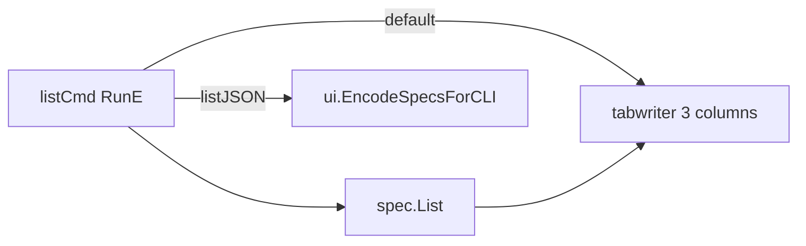
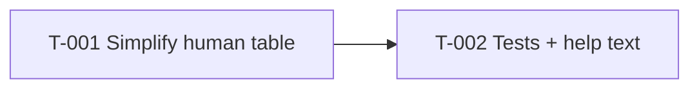

# Simplify list command

> **Status**: complete · **Priority**: medium · **Created**: 2026-05-30 · **Tasks**: 2

## 1. Summary

**Problem:** `flexspec list` prints a wide tab-separated table (ID, name, description, status, type) and indents every task row beneath expanded specs. Long descriptions and many tasks make the output hard to scan in the terminal.

**Outcome:** Default (human) output becomes a compact three-column table: spec identifier (full directory name), status, and task count. One row per spec; no nested task lines, no description or type columns.

**Scope:** `cmd/list.go` human formatting and its tests; update command `Long` help text.

**Out of scope:** Changing `flexspec list --json` shape (must stay aligned with `GET /api/specs` per spec 002 FR-011); UI server or API changes; adding new flags (e.g. `--verbose`).

## 2. Design

### 2.1 Architecture / Technical Plan

Reuse existing `spec.List` — task count is `len(e.Tasks)`. Simple specs always show `0` (tasks are only loaded for `spec_type: expanded`). Identifier is `SpecEntry.Dir` (full spec directory name, e.g. `001-cli-validate`), not the numeric prefix in `SpecEntry.ID`.

| File / Component | Type | Role in this spec |
| --- | --- | --- |
| `cmd/list.go` | modified | Replace human table columns and drop per-task rows; update `Long` |
| `cmd/list_test.go` | new | Table-driven tests for human output |
| `cmd/list_json_test.go` | reference | Existing `--json` tests unchanged |

### 2.2 Code Map



### 2.3 Requirements

**Functional**

- **FR-001** — Default `flexspec list` prints a header row `IDENTIFIER`, `STATUS`, `TASKS` and one data row per spec.
- **FR-002** — Each row shows `SpecEntry.Dir` (full directory name), `Meta.Status` (or `-` when empty), and `len(Tasks)` as a decimal integer.
- **FR-003** — No indented task sub-rows in human output.
- **FR-004** — Empty specs directory still prints `No specs in <specs_dir>` (unchanged).
- **FR-005** — `flexspec list --json` behavior and JSON field set remain unchanged.

**Non-Functional**

- **NF-001** — Human output stays tab-aligned via `text/tabwriter` (same as today).
- **NF-002** — Table-driven tests per charter §7; CI passes (`go test -race`, `gofmt`, `go vet`, `golangci-lint`).

## 3. Implementation Plan

### 3.1 Implementation Code Map



### 3.2 Task List

- **T-001** — Simplify human table in `cmd/list.go`: three columns (`IDENTIFIER` = `SpecEntry.Dir`), task count, remove task loop; update `Long` help. _(satisfies: FR-001, FR-002, FR-003, FR-004, FR-005, NF-001)_
- **T-002** — Add `cmd/list_test.go` with table-driven cases (empty dir, simple spec, expanded spec with tasks); assert full directory name in output; run full test suite. _(satisfies: FR-001–FR-004, NF-002)_

## 4. Testing Criteria

| Test ID | Verifies | Description | Type |
| --- | --- | --- | --- |
| TC-001 | FR-001, FR-002 | Human output header is `IDENTIFIER STATUS TASKS` and rows contain full directory name, status, count | unit |
| TC-002 | FR-002, FR-003 | Expanded spec with 3 tasks shows count `3`, directory name (not numeric ID alone), and no `T-00` sub-rows | unit |
| TC-003 | FR-002 | Simple spec shows task count `0` and full directory name | unit |
| TC-004 | FR-004 | Missing/empty specs dir prints `No specs in specs` | unit |
| TC-005 | FR-005 | Existing `TestListJSON` still passes unchanged | unit |

## 5. Other

**Assumptions**

- Identifier column uses the full spec directory name (`001-cli-validate`), not the numeric prefix (`001`) or frontmatter `name`.
- `--json` consumers (scripts, UI parity docs) keep the full task array; only terminal UX changes.

**Example (after change)**

```
IDENTIFIER              STATUS    TASKS
001-cli-validate        complete  5
002-management-ui       complete  12
```

**Charter follow-up:** §4 CLI bullet for `flexspec list` could note "compact table by default; `--json` for full detail" — optional doc tweak, non-blocking.

**Risks:** None significant; localized CLI formatting change.
