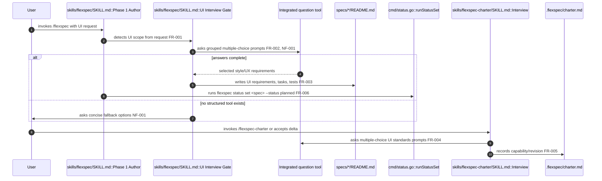
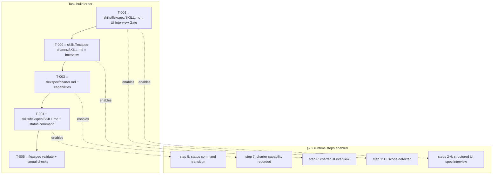

# Enhance UI interviews

> **Status**: complete · **Priority**: high · **Created**: 2026-05-31 · **Tasks**: 5

## 1. Summary

**Problem:** `/flexspec` asks general implementation questions, but UI-heavy work needs richer style and UX detail before a smaller model starts writing a feature. Without an explicit UI interview, agents may create basic layouts, miss expected affordances, or drift from the host app's visual language.

**Outcome:** The FlexSpec skills require structured, multiple-choice UI interviews when authoring UI specs or updating UI-related charter sections. Agents should use the integrated question system available in the current agent runtime (Cursor `AskQuestion`, Claude/Codex equivalents, etc.) and fall back only when no structured tool exists.

**In scope:** `skills/flexspec/SKILL.md`, `skills/flexspec-charter/SKILL.md`, and `.flexspec/charter.md` capability/revision notes. The prompt guidance must include concrete UI question areas such as visual direction, component density, icons, password visibility toggles, empty/loading/error states, accessibility, and app-style reuse. The FlexSpec skill must also direct agents to use `flexspec status set` for spec/task frontmatter status changes instead of editing metadata manually.

**Out of scope:** Adding a new CLI command, changing FlexSpec templates, adding dependencies, or implementing a universal adapter across every AI vendor. The skill should describe the runtime-agnostic contract instead of hard-coding one vendor API.

## 2. Design

### 2.1 Architecture / Technical Plan

Add a UI interview gate to Phase 1 authoring in `/flexspec`. The gate triggers when the requested feature creates or changes pages, screens, visual components, forms, navigation, dashboards, onboarding, auth, settings, marketing surfaces, or other user-facing UI. The gate instructs agents to ask grouped multiple-choice questions before setting a spec to `planned`, while still allowing concise defaults for low-risk UI tweaks.

Update `/flexspec-charter` so charter create/update interviews also use structured multiple-choice prompts for product standards, visual style, accessibility, and UI boundaries. Record the new capability in the active charter. Update `/flexspec` lifecycle instructions to use the existing `status` command for status metadata transitions.

| File / Component | Type | Role in this spec |
| --- | --- | --- |
| `skills/flexspec/SKILL.md` | modified | Add UI interview trigger, required question topics, and structured question-tool rules for spec authoring |
| `skills/flexspec-charter/SKILL.md` | modified | Require structured multiple-choice interviews for charter creation/update and UI standards capture |
| `.flexspec/charter.md` | modified | Document UI/spec interview capability and revision history |
| `cmd/status.go` | reference | Existing `flexspec status set` command the skill must use for metadata status updates |

### 2.2 Code Map

| Step | Location | Executes | Input / condition | Output / side effect | FR/NF |
| --- | --- | --- | --- | --- | --- |
| 1 | `skills/flexspec/SKILL.md :: Phase 1 Author` | request classification | User asks for UI/page/component work | Routes to UI interview before planning | FR-001 |
| 2 | `skills/flexspec/SKILL.md :: UI Interview Gate` | structured prompt selection | UI scope detected | Builds grouped multiple-choice questions | FR-002, NF-001 |
| 3 | Integrated question tool | question roundtrip | Choices for style/UX details | Returns selected answers | FR-002 |
| 4 | `specs/*/README.md` | spec authoring | Complete UI answers | Records requirements, tasks, tests, and style constraints | FR-003 |
| 5 | `cmd/status.go :: runStatusSet` | status transition | Spec/task status changes | Updates frontmatter through CLI command | FR-006 |
| 6 | `skills/flexspec-charter/SKILL.md :: Interview` | charter interview | Charter create/update or delta | Uses structured prompts for UI standards | FR-004 |
| 7 | `.flexspec/charter.md` | charter update | Accepted capability delta | Adds capability/revision note | FR-005 |

### 2.3 Requirements

**Functional**

- **FR-001** — `/flexspec` must define when UI interview mode triggers for UI-bearing specs, including pages, forms, auth, dashboards, navigation, marketing screens, and visual components.
- **FR-002** — `/flexspec` must require the native structured question system when available, with grouped multiple-choice prompts that cover visual direction, app-style reuse, interaction affordances, accessibility, and UI states.
- **FR-003** — `/flexspec` must require answers from the UI interview to be reflected in the spec's requirements, tasks, testing criteria, and §5 assumptions/risks before `status: planned`.
- **FR-004** — `/flexspec-charter` must use structured multiple-choice interviews for charter sections that define product UI standards, UX boundaries, accessibility expectations, or design-system conventions.
- **FR-005** — `.flexspec/charter.md` must record the new agent-skill capability and revision history for structured UI/spec interviews.
- **FR-006** — `/flexspec` must instruct agents to update spec and expanded task frontmatter status with `flexspec status set`, not by manually editing metadata.

**Non-Functional**

- **NF-001** — Guidance must stay runtime-agnostic: name examples such as Cursor `AskQuestion` only as examples, and require equivalent integrated systems for Claude, Codex, or other agents when present.
- **NF-002** — Skill additions must stay concise and preserve existing lifecycle, charter-gate, scope, and token-budget rules.

## 3. Implementation Plan

### 3.1 Implementation Code Map

| Task | Build after | Implements §2.2 steps | Symbols added/changed | Execution unlocked |
| --- | --- | --- | --- | --- |
| T-001 | — | 1–4 | `Phase 1 Author`, `UI Interview Gate` | UI specs ask structured UX/style questions before planning |
| T-002 | T-001 | 6 | `Interview` | Charter interviews use structured UI standards prompts |
| T-003 | T-002 | 7 | `.flexspec/charter.md` capability/revision entries | Product context records the new skill capability |
| T-004 | T-003 | 5 | `CLI Contract`, Phase status steps | Agents use `flexspec status set` for status metadata |
| T-005 | T-004 | 1–7 (assert) | `flexspec validate`, manual checklist | Confirms spec structure and prompt coverage |

### 3.2 Task List

- **T-001** — Update `skills/flexspec/SKILL.md` with a UI interview gate, trigger conditions, grouped multiple-choice question topics, structured-tool usage, and answer-to-spec mapping. _(satisfies: FR-001, FR-002, FR-003, NF-001, NF-002)_
- **T-002** — Update `skills/flexspec-charter/SKILL.md` so charter interviews use structured multiple-choice prompts for UI standards and requested deltas. _(satisfies: FR-004, NF-001, NF-002)_
- **T-003** — Update `.flexspec/charter.md` capabilities/revision history for structured UI/spec interview support. _(satisfies: FR-005)_
- **T-004** — Update `skills/flexspec/SKILL.md` so lifecycle status changes use `flexspec status set` for spec/task metadata. _(satisfies: FR-006, NF-002)_
- **T-005** — Run `flexspec validate` and manually check prompt coverage for login page, new page/screen, full UI creation, and status-command scenarios. _(satisfies: FR-001–FR-006, NF-001–NF-002)_

## 4. Testing Criteria

| Test ID | Verifies | Description | Type |
| --- | --- | --- | --- |
| TC-001 | FR-001, FR-002 | `skills/flexspec/SKILL.md` includes UI trigger conditions and structured multiple-choice question guidance | manual grep/read |
| TC-002 | FR-002, FR-003, NF-001 | FlexSpec skill states that UI interview answers must map into requirements, tasks, tests, and assumptions before `planned` | manual read |
| TC-003 | FR-004, NF-001 | Charter skill requires structured multiple-choice prompts for UI standards and delta interviews | manual read |
| TC-004 | FR-005 | Charter capability/revision history mentions structured UI/spec interviews | manual read |
| TC-005 | NF-002 | Existing lifecycle and charter-gate rules remain present; additions are concise | manual read |
| TC-006 | FR-006 | FlexSpec skill documents `flexspec status set <spec> --status <status>` and task status usage, and forbids manual frontmatter status edits | manual grep/read |
| TC-007 | FR-001–FR-006 | `flexspec validate` succeeds | CLI |

## 5. Other

**Assumptions**

- "Integrated question system" means the current agent runtime's structured question UI when available, such as Cursor `AskQuestion`; the skill should not depend on one vendor-specific API.
- No extra research is needed before implementation because the current agent environment already exposes a structured multiple-choice question tool.
- Charter delta accepted by user on 2026-05-31: include `.flexspec/charter.md` update as T-003.

**Risks**

- Too many UI questions could slow simple UI edits. Mitigate by requiring grouped prompts and allowing concise defaults for low-risk tweaks.
- Vendor-specific wording could age poorly. Mitigate by naming examples only after the runtime-agnostic rule.
