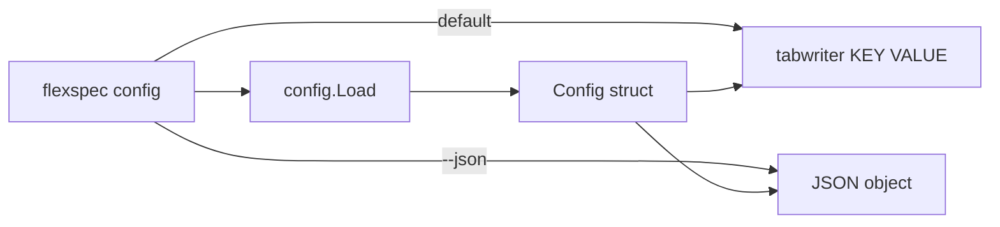

# Config command

> **Status**: planned · **Priority**: high · **Created**: 2026-06-01

## 1. Summary

**Problem:** Agents and humans read `.flexspec/config.yaml` by hand during spec authoring and implementation. That wastes tokens, is easy to mis-parse, and duplicates what the CLI already understands via `config.Load`.

**Outcome:** `flexspec config` prints every **known** project config key with its effective value: human-friendly tab-separated table (default) and `--json` for scripts/agents. Missing config fails fast with the same message as other commands (`run flexspec init`).

**Scope:** New `cmd/config.go`; optional `internal/config` helpers for stable key ordering and JSON shape; tests; docs in README, charter §4, template READMEs, and `skills/flexspec/SKILL.md` (instruct agents to run `flexspec config` instead of opening the YAML file).

**Out of scope:** New config keys (e.g. `comment_aggressiveness` was illustrative only — do not add); editing config from CLI (UI `PUT /api/config` and Settings textarea remain the write path); `--verbose` descriptions column; showing unknown YAML keys not in the `Config` struct.

## 2. Design

### 2.1 Architecture / Technical Plan

| File / Component | Type | Role |
| --- | --- | --- |
| `cmd/config.go` | new | `flexspec config` command, table + `--json` |
| `cmd/config_test.go` | new | Table-driven stdout tests |
| `internal/config/config.go` | modified | `Entries()` or similar: ordered key/value pairs for display |
| `internal/config/config_test.go` | modified | Unit tests for display helpers / validation unchanged |
| `cmd/init.go` | reference | Init template comments only (no new keys) |
| `internal/validate/config.go` | reference | Existing validation; no new rules unless needed |
| `README.md` | modified | Command table + example |
| `.flexspec/charter.md` | modified | §4 CLI bullet |
| `templates/README.md`, `.flexspec/templates/README.md` | modified | CLI command list |
| `skills/flexspec/SKILL.md` | modified | CLI table + "read config via `flexspec config`" |

### 2.2 Code Map



### 2.3 External Interfaces

| Interface | Kind | Contract |
| --- | --- | --- |
| `flexspec config` | CLI | Read cwd → load `.flexspec/config.yaml` → print table |
| `flexspec config --json` | CLI | Same load → JSON object, stable key order |

### 2.4 Requirements

**Functional**

- **FR-001** — `flexspec config` is registered under root and listed in `flexspec --help`.
- **FR-002** — When `.flexspec/config.yaml` is missing, exit non-zero with message directing user to `flexspec init` (same pattern as `config.Load`).
- **FR-003** — Default output: header `KEY` and `VALUE`, then one row per known config field in fixed order: `specs_dir`, `always_one_shot`, `spec_template`.
- **FR-004** — Empty `spec_template` displays as `-` (consistent with `flexspec list` status dash).
- **FR-005** — `always_one_shot` prints as `true` or `false`.
- **FR-006** — `flexspec config --json` prints a single JSON object with snake_case keys matching YAML (`specs_dir`, `always_one_shot`, `spec_template`); string values as JSON strings, boolean as JSON boolean.
- **FR-007** — After table output, print a single footer line: `config: <absolute-or-relative path>` using `config.ConfigPath(root)`.
- **FR-008** — `skills/flexspec/SKILL.md` documents the command and tells agents to prefer `flexspec config` / `flexspec config --json` over reading `config.yaml` manually during authoring and implementation.

**Non-Functional**

- **NF-001** — Human table uses `text/tabwriter` like `flexspec list`.
- **NF-002** — Table-driven tests; CI passes (`go test -race`, `gofmt`, `go vet`, `golangci-lint`).
- **NF-003** — No new Go dependencies.

## 3. Implementation Plan

### 3.1 Implementation Code Map


### 3.2 Task List

| Task | File | Satisfies | Depends on | Summary |
| --- | --- | --- | --- | --- |
| T-001 | `internal/config` | FR-003–FR-006 | — | Ordered entries + JSON marshal helper |
| T-002 | `cmd/config.go` | FR-001–FR-007, NF-001–NF-002 | T-001 | CLI command and tests |
| T-003 | README, charter, templates, skill | FR-008, NF-002 | T-002 | Human/agent discoverability |

## 4. Testing Criteria

| Test ID | Verifies | Task | Description | Type |
| --- | --- | --- | --- | --- |
| TC-001 | FR-002 | T-002 | No config file → error mentions `flexspec init` | unit |
| TC-002 | FR-003, FR-004, FR-005 | T-002 | Known fixture prints three rows with expected values; empty template → `-` | unit |
| TC-003 | FR-006 | T-002 | `--json` matches expected object | unit |
| TC-004 | FR-007 | T-002 | Footer line includes `config:` and path suffix | unit |
| TC-005 | FR-001 | T-002 | Command appears in root help output | unit |
| TC-006 | FR-008 | T-003 | Skill contains `flexspec config` in CLI table and guidance to use it | manual |

## 5. Other

**Assumptions**

- Display only fields on `internal/config.Config` today; future keys require struct + display list updates (document in skill).
- JSON is the machine contract; table is the human/agent quick view.

**Example (human)**

```
KEY               VALUE
specs_dir         specs
always_one_shot   false
spec_template     -
config: H:\myproj\.flexspec\config.yaml
```

**Example (`--json`)**

```json
{
  "specs_dir": "specs",
  "always_one_shot": false,
  "spec_template": ""
}
```

**Charter:** §4 CLI list gains `flexspec config` (and `--json`).

**Risks:** Low; read-only command mirroring `list` patterns.
