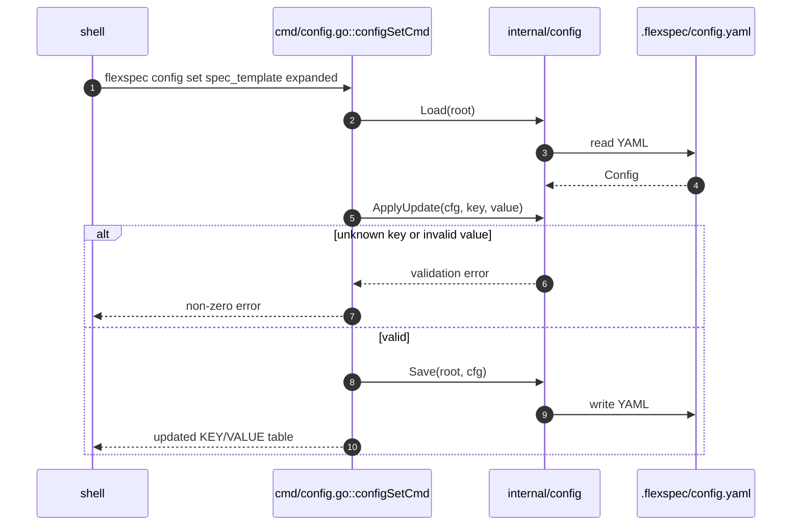
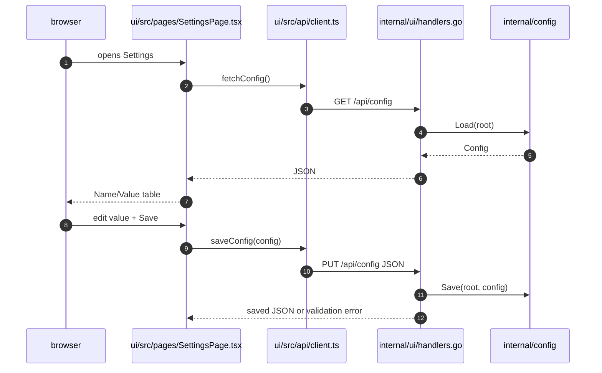
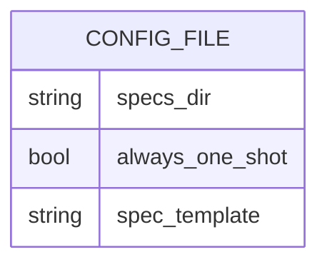
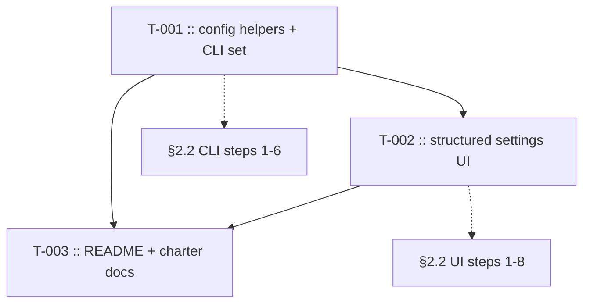

# Config update command and UI

> **Status**: complete · **Priority**: high · **Created**: 2026-06-01 · **Tasks**: 3

## 1. Summary

**Problem:** `flexspec config` currently reads config, while config writes require either editing `.flexspec/config.yaml` by hand or using the UI textarea. That makes simple changes more error-prone than other FlexSpec workflows and asks UI users to understand YAML syntax.

**Outcome:** Users can run `flexspec config set <key> <value>` to update any known config value with validation and can edit config in the UI through structured rows. The settings UI shows config as a two-column table: name, then value.

**Scope:** Add CLI config mutation, reuse existing `internal/config.Save`, update the local UI settings page and API/client helpers, cover config-write tests, and update product docs (`README.md`, charter) for the new write surfaces.

**Out of scope:** Adding new config keys, preserving comments during writes, editing unknown YAML keys, multi-key batch updates, remote/hosted config management, or turning FlexSpec into a general project-management settings system.

## 2. Design

### 2.1 Architecture / Technical Plan

Keep `flexspec config` and `flexspec config --json` behavior unchanged. Add a Cobra child command, `flexspec config set <key> <value>`, that loads the current config, applies one known key update, saves the full config through `config.Save`, and prints the updated config table.

UI settings should stop loading `/api/config/raw` for normal editing. Instead, fetch structured JSON from `GET /api/config`, render known keys in a `Name` / `Value` table, and send full JSON to `PUT /api/config` after each save. `spec_template` should use the existing `Select` component with an "Infer" empty option; `always_one_shot` should be a boolean select; `specs_dir` should be a text input.

| File / Component | Type | Role in this spec |
| --- | --- | --- |
| `cmd/config.go` | modified | Add `set` subcommand and preserve current read output |
| `cmd/config_test.go` | modified | CLI update tests and regression coverage for read output |
| `internal/config/config.go` | modified | Central key update/parser helper for CLI/UI consistency |
| `internal/config/config_test.go` | modified | Unit tests for key parsing, coercion, and validation errors |
| `internal/ui/handlers.go` | modified | Keep JSON config GET/PUT; raw endpoint may stay for compatibility |
| `internal/ui/server_test.go` | modified | API tests for structured config read/write |
| `ui/src/api/client.ts` | modified | Replace YAML edit helpers with structured config fetch/save helpers |
| `ui/src/pages/SettingsPage.tsx` | modified | Render two-column config table and typed inputs |
| `ui/src/components/Select.tsx` | reference | Reuse for enum/boolean controls |
| `ui/src/index.css` | modified | Shared table/input styles if inline styles become noisy |
| `.flexspec/charter.md` | modified | Note config can now be read and updated via CLI/UI |
| `README.md` | modified | Document `flexspec config set` and structured settings UI |

### 2.2 Code Map

| Step | Location | Executes | Input / condition | Output / side effect | FR/NF |
| --- | --- | --- | --- | --- | --- |
| 1 | `cmd/config.go` | `config set` RunE | key/value args | starts mutation | FR-001 |
| 2 | `internal/config` | `Load` | project root | current config | FR-002 |
| 3 | `.flexspec/config.yaml` | filesystem read | YAML exists | bytes parsed | FR-002 |
| 4 | `internal/config` | update helper | known key, raw value | updated `Config` or error | FR-003, FR-004 |
| 5 | `internal/config` | `Save` | validated config | YAML written | FR-005 |
| 6 | `cmd/config.go` | table render | updated config | stdout table | FR-006 |

### 2.3 Data Model

No database or persistent schema is introduced. The persistent entity remains `.flexspec/config.yaml`.

| Entity | Change | Key fields | Notes |
| --- | --- | --- | --- |
| `.flexspec/config.yaml` | modified | `specs_dir`, `always_one_shot`, `spec_template` | Written by CLI and UI via `config.Save`; comments may be normalized by YAML marshal |

### 2.4 External Interfaces

| Interface | Type | Contract / Shape | Notes |
| --- | --- | --- | --- |
| `flexspec config` | CLI | Print current config table | Existing behavior unchanged |
| `flexspec config --json` | CLI | Print JSON config object | Existing behavior unchanged |
| `flexspec config set <key> <value>` | CLI | Update one known key and print table | `key` is YAML key; values are strings parsed by key type |
| `GET /api/config` | HTTP | `200` JSON `ProjectConfig` | Used by settings UI |
| `PUT /api/config` | HTTP | JSON `ProjectConfig` -> saved JSON | Validation errors return `400` |
| Settings page config table | UI | Two columns: `Name`, `Value` | No YAML textarea for normal editing |

### 2.5 Requirements

**Functional**

- **FR-001** — `flexspec config set <key> <value>` is registered under `config` and rejects missing/extra args with Cobra usage errors.
- **FR-002** — The set command loads `.flexspec/config.yaml`; missing config keeps the existing "run `flexspec init` first" error.
- **FR-003** — The set command accepts all known config keys: `specs_dir`, `always_one_shot`, and `spec_template`.
- **FR-004** — Values are parsed by key type: non-empty string for `specs_dir`, Go bool syntax for `always_one_shot`, and `simple`, `expanded`, or empty string for `spec_template`.
- **FR-005** — Valid updates persist through `config.Save` and can be reloaded by `config.Load`.
- **FR-006** — After a successful set, stdout shows the updated config table using the same format as `flexspec config`.
- **FR-007** — The settings UI renders config as a two-column table with names in the first column and typed value controls in the second.
- **FR-008** — The settings UI saves structured JSON, shows validation errors without losing edited values, and no longer requires users to edit YAML text.
- **FR-009** — `README.md` and `.flexspec/charter.md` document config updates through CLI/UI.

**Non-Functional**

- **NF-001** — No new Go runtime dependencies.
- **NF-002** — CLI and config tests follow the charter's table-driven style where practical.
- **NF-003** — UI controls are keyboard-accessible native inputs/buttons/select-backed controls.
- **NF-004** — Existing read-only command output and API behavior remain backward compatible.

## 3. Implementation Plan

### 3.1 Implementation Code Map

| Task | Build after | Implements §2.2 steps | Symbols/files changed | Execution unlocked |
| --- | --- | --- | --- | --- |
| T-001 | — | CLI 1-6 | `cmd/config.go`, `internal/config` | CLI config writes |
| T-002 | T-001 | UI 1-8 | `SettingsPage.tsx`, `client.ts`, UI API tests | UI structured editing |
| T-003 | T-001, T-002 | — | `README.md`, `.flexspec/charter.md` | docs align with behavior |

### 3.2 Task List

| Task | File | Satisfies | Depends on | Summary |
| --- | --- | --- | --- | --- |
| **T-001** | `tasks/T-001-cli-config-set.md` | FR-001-FR-006, NF-001-NF-002, NF-004 | — | Add validated `config set` command |
| **T-002** | `tasks/T-002-structured-settings-ui.md` | FR-007-FR-008, NF-003-NF-004 | T-001 | Replace YAML textarea with Name/Value table |
| **T-003** | `tasks/T-003-docs-charter.md` | FR-009 | T-001, T-002 | Update README and charter references |

## 4. Testing Criteria

| Test ID | Verifies | Implemented by | Description | Type |
| --- | --- | --- | --- | --- |
| TC-001 | FR-001, FR-002 | T-001 | `config set` arg validation and missing config error | unit |
| TC-002 | FR-003-FR-006 | T-001 | Table-driven successful updates for each key persist and print updated table | unit |
| TC-003 | FR-004 | T-001 | Invalid key/value cases return errors and do not write config | unit |
| TC-004 | FR-007-FR-008 | T-002 | Settings UI code uses structured config helpers and renders `Name`/`Value` table instead of YAML textarea | build/manual |
| TC-005 | FR-008, NF-004 | T-002 | `GET /api/config` and `PUT /api/config` round-trip valid JSON and return `400` on invalid config | unit |
| TC-006 | FR-009 | T-003 | README command table and charter capability/glossary mention config updates | manual |

Run: `go test -race ./...`, `go vet ./...`, `go run . validate`, and `npm run build` from `ui/`.

## 5. Other

**Resolved decisions**

- CLI mutation syntax is `flexspec config set <key> <value>`.
- Charter should be updated for this capability.
- Repository `README.md` may be modified as needed; it must not be removed.

**Charter freshness**

- `.flexspec/charter.md` §4 should describe `flexspec config` as read/write (`set`) and the UI settings page as structured config editing.
- §9 glossary should update `Config` from read-only wording to read/update wording.
- §11 should add a revision row for `006-config-update-command-and-ui`.

**Risks**

- `config.Save` rewrites YAML without comments. Accept this for CLI/UI writes; preserving comments is out of scope.
- React UI has no test runner today. Use TypeScript build plus focused manual/browser verification unless a test harness already exists by implementation time.

**Open questions**

- None.
