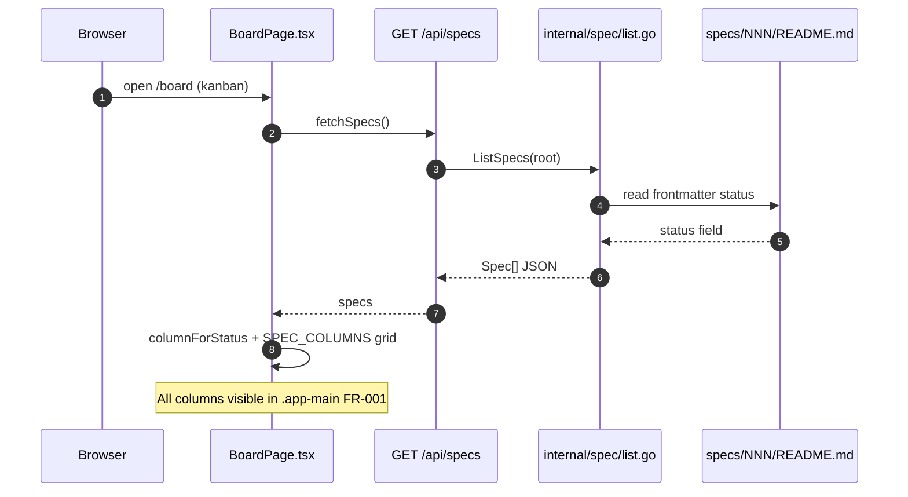
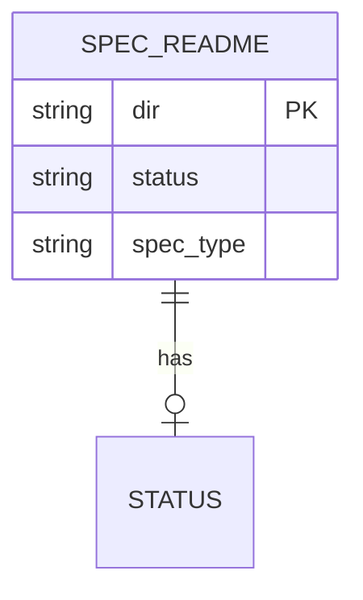
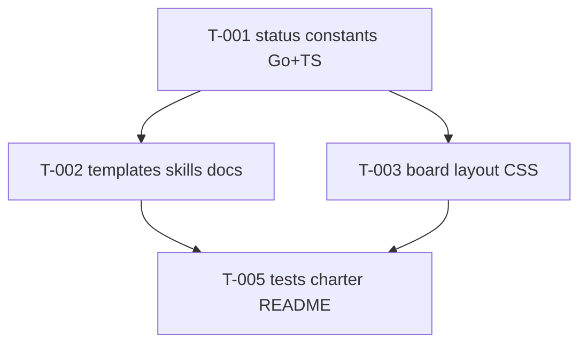

# Board page UI overhaul

> **Status**: planned · **Priority**: high · **Created**: 2026-06-01

## 1. Summary

The management UI board (`/board`) is the primary visibility surface for spec lifecycle. Today the **kanban** layout overflows horizontally: seven columns at `minWidth: 220px` plus gap force **page-level** horizontal scrolling with an inconsistent scrollbar, while many specs sit in late columns (`complete`) and early columns are empty until the user scrolls.

This spec delivers:

1. **Board UX overhaul** — layout and styles so all kanban columns are visible within the main content area at typical desktop widths (no document-level horizontal scroll for the board).
2. **Simplified spec statuses** — remove `refined`, rename `initial` → `draft`, and align the board, templates, skills, and docs with `/flexspec` phases plus `complete`.
3. **Legacy normalization (display only)** — the board normalizes legacy `refined`/`initial` to `planned`/`draft` when assigning columns, so old specs render correctly until migrated. **On-disk migration is delivered separately by spec `008-update-command` (`flexspec update`).**
4. **Column visibility** — show all status columns by default; user can choose visible columns via a board dropdown (persisted in `localStorage`).
5. **Light shell polish** — shared nav/shell styles consistent with the refreshed board (theme tokens only; no new routes).

**In scope:** `BoardPage`, board CSS, column picker UI, shared status constants (Go + TypeScript), embedded templates, `templates/` mirror, `skills/flexspec/SKILL.md`, `.flexspec/charter.md` §4/§9/§11, root `README.md`, tests.

**Out of scope:** On-disk frontmatter migration of existing specs (→ spec `008-update-command`); task-level statuses (`todo`, `in_progress`, …); drag-and-drop status on the board; hosted UI; charter WYSIWYG; changing `/flexspec` one-phase-per-prompt behavior; full Specs browser or Settings redesign.

## 2. Design

### 2.1 Architecture / Technical Plan

Kanban today uses inline flex + `overflowX: auto` on the row (`BoardPage.tsx`), while `.app-main` caps width at 1400px. Seven columns × 220px minimum exceeds the container → overflow propagates to the viewport.

**Approach:** Introduce a single source of truth for **spec lifecycle statuses** in Go (`internal/spec/status.go`), export the ordered list for the UI API (or duplicate a generated constant — prefer one Go package + TS mirror in `ui/src/api/status.ts` kept in sync via comment/test), update `SPEC_COLUMNS` in the client, and refactor the board to a **CSS grid** with equal fractional columns, smaller min track width, and `overflow: hidden` on the board shell so scrolling stays inside the board region only if the viewport is narrower than a documented breakpoint.

Status model (agreed):

| Status | Phase | Meaning |
| --- | --- | --- |
| `draft` | Author | Drafting / interview; open questions may remain |
| `planned` | Author → Implement gate | Definition of Ready; implementation may start |
| `in_progress` | Implement | Code/tasks in flight |
| `in_review` | Review | Diff review / slop scan |
| `complete` | Done | Spec lifecycle finished |

**Removed:** `refined`, `initial` (renamed to `draft`).

**Legacy mapping:** `refined` → `planned`; `initial` → `draft`.

| File / Component | Type | Role |
| --- | --- | --- |
| `internal/spec/status.go` | new | Ordered spec statuses, `SpecStatuses()`, `NormalizeSpecStatus`, legacy map |
| `internal/spec/status_test.go` | new | Table-driven tests for normalization |
| `ui/src/api/status.ts` | new | `SPEC_COLUMNS` + `columnForStatus` (import from one place) |
| `ui/src/api/client.ts` | modified | Re-export or remove duplicate column helpers |
| `ui/src/pages/BoardPage.tsx` | modified | Grid layout, column picker, semantic classes |
| `ui/src/components/Layout.tsx` | modified | Light nav/shell polish (shared tokens) |
| `ui/src/index.css` | modified | Board + shell styles |
| `cmd/status.go` | modified | Optional: warn on deprecated status (non-blocking) |
| `.flexspec/templates/flexspec-simple.md` | modified | Frontmatter status enum + §5 refined wording |
| `.flexspec/templates/expanded/flexspec-expanded.md` | modified | Same |
| `.flexspec/templates/README.md` | modified | Status table |
| `templates/*` | modified | Mirror embedded templates |
| `skills/flexspec/SKILL.md` | modified | Phase table: Author ends at `planned` from `draft` only |
| `README.md` | modified | CLI/docs status list |
| `.flexspec/charter.md` | modified | §4/§9 if user confirms charter update |

### 2.2 Code Map

| Step | Location | Executes | Input | Output | FR/NF |
| --- | --- | --- | --- | --- | --- |
| 1 | `BoardPage` | mount | — | `useSpecs()` | FR-001 |
| 2 | `GET /api/specs` | list specs | project root | JSON array | FR-004 |
| 3 | `columnForStatus` | map status | raw frontmatter | column id | FR-003 |
| 4 | `.board-kanban` CSS | layout | column count | grid, no body overflow | FR-001, NF-002 |
| 5 | `NormalizeSpecStatus` | migration helper | `refined`/`initial` | `planned`/`draft` | FR-002 |
| 6 | Column picker | filter columns | localStorage | subset of SPEC_COLUMNS | FR-008 |

### 2.3 Data Model

No database. **Frontmatter** `status` on spec `README.md` only (task files unchanged).

| Entity | Change | Notes |
| --- | --- | --- |
| Spec README frontmatter | enum shrink | Remove `refined` from templates; legacy values normalized on read for board column only or migrated on disk per FR-002 |

### 2.4 External Interfaces

| Interface | Type | Contract | Notes |
| --- | --- | --- | --- |
| `GET /api/specs` | HTTP | unchanged shape; `status` string | Board uses new column set |
| `PATCH /api/specs/{dir}/status` | HTTP | `{ "status": "<allowed>" }` | May accept deprecated values with normalization |
| `flexspec status set` | CLI | `--status` | Document new enum in help |
| `/board` | UI | Kanban + table toggle | Table shows raw status string |
| `/flexspec` skill | docs | Phase ↔ status table | Author: `initial` → `planned` |

### 2.5 Requirements

**Functional**

- **FR-001** — Kanban view shows all spec lifecycle columns (plus Unassigned) within `.app-main` at viewport width ≥ 1280px without horizontal scrolling on `document`/`body`.
- **FR-002** — Spec lifecycle statuses are exactly: `draft`, `planned`, `in_progress`, `in_review`, `complete`. `refined` and `initial` are removed from templates and skills. `NormalizeSpecStatus` maps legacy `refined` → `planned`, `initial` → `draft` (used for board display and reused by spec 008's migration). This spec does **not** rewrite on-disk spec frontmatter.
- **FR-003** — Board column assignment normalizes status first (`columnForStatus(NormalizeSpecStatus(s))`); order matches §2.1; truly unknown statuses appear only in **Unassigned**.
- **FR-004** — Table view lists all specs; the raw `status` string is shown as-is (legacy values remain visible until `flexspec update` is run).
- **FR-005** — Shared status list defined in Go and mirrored in TypeScript (same order); tests fail if lists diverge.
- **FR-006** — `skills/flexspec/SKILL.md` phase table matches five statuses (Author: none/`draft` → `planned`; no `refined` step).
- **FR-007** — Board visual refresh: dedicated column/card styles (readable at narrower column width), consistent with existing theme tokens in `index.css`.
- **FR-008** — Board provides a column visibility control (dropdown or multi-select): default all five status columns visible; user selection persists in `localStorage` (key e.g. `flexspec.boardColumns`); Unassigned column always shown when it has cards, or always shown (implementer picks one behavior and documents in task).
- **FR-009** — Nav/shell (`Layout`, `.app-nav`, `.app-main`) receive light spacing/overflow polish so board fit-viewport behavior is not undermined by shell styles.

**Non-Functional**

- **NF-001** — Table-driven Go tests for status normalization; existing UI/server tests updated.
- **NF-002** — At viewport 1024–1279px, board may use internal horizontal scroll inside `.board-kanban` only; must not styled differently from app scrollbar tokens (use `overflow-x: auto` on board container with themed scrollbar if needed).
- **NF-003** — `go test -race`, `gofmt`, `go vet`, `golangci-lint` pass; UI build via `make build-ui` succeeds.

## 3. Implementation Plan

### 3.1 Implementation Code Map

| Task | Build after | Unlocks |
| --- | --- | --- |
| T-001 | — | Constants + normalization |
| T-002 | T-001 | Template/skill enum |
| T-003 | T-001 | Board UX |
| T-005 | T-002, T-003 | CI + docs |

### 3.2 Task List

| Task | File | Satisfies | Depends on | Summary |
| --- | --- | --- | --- | --- |
| **T-001** | `tasks/T-001-spec-status-model.md` | FR-002, FR-003, FR-005 | — | Go `status.go` + TS mirror + tests |
| **T-002** | `tasks/T-002-templates-and-skills.md` | FR-002, FR-006 | T-001 | Templates, README, SKILL phase table |
| **T-003** | `tasks/T-003-board-layout.md` | FR-001, FR-007, FR-008, FR-009, NF-002 | T-001 | BoardPage, column picker, shell CSS |
| **T-005** | `tasks/T-005-verify-and-charter.md` | FR-004–FR-006, NF-001, NF-003 | T-002, T-003 | Integration tests, charter §11 row |

> On-disk migration of existing `specs/**` frontmatter is delivered by spec `008-update-command` (was T-004 here, now removed).

## 4. Testing Criteria

| Test ID | Verifies | Implemented by | Description | Type |
| --- | --- | --- | --- | --- |
| TC-001 | FR-002, FR-005 | T-001 | `NormalizeSpecStatus("refined")` → `planned`; `initial` → `draft`; list length 5 | unit |
| TC-002 | FR-003 | T-001 | Unknown status maps to unassigned column key | unit |
| TC-003 | FR-001, NF-002 | T-003 | Board grid CSS: no `overflow-x` on `body` for kanban (manual or playwright-less DOM assert in doc) | manual |
| TC-004 | FR-004 | T-003 | Table view renders a spec whose raw status is legacy `refined` without crashing; board places it in `planned` | manual |
| TC-005 | FR-006 | T-002 | SKILL phase table has no `refined` | manual |
| TC-006 | NF-001 | T-005 | `go test -race ./...` green | CI |
| TC-007 | NF-003 | T-005 | `make build-ui` embed succeeds | build |
| TC-008 | FR-008 | T-003 | Column picker hides/shows columns; persists across reload | manual |

## 5. Other

### Decisions (resolved 2026-06-01)

- **Migration:** legacy `refined`/`initial` normalized for board display here; **on-disk rewrite deferred to spec `008-update-command`** (`flexspec update`).
- **Columns:** Default show all five; dropdown lets user pick visible columns (`localStorage`).
- **UI scope:** Board + light nav/shell polish.
- **Rename:** `initial` → `draft` everywhere in templates/skills/constants.
- **Charter:** Update §4, §9, §11 in T-005.

### Risks

- Breaking change for external projects using `refined` or `initial`; document in root README and surface via `flexspec update` (008).
- Reinstall skills after `skills/flexspec/SKILL.md` changes (`npx skills`).
- `NormalizeSpecStatus` here is the shared helper spec 008 reuses; keep it stable.

### Charter freshness

**Confirmed:** update charter in T-005 — §4 board column picker + fit-viewport kanban; §9 five-status glossary (`draft` not `initial`).
