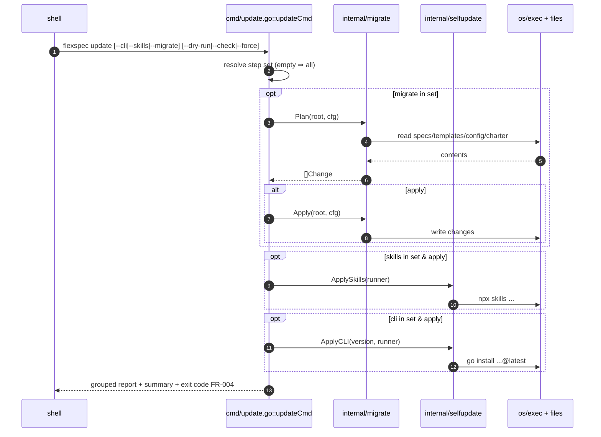
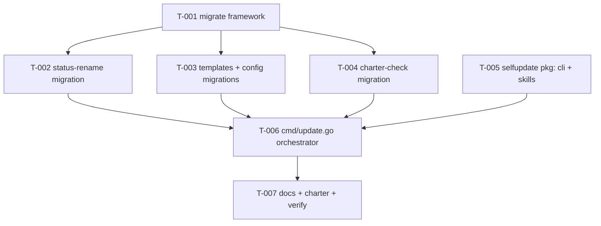

# Update command

> **Status**: planned · **Priority**: high · **Created**: 2026-06-01 · **Tasks**: 7

## 1. Summary

As FlexSpec evolves (e.g. the status rename in spec `007-board-page-ui-overhaul`: `refined`→`planned`, `initial`→`draft`), a project and its tooling drift from the current release: an old `flexspec` binary, stale installed skills, legacy statuses in spec frontmatter, out-of-date `.flexspec/templates`, missing `config.yaml` keys.

This spec adds a single **`flexspec update`** command that brings everything current in one step:

1. **Install latest CLI** — `go install github.com/joshk418/flexspec@latest` (the documented install method, charter §5).
2. **Install latest skills** — the `npx skills` installer.
3. **Run migrations** — a registry-driven engine that detects and applies in-project upgrades (spec/task status, templates, config, charter).

**Bare `flexspec update` runs all three and applies them** — the simplest path for an end user. Flags select individual steps: `--cli`, `--skills`, `--migrate` (any combination; none ⇒ all three). `--dry-run` previews without writing/installing. `--check` is a CI gate (detect-only; non-zero exit when migrations are pending). `--force` permits overwriting locally-modified template files.

Because steps 1–2 write **outside `.flexspec/`** (the installed binary on PATH/`GOBIN`, and global skill dirs), this requires a **charter §8 carve-out** and a **§5 note** that the skills step uses Node/`npx` for that path only.

**In scope:** new `internal/migrate` package (framework + migrations), new `internal/selfupdate` package (CLI + skills), `cmd/update.go`, version reuse (`cmd.version`), reuse of `internal/spec` + `internal/config` + embedded `TemplatesFS`, charter §4/§5/§8/§9/§11, root `README.md`, tests.

**Out of scope:** downloading prebuilt release binaries + in-place self-replacement (Windows rename-self dance — deferred; `go install` chosen); auto-rewriting charter prose (charter migration is report-only); UI surface; scheduled/auto updates; user-defined migration plugins; rollback (use git / `go install <version>`).

## 2. Design

### 2.1 Architecture / Technical Plan

`cmd/update.go` orchestrates three step groups. A **step set** is resolved from flags (`--cli`/`--skills`/`--migrate`; empty ⇒ all). Each step produces uniform records so the command prints one grouped, tab-separated report (like `validate`) and one combined summary/exit code.

- **Migrations** (`internal/migrate`): a `Migration` interface; `Registry()` returns them ordered. `Plan` runs each `Detect` (no writes); `Apply` runs each `Apply`. Detection is **pattern-based**, not version-based, so older projects are handled with no recorded schema version. Embedded templates are injected as `fs.FS` to avoid `embed`/import cycles.
- **Self-update** (`internal/selfupdate`): wraps `go install …@latest` and `npx skills …` behind an injectable command `Runner` (so tests never spawn real processes). Installed version = existing `cmd.version` (release-please managed); "latest" is resolved by `go install`, not pre-fetched.

Apply order: **migrations → skills → CLI**. The new binary only takes effect on the *next* invocation, so it runs last; the report tells the user to re-run `flexspec update` afterward to pick up any migrations shipped by the newer CLI.

```go
// internal/migrate
type Change struct { Migration, Path, Kind, Detail string } // Kind: rewrite|create|delete|report
type Migration interface {
    ID() string
    Description() string
    Detect(root string, cfg config.Config) ([]Change, error) // no writes
    Apply(root string, cfg config.Config) ([]Change, error)  // writes
}
// internal/selfupdate
type Action struct { Target, Command, Detail string } // Target: cli|skills
type Runner func(name string, args ...string) error
```

| File / Component | Type | Role |
| --- | --- | --- |
| `internal/migrate/migrate.go` | new | `Change`, `Migration`, `Registry`, `Plan`, `Apply`, `Select` |
| `internal/migrate/status_rename.go` | new | Legacy status → new (uses `spec.NormalizeSpecStatus`) |
| `internal/migrate/templates_resync.go` | new | Re-sync `.flexspec/templates` from embedded FS |
| `internal/migrate/config_keys.go` | new | Add missing / report deprecated `config.yaml` keys |
| `internal/migrate/charter_check.go` | new | Detect missing charter sections (report-only) |
| `internal/migrate/*_test.go` | new | Table-driven tests per file |
| `internal/selfupdate/selfupdate.go` | new | `PlanCLI/ApplyCLI`, `PlanSkills/ApplySkills`, `Runner`, LookPath |
| `internal/selfupdate/selfupdate_test.go` | new | Plan + exec-injection tests |
| `cmd/update.go` | new | Orchestrate steps; flags; report; exit code |
| `cmd/update_test.go` | new | Default-all, step flags, dry-run, check |
| `cmd/root.go` | modified | Register `updateCmd`; `version` reused |
| `main.go` | modified | Pass `TemplatesFS` subtree to `cmd` |
| `internal/spec/status.go` | reference | `NormalizeSpecStatus` (spec 007) |
| `internal/spec/frontmatter.go` | reference | `SetFileStatus`, `ReadFileParts` |
| `internal/config/config.go` | reference | Load/marshal config |
| `cmd/init.go` | reference | embedded-template walk pattern |
| `README.md` | modified | Document `flexspec update` |
| `.flexspec/charter.md` | modified | §4/§5/§8/§9/§11 |

### 2.2 Code Map



| Step | Location | Executes | Input | Output | FR/NF |
| --- | --- | --- | --- | --- | --- |
| 2 | `updateCmd` | resolve steps | flags | step set | FR-001, FR-002 |
| 4–6 | `migrate.Plan`/`Detect` | scan | files | `[]Change`, no writes | FR-005, NF-001 |
| 7 | `migrate.Apply` | write | changes | files updated | FR-003 |
| 9 | `selfupdate.ApplySkills` | exec npx | runner | skills reinstalled | FR-008 |
| 11 | `selfupdate.ApplyCLI` | exec go install | runner | binary updated (next run) | FR-007 |
| 12 | `updateCmd` | report + exit | records | stdout, code 0/1 | FR-004, FR-006 |

### 2.3 Data Model

No database. Operates on existing files (spec/task frontmatter, `.flexspec/templates/**`, `config.yaml`, `charter.md`) and the installed binary/skill dirs. No new schema; no version stamp written (pattern-based detection; installed version read from `cmd.version`).

### 2.4 External Interfaces

| Interface | Type | Contract | Notes |
| --- | --- | --- | --- |
| `flexspec update` | CLI | run all three, **apply** | Default end-user path |
| `flexspec update --dry-run` | CLI | print plan for all steps; no writes/exec | Preview |
| `flexspec update --migrate` | CLI | only migrations (apply) | combine w/ others |
| `flexspec update --cli` | CLI | only CLI install (apply) | needs Go |
| `flexspec update --skills` | CLI | only skills install (apply) | needs Node/`npx` |
| `flexspec update --check` | CLI | detect-only; exit 1 if migrations pending | CI gate |
| `flexspec update --only <id>` | CLI | restrict migrations to ids | repeatable |
| `flexspec update --force` | CLI | overwrite differing template files | with apply |

### 2.5 Requirements

**Functional**

- **FR-001** — `flexspec update` with no step flags runs all three steps (CLI install, skills install, migrations) and **applies** them by default.
- **FR-002** — `--cli`, `--skills`, `--migrate` select individual steps; any combination is allowed; specifying any of them restricts the run to the selected set.
- **FR-003** — `--dry-run` previews the selected steps (migration plan + the exact `go install`/`npx` commands) and performs **no writes and no process spawning**.
- **FR-004** — Output groups records by step/migration in the tab-separated style of `validate`, with a combined summary and a single exit code.
- **FR-005** — Migration registry exposes ordered migrations; `Detect` performs no writes; `Apply` reports the changes written.
- **FR-006** — `--check` runs detection only and exits non-zero when any migration is pending (clean ⇒ exit 0); it never writes or installs.
- **FR-007** — CLI step: applies `go install github.com/joshk418/flexspec@latest` via `os/exec`; reports installed version (`cmd.version`); the new binary takes effect on the next invocation; non-zero exit surfaced as error.
- **FR-008** — Skills step: applies the documented `npx skills` install command via `os/exec` (Node/`npx` dependency accepted for this step only).
- **FR-009** — Missing required toolchain (`go` for CLI, `npx` for skills) produces a clear error naming the tool when that step is to be applied; it does not silently no-op.
- **FR-010** — Status-rename migration: rewrites `refined`→`planned`, `initial`→`draft` in spec/task frontmatter (body untouched) using `spec.NormalizeSpecStatus` + `spec.SetFileStatus`.
- **FR-011** — Templates-resync migration: restores missing embedded template files; files that differ are **reported** and overwritten only when `--force` is combined with apply.
- **FR-012** — Config-keys migration: adds missing known keys (e.g. `spec_template`) with documented defaults; reports deprecated/unknown keys.
- **FR-013** — Charter-check migration: detects missing required charter sections/placeholders and **reports** them; never edits charter prose.

**Non-Functional**

- **NF-001** — `Detect` and `--dry-run`/`--check` never write or spawn processes; verified by tests (content/mtime unchanged; injected runner not called).
- **NF-002** — Cross-platform: `filepath` for paths, `exec.LookPath` + `exec.Command` arg slices (no shell interpolation); frontmatter writes preserve body and other keys.
- **NF-003** — `go test -race`, `gofmt`, `go vet`, `golangci-lint` pass; table-driven tests per source file (charter §7).

## 3. Implementation Plan

### 3.1 Implementation Code Map



| Task | Build after | Unlocks |
| --- | --- | --- |
| T-001 | — | Migration engine |
| T-002 | T-001 | Status rename |
| T-003 | T-001 | Templates + config |
| T-004 | T-001 | Charter check |
| T-005 | — | CLI + skills self-update |
| T-006 | T-002–T-005 | Unified `update` command |
| T-007 | T-006 | Docs + charter |

### 3.2 Task List

> Depends on spec `007-board-page-ui-overhaul` for `internal/spec/status.go` (`NormalizeSpecStatus`) and reuses `cmd.version`.

| Task | File | Satisfies | Depends on | Summary |
| --- | --- | --- | --- | --- |
| **T-001** | `tasks/T-001-migration-framework.md` | FR-005, NF-001 | — | `Change`, `Migration`, `Registry`, `Plan`, `Apply`, `Select` |
| **T-002** | `tasks/T-002-status-rename-migration.md` | FR-010 | T-001 | Legacy status rewrite (reuses 007) |
| **T-003** | `tasks/T-003-templates-config-migrations.md` | FR-011, FR-012 | T-001 | Template re-sync + config keys |
| **T-004** | `tasks/T-004-charter-check-migration.md` | FR-013 | T-001 | Report-only charter section check |
| **T-005** | `tasks/T-005-selfupdate-package.md` | FR-007, FR-008, FR-009, NF-002 | — | `internal/selfupdate` (go install + npx) |
| **T-006** | `tasks/T-006-update-cli.md` | FR-001–FR-004, FR-006 | T-002, T-003, T-004, T-005 | `cmd/update.go` orchestrator + flags |
| **T-007** | `tasks/T-007-docs-and-charter.md` | NF-003 | T-006 | README, charter §4/§5/§8/§9/§11, verify |

## 4. Testing Criteria

| Test ID | Verifies | Implemented by | Description | Type |
| --- | --- | --- | --- | --- |
| TC-001 | FR-005, NF-001 | T-001 | `Plan` returns changes, writes nothing (content/mtime unchanged) | unit |
| TC-002 | FR-010 | T-002 | `status: refined` detected; apply → `planned`, body intact | unit |
| TC-003 | FR-011 | T-003 | Missing template restored; differing reported, not overwritten without `--force` | unit |
| TC-004 | FR-012 | T-003 | Config missing `spec_template` detected; apply adds default | unit |
| TC-005 | FR-013 | T-004 | Charter missing required `##` section detected; no write | unit |
| TC-006 | FR-007, FR-009 | T-005 | `PlanCLI` prints `go install …@latest`+version; `ApplyCLI` runs it; missing `go` errors | unit |
| TC-007 | FR-008 | T-005 | `ApplySkills` runs `npx skills …`; injected runner asserted | unit |
| TC-008 | FR-001, FR-002 | T-006 | No flags ⇒ all three steps run; a single step flag restricts the set | unit |
| TC-009 | FR-003, NF-001 | T-006 | `--dry-run` prints plan; no writes, runner not invoked | unit |
| TC-010 | FR-006 | T-006 | `--check` exits 1 when migrations pending, 0 when clean | unit |
| TC-011 | NF-003 | T-007 | `go test -race ./...` green; vet/gofmt clean | CI |

## 5. Other

### Decisions (resolved 2026-06-01)

- **Merged** former spec 009 (self-update) into this spec; 009 deleted.
- **Default applies all three** (CLI + skills + migrations); `--dry-run` previews. (Supersedes the earlier dry-run-by-default decision.)
- **Step flags** `--cli`/`--skills`/`--migrate` select individual steps; none ⇒ all.
- **`--check`** retained as a migration CI gate (detect-only, exit 1 if pending).
- CLI update method: **`go install @latest`** (Option B release-download deferred).
- Skills update: included, uses `npx` (Node) for that step only.
- **Charter §8 carve-out**: the `update` CLI command may modify its own binary + installed skills.
- Charter migration is **report-only** (charter prose sacred per §8).

### Assumptions

- **A1:** Users who installed via `go install` have Go available for the CLI step.
- **A2:** `npx skills` is the canonical skills installer (charter §5); exact args confirmed in T-005 from README/install docs.
- **A3:** Status-rename depends on spec 007's `NormalizeSpecStatus`; 007 lands first.
- **A4:** This repo has no on-disk `refined`/`initial` specs, so the status migration is a no-op here — ships for external projects.

### Risks

- Template re-sync could clobber user edits → mitigated by report-unless-`--force`.
- `go install @latest` may resolve unexpectedly if the module proxy lags → report the resolved action; user can pin a version.
- Windows: no in-place overwrite of the running `.exe` (`go install` writes `GOBIN`; new binary used next run).
- A newer CLI may ship new migrations not applied this run → report advises re-running `flexspec update`.

### Charter freshness

**Deltas (update in T-007):**

- **§4 Capabilities** — `flexspec update` (CLI + skills self-update + migration engine; default-all, `--dry-run`, `--check`).
- **§5 Technical context** — `--skills` uses `npx` (Node) for that step only; otherwise runtime is Node-free.
- **§8 Boundaries** — carve-out: `update` may modify its own binary + installed skills.
- **§9 Glossary** — "Migration", "Update", "Self-update".
- **§11** — revision row citing `008-update-command`.
