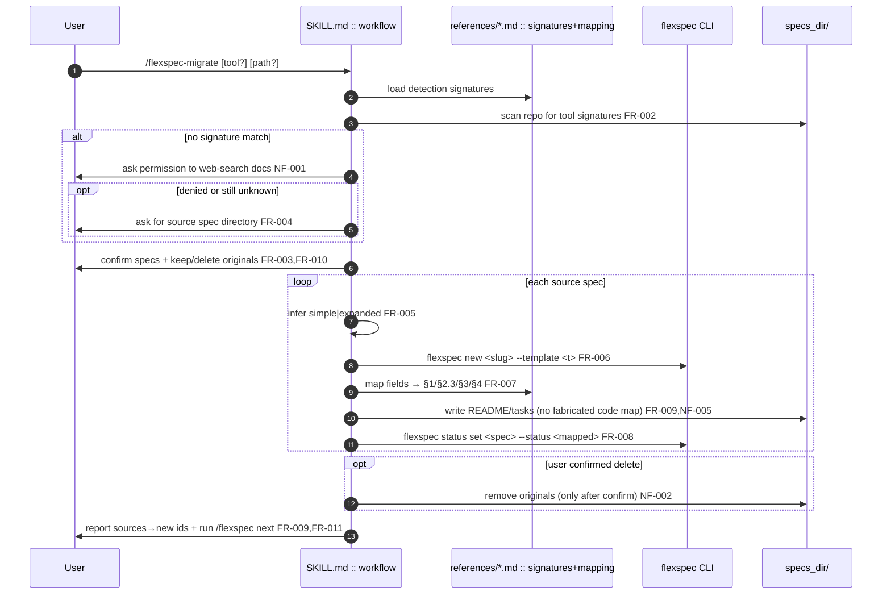
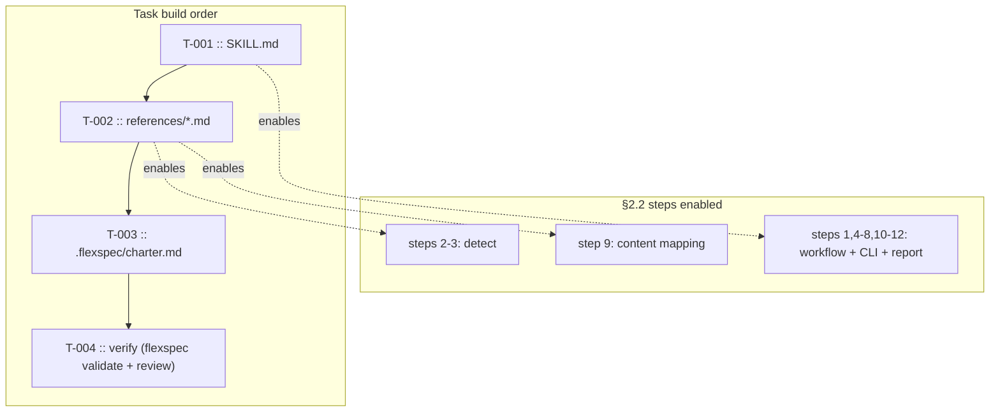

# flexspec-migrate skill

> **Status**: draft · **Priority**: medium · **Created**: 2026-06-03

## 1. Summary

Add a new FlexSpec agent skill, `/flexspec-migrate`, that converts specs created
by other spec-driven-development (SDD) tools — GitHub Spec Kit, OpenSpec,
LeanSpec, Spec Kitty, Kiro, Tessl, plus a generic fallback — into FlexSpec specs.

The skill locates the source tool's spec directory using embedded detection
signatures (no web lookup for supported tools), confirms scope with the user,
scaffolds each migrated spec via the FlexSpec CLI, maps source content into
FlexSpec sections, and leaves the result at `draft` so the user can run
`/flexspec` to finish design, code maps, and testing criteria.

**In scope:** the skill files only — `skills/flexspec-migrate/SKILL.md` plus
bundled per-tool reference docs; a charter §4/§9 sync. Embedded docs are the
primary source of truth so web searches happen only when a tool/directory is
truly unknown and only with user permission.

**Out of scope:** CLI/Go code changes (the new skill ships automatically via the
existing `npx skills add joshk418/flexspec` install); building two-way sync or
importing back into the source tool; fabricating full FlexSpec designs/code maps
during migration (that is `/flexspec`'s job); auto-deleting source files without
explicit per-run confirmation.

## 2. Design

### 2.1 Architecture / Technical Plan

`/flexspec-migrate` follows the same skill convention as `/flexspec`: a
`SKILL.md` with `name`/`description` frontmatter under `skills/<name>/`, shipped
globally via the existing `npx skills add joshk418/flexspec --global` step (no
CLI change — the whole `skills/` tree is installed, so a new directory is picked
up automatically). To keep `SKILL.md` token-lean while embedding full docs, each
supported tool gets a reference file under `skills/flexspec-migrate/references/`
holding its detection signature, layout, field→FlexSpec mapping, and status map.
The skill never hand-creates spec dirs: it always uses `flexspec new` and
`flexspec status set`.

| File / Component | Type | Role in this spec |
| --- | --- | --- |
| `skills/flexspec-migrate/SKILL.md` | new | Main skill: trigger, workflow, detection summary, template-inference + status-map + content-map rules, web/destructive policy, report format, references index |
| `skills/flexspec-migrate/references/speckit.md` | new | GitHub Spec Kit signature + mapping |
| `skills/flexspec-migrate/references/openspec.md` | new | OpenSpec signature + mapping |
| `skills/flexspec-migrate/references/leanspec.md` | new | LeanSpec signature + mapping |
| `skills/flexspec-migrate/references/speckitty.md` | new | Spec Kitty signature + mapping |
| `skills/flexspec-migrate/references/kiro.md` | new | Kiro signature + mapping |
| `skills/flexspec-migrate/references/tessl.md` | new | Tessl signature + mapping |
| `skills/flexspec-migrate/references/generic.md` | new | Interview-based fallback for unknown tools |
| `.flexspec/charter.md` | modified | §4 skills list, §9 glossary, revision history |
| `skills/flexspec/SKILL.md` | reference | Convention to mirror (frontmatter, CLI-only scaffolding) |
| `templates/flexspec-simple.md`, `templates/expanded/flexspec-expanded.md` | reference | Target FlexSpec format the skill maps source content into |
| `internal/selfupdate/selfupdate.go` | reference | Confirms skill distribution; no code change needed |

### 2.2 Code Map

Execution = the agent running `/flexspec-migrate` end to end. No source code runs;
"symbols" are skill workflow steps and the CLI commands they invoke.

| Step | Location | Executes | Input / condition | Output / side effect | FR/NF |
| --- | --- | --- | --- | --- | --- |
| 1 | `SKILL.md :: workflow` | skill trigger | `/flexspec-migrate` invocation | begins migration flow | FR-001 |
| 2 | `references/*.md` | load signatures | supported tool docs | in-memory detection table | FR-012 |
| 3 | `SKILL.md :: detect` | scan repo root | dir/file signatures | candidate tools + spec inventory | FR-002 |
| 4 | `SKILL.md :: unknown` | ask web permission | no signature match | web search only if user=yes | NF-001, FR-004 |
| 5 | `SKILL.md :: unknown` | ask for path | web denied/unknown | user-supplied dir | FR-004 |
| 6 | `SKILL.md :: confirm` | confirm scope | detected inventory | selected specs + keep/delete choice | FR-003, FR-010 |
| 7 | `SKILL.md :: infer` | template inference | source structure | simple or expanded | FR-005 |
| 8 | `flexspec new` | scaffold spec | slug + template | `specs_dir/NNN-slug/` created | FR-006, NF-003 |
| 9 | `references/<tool>.md` map | content mapping | source fields | §1/§2.3/§3/§4 filled, code map left pending | FR-007, FR-009, NF-005 |
| 10 | `flexspec status set` | set status | mapped status (default draft) | frontmatter status updated | FR-008, NF-003 |
| 11 | `SKILL.md :: cleanup` | delete originals | only if confirmed | source files removed | NF-002 |
| 12 | `SKILL.md :: report` | summarize | migrated set | report + "run /flexspec" guidance | FR-011, FR-009 |

### 2.3 Requirements

**Functional**

- **FR-001** — Skill triggers on `/flexspec-migrate` (optional `[tool]` and `[path]` args) and on phrases like "migrate my specs to flexspec".
- **FR-002** — Detect source tool(s) by scanning the repo for embedded signatures (Spec Kit `.specify/`+`spec.md/plan.md/tasks.md`; OpenSpec `openspec/`; LeanSpec `.leanspec/`; Spec Kitty; Kiro `.kiro/specs/`; Tessl `.tessl/`); support multiple tools present in one repo.
- **FR-003** — Before any writes, present detected tools + spec inventory and require the user to confirm which specs to migrate (multi-select).
- **FR-004** — On no signature match, ask user permission before any web search; if denied or still unknown, ask the user for the source spec directory. Never web-search without explicit permission.
- **FR-005** — Infer FlexSpec template per source spec: single-file / no task list → `simple`; multi-file or has a tasks list → `expanded`.
- **FR-006** — Scaffold every migrated spec with `flexspec new <slug> --template <simple|expanded>`; never hand-create directories, README seeds, or sequence numbers.
- **FR-007** — Map source content into FlexSpec sections (Summary + in/out scope, FR/NF requirements, task list / task files, testing criteria) using the per-tool mapping tables in `references/`; preserve source IDs/titles where sensible.
- **FR-008** — Map source status to a FlexSpec status (`draft`…`complete`) via the embedded status table and apply it with `flexspec status set` (default `draft` when unmappable).
- **FR-009** — Migrated specs end at `draft`; the skill must not fabricate §2.2/§3.1 code maps or testing criteria, instead leaving a clear "complete via `/flexspec`" marker, and the final report instructs the user to run `/flexspec`.
- **FR-010** — Ask per run whether to keep (default) or delete the original source files; deletion only after explicit confirmation.
- **FR-011** — Produce a migration report: each source spec → new FlexSpec id, chosen template, mapped status, any unmapped content, and next steps.
- **FR-012** — Bundle per-tool reference docs (signature, layout, field mapping, status map) plus a generic fallback so supported tools need no web lookup.

**Non-Functional**

- **NF-001** — No external/web lookups unless the user explicitly grants permission for that run.
- **NF-002** — Non-destructive by default; never delete or overwrite source files without explicit confirmation.
- **NF-003** — All scaffolding via the FlexSpec CLI (`flexspec new`, `flexspec status set`); no manual dir creation or frontmatter status edits.
- **NF-004** — Follow FlexSpec skill conventions: valid `SKILL.md` frontmatter (`name`, `description`), token-lean `SKILL.md`, full docs pushed into `references/`.
- **NF-005** — Never invent spec content; missing/ambiguous source fields are flagged for the user or `/flexspec`, not fabricated.

## 3. Implementation Plan

### 3.1 Implementation Code Map

| Task | Build after | Implements §2.2 steps | Symbols added/changed | Execution unlocked |
| --- | --- | --- | --- | --- |
| T-001 | — | 1, 4–8, 10–12 | `SKILL.md :: workflow` | full migration flow, CLI calls, policies, report |
| T-002 | T-001 | 2–3, 9 | `references/{speckit,openspec,leanspec,speckitty,kiro,tessl,generic}.md` | detection + content/status mapping run without web |
| T-003 | T-002 | — | `.flexspec/charter.md` §4/§9/history | charter reflects new skill |
| T-004 | T-003 | 1–12 (assert) | `flexspec validate` + structural review | TC coverage of skill files |

### 3.2 Task List

- **T-001** — Write `skills/flexspec-migrate/SKILL.md`: frontmatter, trigger, end-to-end workflow, detection summary table, template-inference rules, status-map table, content-map overview, web-permission + ask-per-run delete policies, draft end-state + "run /flexspec" guidance, report format, references index. _(satisfies: FR-001, FR-003, FR-004, FR-005, FR-006, FR-008, FR-009, FR-010, FR-011, NF-001, NF-002, NF-003, NF-004, NF-005)_
- **T-002** — Write `skills/flexspec-migrate/references/*.md` for speckit, openspec, leanspec, speckitty, kiro, tessl, generic — each with detection signature, directory layout, field→FlexSpec mapping table, and status map. _(satisfies: FR-002, FR-007, FR-012)_
- **T-003** — Update `.flexspec/charter.md`: add `/flexspec-migrate` to §4 skills, §9 glossary entry, and a §11 revision row. _(satisfies: charter sync per §5 decision)_
- **T-004** — Verify: run `flexspec validate` and review skill files against all TCs. _(satisfies: testing)_

## 4. Testing Criteria

| Test ID | Verifies | Description | Type |
| --- | --- | --- | --- |
| TC-001 | FR-002, FR-012 | `references/` has a doc for every supported tool + generic; each has signature, layout, field-mapping, status-map sections | structural |
| TC-002 | FR-001, NF-004 | `SKILL.md` has valid YAML frontmatter with `name: flexspec-migrate` and a description containing trigger phrases; `SKILL.md` stays token-lean | structural |
| TC-003 | FR-003, FR-004, FR-010, NF-001, NF-002 | `SKILL.md` workflow documents confirm-before-write, ask-permission web policy, and ask-per-run (default keep) deletion | manual review |
| TC-004 | FR-006, NF-003 | `SKILL.md` mandates `flexspec new` + `flexspec status set` and forbids manual dir/frontmatter creation | manual review |
| TC-005 | FR-005, FR-007, FR-008 | Per-tool mapping + status tables present and consistent; template-inference rule (single→simple, multi/tasks→expanded) stated | manual review |
| TC-006 | FR-009, NF-005 | `SKILL.md` specifies draft end-state, "run /flexspec next", and no fabricated code maps/TC | manual review |
| TC-007 | FR-011 | `SKILL.md` defines the migration report format (source→new id, template, status, unmapped, next steps) | manual review |

## 5. Other

- **Charter delta (resolved: yes):** add `/flexspec-migrate` to charter §4 skills list and §9 glossary, with a §11 revision row — done in T-003 during implementation (mirrors how prior specs sync the charter).
- **Assumption:** new skill ships via the existing `npx skills add joshk418/flexspec` install (whole `skills/` tree), so no `internal/selfupdate` change is required. Verify during T-004.
- **Risk / uncertain signatures:** detection signatures for **Spec Kitty** and **Tessl** are less certain than Spec Kit / OpenSpec / LeanSpec / Kiro. T-002 should embed best-known signatures and have the skill fall back to the web-permission → ask-user path (FR-004) when a detected layout does not match the embedded signature.
- **Assumption:** testing is structural/manual review of markdown skill files (not Go tests), since the deliverable is documentation, not CLI code.
