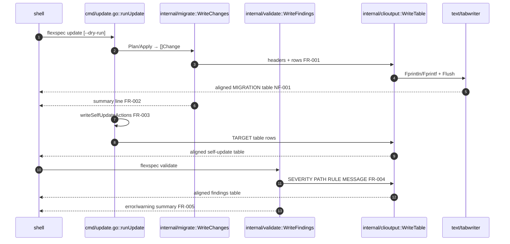

# CLI table output

> **Status**: complete · **Priority**: medium · **Created**: 2026-06-03 · **Tasks**: 4

## 1. Summary

**Problem:** `flexspec list` and `flexspec config` print aligned tables with column headers via `text/tabwriter`. `flexspec update` and `flexspec validate` print raw tab-separated rows with no headers and no column alignment, so migration plans, self-update steps, and validation findings are hard to scan. Spec `008-update-command` FR-004 intended validate-style grouped output, but neither command actually matches the list/config table UX.

**Outcome:** All tabular human CLI output uses one shared helper with consistent headers, alignment, and summary lines. `flexspec update` shows clear tables for migration changes and self-update actions. `flexspec validate` shows a header row for findings. `list` and `config` adopt the same helper so padding and flush behavior stay identical.

**In scope:** new `internal/clioutput` package; update `migrate.WriteChanges`, `validate.WriteFindings`, `cmd/update.go` self-update reporting; refactor `cmd/list.go` and `cmd/config.go` to use the helper; table-driven tests; README command examples if output samples change.

**Out of scope:** JSON output flags (`--json` on list/config unchanged); management UI; new CLI commands; grouping/filter flags; color/bold terminal styling.

## 2. Design

### 2.1 Architecture / Technical Plan

Introduce `internal/clioutput` with a small `WriteTable(w, headers, rows)` that wraps `text/tabwriter` using the same settings as today’s list/config (`minwidth 0`, `tabwidth 0`, `padding 2`, `padchar ' '`, `flags 0`). Callers pass uppercase header labels and string rows; the helper writes the header row, data rows, flushes, and returns. Summary/footer lines (counts, config path, re-run notes) stay caller-owned and print **after** the flushed table.

Audit result:

| Command | Current human output | Action |
| --- | --- | --- |
| `list` | tabwriter + `IDENTIFIER STATUS TASKS` | refactor to `clioutput` |
| `config` | tabwriter + `KEY VALUE` | refactor to `clioutput` |
| `validate` | raw `\t` rows, no header | add table via `clioutput` |
| `update` migrate | raw `\t` via `WriteChanges` | add table via `clioutput` |
| `update` skills/cli | raw `\t` via `writeSelfUpdateAction` | add table via `clioutput` |
| `init`, `new`, `status set` | short prose lines | no change (not tabular) |

Update human output shape when `--migrate` (or default all-steps) runs:

1. If migration changes exist: table `MIGRATION | PATH | KIND | DETAIL`, then summary `%d change(s), %d pending`.
2. If no migration changes: summary only `0 pending change(s)` (no empty table).
3. For each self-update step in the run set: table `TARGET | COMMAND | ACTION | DETAIL` (one or two data rows), where `ACTION` is `plan` on dry-run/check preview and `exec` on apply.

When both migration and self-update tables print in one run, emit migration block first, then self-update block (preserve apply order narrative). The post-CLI apply note (`re-run flexspec update…`) stays a plain line after the CLI table.

| File / Component | Type | Role |
| --- | --- | --- |
| `internal/clioutput/table.go` | new | Shared tabwriter table writer |
| `internal/clioutput/table_test.go` | new | Table-driven tests for headers, alignment, empty rows |
| `internal/migrate/migrate.go` | modified | `WriteChanges` uses `clioutput` + headers |
| `internal/migrate/migrate_test.go` | modified | Tests for `WriteChanges` output shape |
| `internal/validate/output.go` | modified | `WriteFindings` uses `clioutput` + headers |
| `internal/validate/output_test.go` | new | Tests for finding table + summary |
| `cmd/update.go` | modified | Self-update actions via shared table helper |
| `cmd/update_test.go` | modified | Assert header columns in stdout |
| `cmd/list.go` | modified | Use `clioutput` (behavior unchanged) |
| `cmd/config.go` | modified | Use `clioutput` (behavior unchanged) |
| `cmd/validate_test.go` | modified | Assert `SEVERITY` header present |
| `README.md` | modified | Update example output snippets if present |

### 2.2 Code Map

| Step | Location | Executes | Input / condition | Output / side effect | FR/NF |
| --- | --- | --- | --- | --- | --- |
| 1 | `runUpdate` | orchestrate steps | flags | migration + self-update records | — |
| 2 | `migrate.WriteChanges` | format migrations | `[]Change` | table or summary-only | FR-001, FR-002 |
| 3 | `clioutput.WriteTable` | align columns | headers, rows | flushed stdout | NF-001 |
| 4 | `writeSelfUpdateActions` | format CLI/skills | `[]Action` | TARGET table | FR-003 |
| 5 | `validate.WriteFindings` | format findings | `[]Finding` | SEVERITY table + summary | FR-004, FR-005 |

### 2.3 Requirements

**Functional**

- **FR-001** — `migrate.WriteChanges` prints an aligned table with header row `MIGRATION`, `PATH`, `KIND`, `DETAIL` when at least one change exists.
- **FR-002** — When no migration changes exist, `WriteChanges` prints only the summary line `0 pending change(s)` (no header row).
- **FR-003** — `flexspec update` prints self-update steps (`skills`, `cli`) in an aligned table with header row `TARGET`, `COMMAND`, `ACTION`, `DETAIL`; `ACTION` is `plan` when not applying and `exec` when applying.
- **FR-004** — `validate.WriteFindings` prints an aligned table with header row `SEVERITY`, `PATH`, `RULE`, `MESSAGE` before the existing error/warning summary lines.
- **FR-005** — Validate summary lines (`0 error(s), 0 warning(s)` or `N error(s), M warning(s)`) are unchanged in meaning and still print after the table (or alone when no findings).
- **FR-006** — `flexspec list` and `flexspec config` human output remains column-compatible (`IDENTIFIER/STATUS/TASKS`, `KEY/VALUE`) after refactor to the shared helper.

**Non-Functional**

- **NF-001** — Shared helper uses `text/tabwriter` with the same numeric settings as current list/config; no new third-party dependencies.
- **NF-002** — Table-driven tests per new/modified source file; `go test -race`, `gofmt`, `go vet`, `golangci-lint` pass (charter §7).

## 3. Implementation Plan

### 3.2 Task List

- **T-001** — Add `internal/clioutput` with `WriteTable` and unit tests _(satisfies: FR-001, FR-003, FR-004, NF-001; files: `internal/clioutput/table.go`, `internal/clioutput/table_test.go`; §2.2 steps: 3)_
- **T-002** — Update `migrate.WriteChanges` and `validate.WriteFindings` to use shared table; add output tests _(satisfies: FR-001, FR-002, FR-004, FR-005; files: `internal/migrate/migrate.go`, `internal/migrate/migrate_test.go`, `internal/validate/output.go`, `internal/validate/output_test.go`; depends_on: T-001; §2.2 steps: 2, 5)_
- **T-003** — Update `cmd/update.go` self-update reporting; extend `cmd/update_test.go` and `cmd/validate_test.go` for header assertions _(satisfies: FR-003; files: `cmd/update.go`, `cmd/update_test.go`, `cmd/validate_test.go`; depends_on: T-001; §2.2 steps: 4)_
- **T-004** — Refactor `cmd/list.go` and `cmd/config.go` to `clioutput`; verify existing list/config tests pass _(satisfies: FR-006, NF-001; files: `cmd/list.go`, `cmd/config.go`; depends_on: T-001; §2.2 steps: 3)_

§3.1 omitted: linear four-task CLI refactor; build order T-001 → T-002/T-003/T-004 parallel after helper lands.

## 4. Testing Criteria

| Test ID | Verifies | Description | Type |
| --- | --- | --- | --- |
| TC-001 | FR-001, NF-001 | `WriteTable` output contains header labels and aligned columns for multi-column rows | unit |
| TC-002 | FR-002 | `WriteChanges` with empty slice prints `0 pending change(s)` and no `MIGRATION` header | unit |
| TC-003 | FR-003 | `update --dry-run` stdout contains `TARGET`, `COMMAND`, `ACTION`, `DETAIL` headers | integration |
| TC-004 | FR-004, FR-005 | `validate` on fixture prints `SEVERITY` header and error summary unchanged | integration |
| TC-005 | FR-006 | Existing `TestListHuman` and config table tests pass without expectation changes | integration |

## 5. Other

- **Assumption:** Uppercase header labels match existing list/config convention; no locale/i18n needed.
- **Risk:** Very long `Detail` or `Message` fields may wrap awkwardly in narrow terminals — acceptable; tabwriter still aligns start columns.
- **Charter:** Updated §4 and §11 per user confirmation (`yes`).
