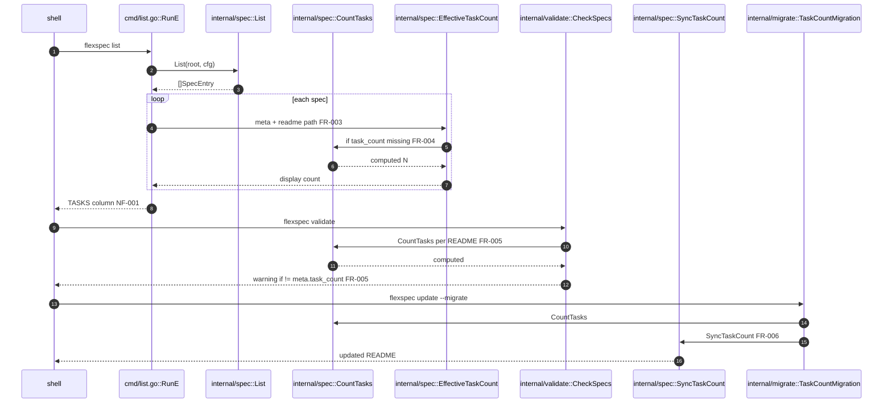

# Task count metadata

> **Status**: complete · **Priority**: medium · **Created**: 2026-06-03 · **Tasks**: 5

## 1. Summary

**Problem:** `flexspec list` shows `TASKS` as `len(tasks/)` files. Simple specs keep tasks in §3.2 of `README.md` only, so every simple row shows `0` even when the spec has multiple `T-XXX` items (e.g. `011-cli-table-output` has four tasks but lists `0`).

**Outcome:** Each spec README carries an authoritative `task_count` in YAML frontmatter and in the blockquote metadata line under the title (`**Tasks**: N`). `flexspec list` prints that value. Expanded specs count `tasks/T-*.md` files; simple specs count `T-XXX` bullets in the README body. `flexspec validate` warns when stored count drifts from computed count. `flexspec update` migration backfills existing specs.

**In scope:** `task_count` field; metadata header format in bundled templates; `internal/spec` count/sync helpers; `cmd/list.go`; validate rule; one migration; tests; README note for agents to keep count in sync when editing §3.2 or task files.

**Out of scope:** New CLI subcommand; auto-sync on every `status set`; UI board column changes; changing `--json` task array shape (may add `task_count` field alongside existing `tasks`).

## 2. Design

### 2.1 Architecture / Technical Plan

Add `TaskCount int` to `SpecMeta`. Implement `CountTasks(readmePath, specType)` (expanded → `loadTasks`; simple → count lines matching `^\s*-\s+\*\*T-\d{3}\*\*` in body after frontmatter). Implement `SyncTaskCount(readmePath)` to set frontmatter `task_count` and rewrite the blockquote metadata line to include `· **Tasks**: N` (preserve other fields on that line when possible; insert segment if missing).

`spec.List` leaves task file loading as today for JSON/API; list human column uses `effectiveTaskCount(meta, readmePath)` — prefer non-negative frontmatter `task_count` when present, else computed count (back-compat for specs not yet migrated).

| File / Component | Type | Role |
| --- | --- | --- |
| `internal/spec/spec.go` | modified | `TaskCount` on `SpecMeta`; `CountTasks`; `EffectiveTaskCount` |
| `internal/spec/frontmatter.go` | modified | `SyncTaskCount`, metadata line updater |
| `internal/spec/metadata_test.go` | modified | Count/sync tests for simple + expanded |
| `internal/validate/specs.go` | modified | `specs.task_count_mismatch` warning |
| `internal/migrate/task_count.go` | new | Backfill `task_count` + header for all specs |
| `internal/migrate/migrate.go` | modified | Register migration |
| `cmd/list.go` | modified | Use effective task count |
| `cmd/list_test.go` | modified | Simple spec with `task_count: 3` shows `3` |
| `templates/flexspec-simple.md` | modified | `task_count: 0`, `**Tasks**: 0` in header |
| `templates/expanded/flexspec-expanded.md` | modified | Same |
| `flexspec-simple.md`, `flexspec-expanded.md` | modified | Root embed copies |
| `skills/flexspec/SKILL.md` | modified | Agents update `task_count` + header when adding/removing tasks |
| `README.md` | modified | Document field + list behavior |

### 2.2 Code Map

| Step | Location | Executes | Input / condition | Output / side effect | FR/NF |
| --- | --- | --- | --- | --- | --- |
| 1 | `cmd/list.go` | format row | `SpecEntry` | calls effective count | FR-003 |
| 2 | `EffectiveTaskCount` | choose source | `SpecMeta`, path | frontmatter or computed | FR-003, FR-004 |
| 3 | `CountTasks` | count | `spec_type`, body/tasks dir | integer N | FR-001, FR-002 |
| 4 | `validate.CheckSpecs` | compare | meta vs computed | warning finding | FR-005 |
| 5 | `SyncTaskCount` | write README | path | YAML + blockquote updated | FR-006 |
| 6 | `TaskCountMigration` | batch sync | all spec READMEs | backfill | FR-006 |

### 2.3 Requirements

**Functional**

- **FR-001** — Simple specs: `CountTasks` counts markdown list items matching `- **T-NNN**` (three-digit task id) in the README body.
- **FR-002** — Expanded specs: `CountTasks` equals the number of `tasks/T-*.md` files (same rules as `loadTasks`, excluding directories and `README.md`).
- **FR-003** — `flexspec list` human `TASKS` column uses `task_count` from frontmatter when the field is present and ≥ 0; otherwise uses `CountTasks` result.
- **FR-004** — New templates scaffold `task_count: 0` in YAML and `· **Tasks**: 0` in the blockquote metadata line under the H1.
- **FR-005** — `flexspec validate` emits a **warning** (not error) per spec when `task_count` in frontmatter differs from `CountTasks`.
- **FR-006** — A registered migration (via `flexspec update`) runs `SyncTaskCount` on every spec `README.md` to backfill frontmatter and metadata header.

**Non-Functional**

- **NF-001** — No new third-party dependencies; reuse `yaml.v3` and existing frontmatter split/write patterns.
- **NF-002** — Table-driven tests; `go test -race`, `gofmt`, `go vet`, `golangci-lint` pass (charter §7).

## 3. Implementation Plan

§3.1 omitted: linear five-task change; build order T-001 → T-002 → T-003/T-004 → T-005.

### 3.2 Task List

- **T-001** — Add `TaskCount`, `CountTasks`, `EffectiveTaskCount`, `SyncTaskCount`, metadata line helper; unit tests in `internal/spec` _(satisfies: FR-001, FR-002, FR-004, FR-006; files: `internal/spec/spec.go`, `internal/spec/frontmatter.go`, `internal/spec/metadata_test.go`; §2.2 steps: 3, 5)_
- **T-002** — Update templates (`.flexspec/templates`, root embed copies) with `task_count` and `**Tasks**` header segment _(satisfies: FR-004; files: `templates/*`, `flexspec-simple.md`, `flexspec-expanded.md`; depends_on: T-001)_
- **T-003** — Wire `cmd/list.go` to effective count; update `cmd/list_test.go` _(satisfies: FR-003; files: `cmd/list.go`, `cmd/list_test.go`; depends_on: T-001; §2.2 steps: 1–2)_
- **T-004** — Add validate warning `specs.task_count_mismatch`; tests _(satisfies: FR-005; files: `internal/validate/specs.go`, `internal/validate/specs_test.go`; depends_on: T-001; §2.2 steps: 4)_
- **T-005** — Add migration + register; optional `task_count` on `ui.SpecJSON` for `--json`; README + skill note _(satisfies: FR-006, NF-001; files: `internal/migrate/task_count.go`, `internal/migrate/migrate.go`, `internal/ui/types.go`, `internal/ui/encode.go`, `skills/flexspec/SKILL.md`, `README.md`; depends_on: T-001, T-002; §2.2 steps: 6)_

## 4. Testing Criteria

| Test ID | Verifies | Description | Type |
| --- | --- | --- | --- |
| TC-001 | FR-001 | Simple README with three `T-XXX` bullets → `CountTasks` == 3 | unit |
| TC-002 | FR-002 | Expanded spec with 2 task files → `CountTasks` == 2 | unit |
| TC-003 | FR-003 | List human output shows frontmatter `task_count` when set; falls back when omitted | unit |
| TC-004 | FR-005 | Validate warns on mismatch; silent when equal | unit |
| TC-005 | FR-006 | Migration sets frontmatter and `**Tasks**` line on fixture spec | unit |
| TC-006 | FR-004 | `flexspec new` README contains `task_count: 0` and `**Tasks**: 0` | integration |

## 5. Other

- **Assumption:** Task bullets use template form `- **T-001** —`; index-table-only mentions without list bullets are not counted (expanded uses files only).
- **Risk:** Manual edits to metadata line without frontmatter (or vice versa) — validate warning + migration resync address drift.
- **Agent habit:** `/flexspec` skill should tell implementers to bump `task_count` and the blockquote `**Tasks**` segment when adding/removing §3.2 items or task files (T-005).
- **Charter:** User confirmed update §4 (Capabilities / CLI) in T-005 when implementation lands.
