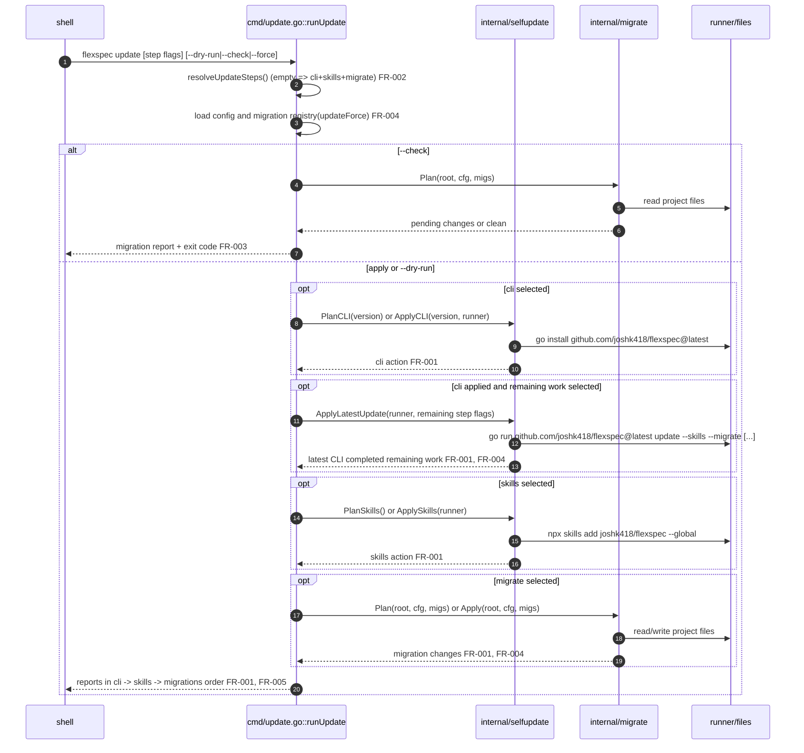

# Update command order

> **Status**: draft · **Priority**: high · **Created**: 2026-06-04 · **Tasks**: 3

## 1. Summary

`flexspec update` currently runs migrations, then skills, then `go install` for the CLI. That means a user who has an older binary may need to run `flexspec update` twice: once to install the newer CLI, then again so the newer CLI can discover and apply migrations or update behavior shipped by that version.

This spec changes the default orchestration so the CLI update step runs first, followed by skills and then migrations. The intended outcome is that a bare `flexspec update` updates the installed CLI before doing the rest of the work, then delegates the remaining selected work to the latest module so users do not need to run the command again for newly shipped migration/update behavior.

In scope: update command ordering, user-facing long help/order text, output/order tests, and preserving existing step flag behavior. Out of scope: replacing the running process after `go install`, changing how `go install` resolves `@latest`, changing migration registration, or changing `--force` beyond its existing migration-template overwrite behavior.

## 2. Design

### 2.1 Architecture / Technical Plan

`cmd/update.go` already resolves selected step groups through `resolveUpdateSteps()` and then orchestrates migrations and self-update actions. The implementation will reorder the execution blocks so `doCLI` is handled before `doSkills`, and migrations are handled after both self-update steps. When a real apply run includes `--cli` plus remaining `--skills` or `--migrate` work, the current process applies `go install` first, without first loading project migrations, and then invokes `go run github.com/joshk418/flexspec@latest update ...` for the remaining selected steps. The child run omits `--cli` to avoid recursion and receives migration flags such as `--force` and `--only`.

`--dry-run` and `--check` keep their existing safety contracts. `--dry-run` plans every selected step without writing or spawning processes. `--check` remains a migrations-only CI gate for pending migration detection; it must not run self-update commands even though the default runtime order changes. `--force` continues to flow only into `migrate.Registry(templatesFS, updateForce)` and only affects the templates-resync migration's overwrite behavior.

| File / Component | Type | Role in this spec |
| --- | --- | --- |
| `cmd/update.go` | modified | Reorder default orchestration and update command long help text |
| `cmd/update_test.go` | modified | Assert execution/output order and unchanged flag semantics |
| `internal/selfupdate/selfupdate.go` | modified | Existing CLI/skills helpers plus latest-module update delegation |
| `internal/migrate/registry.go` | reference | Existing migration registry keeps receiving `updateForce` unchanged |

### 2.2 Code Map

| Step | Location | Executes | Input / condition | Output / side effect | FR/NF |
| --- | --- | --- | --- | --- | --- |
| 1 | `cmd/update.go :: runUpdate` | command entry | selected flags | begins update orchestration | FR-001 |
| 2 | `cmd/update.go :: resolveUpdateSteps` | step resolution | `--cli`, `--skills`, `--migrate` | selected booleans; none => all | FR-002 |
| 3 | `cmd/update.go :: runUpdate` | config and registry load | project root, `updateForce` | migrations prepared with existing force semantics | FR-004 |
| 4 | `cmd/update.go :: runUpdate` | check branch | `--check` | migration plan only; no self-update | FR-003, NF-001 |
| 8 | `cmd/update.go :: runUpdate` | CLI self-update branch | cli selected, not `--check` | CLI action planned/applied first | FR-001, FR-005 |
| 11 | `internal/selfupdate :: ApplyLatestUpdate` | latest CLI handoff | apply run with cli plus remaining work | `go run ...@latest update` handles skills/migrations | FR-001, FR-004 |
| 12 | `cmd/update.go :: runUpdate` | skills self-update branch | skills selected, not `--check` | skills action planned/applied second | FR-001, FR-005 |
| 16 | `cmd/update.go :: runUpdate` | migration branch | migrate selected, not `--check` | migrations planned/applied after self-update | FR-001, FR-004, FR-005 |
| 19 | `cmd/update.go :: runUpdate` | report | collected actions/changes | stdout and exit code | FR-005 |

### 2.3 Requirements

**Functional**

- **FR-001** — Bare `flexspec update` runs selected work in this order: CLI update first, skills update second, migrations third; after a successful CLI apply, remaining skills/migration work runs through the latest module so users only need one command and the parent process does not require current-project migration loading before the CLI update.
- **FR-002** — Step flags keep existing selection behavior: no step flags selects all steps; any `--cli`, `--skills`, or `--migrate` flag restricts execution to the selected set.
- **FR-003** — `--check` remains detect-only for migrations and never runs or plans CLI/skills self-update actions.
- **FR-004** — `--force` keeps its current meaning: it is passed only to the migration registry and affects template overwrite behavior only when migrations apply.
- **FR-005** — Human-facing long help and command output order reflect the new CLI -> skills -> migrations order, without retaining the old re-run note that assumed CLI ran last.

**Non-Functional**

- **NF-001** — `--dry-run` and `--check` must not write files or invoke external processes; existing injected runner tests must continue to enforce this.
- **NF-002** — The change must not add dependencies or shell interpolation; self-update still uses the existing `internal/selfupdate` runner abstraction.

## 3. Implementation Plan

### 3.2 Task List

- **T-001** — Reorder `cmd/update.go::runUpdate` so CLI actions are planned/applied before skills, and apply runs delegate remaining work to the latest module _(satisfies: FR-001, FR-003, FR-004, NF-002; files: `cmd/update.go`, `internal/selfupdate/selfupdate.go`; depends_on: none; §2.2 steps: 3-16)_.
- **T-002** — Update `cmd/update.go` long help and remove/replace the old "re-run after upgrading CLI" note so user-facing text matches the new order _(satisfies: FR-005; files: `cmd/update.go`; depends_on: T-001; §2.2 step: 19)_.
- **T-003** — Add/update `cmd/update_test.go` and `internal/selfupdate/selfupdate_test.go` coverage for default dry-run/report order, latest-module handoff, `--check` migration-only behavior, and unchanged step flag selection _(satisfies: FR-001, FR-002, FR-003, FR-004, FR-005, NF-001; files: `cmd/update_test.go`, `internal/selfupdate/selfupdate_test.go`; depends_on: T-001, T-002; §2.2 steps: 2-19)_.

## 4. Testing Criteria

| Test ID | Verifies | Description | Type |
| --- | --- | --- | --- |
| TC-001 | FR-001, FR-005 | Default `--dry-run` output lists/plans CLI before skills before migrations. | unit |
| TC-002 | FR-001, NF-002 | Applied update with injected runner records `go install` followed by `go run ...@latest update --skills --migrate`. | unit |
| TC-003 | FR-002 | Existing `resolveUpdateSteps` tests still prove no flags => all and a single flag restricts to that step. | unit |
| TC-004 | FR-003, NF-001 | `--check` with default steps reports migration status and does not call the runner or print self-update actions. | unit |
| TC-005 | FR-004 | Existing force-backed migration tests continue to own overwrite semantics; update tests verify `updateForce` still only feeds migration setup. | unit |
| TC-006 | NF-001, NF-002 | `go test ./cmd ./internal/migrate ./internal/selfupdate` passes; broader project tests run if practical. | automated |

## 5. Other

- `§3.1 omitted: linear 3-task change in one CLI command file plus tests; §3.2 maps every execution step.`
- This is a behavior fix, not a new option. No new flag is required, and `--force` should not be repurposed.
- Charter freshness: no charter update required. The charter already describes `flexspec update` as updating CLI, skills, and migrations; it does not mandate the old internal order.
- Open questions: none.
