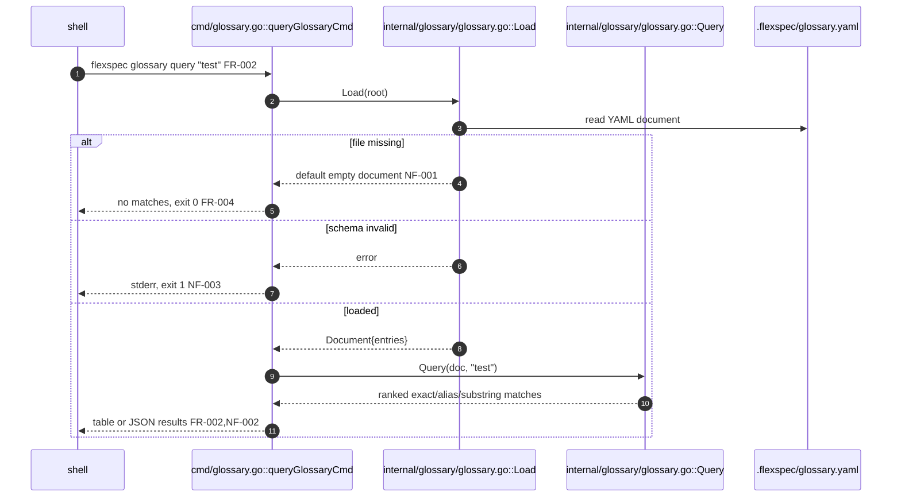
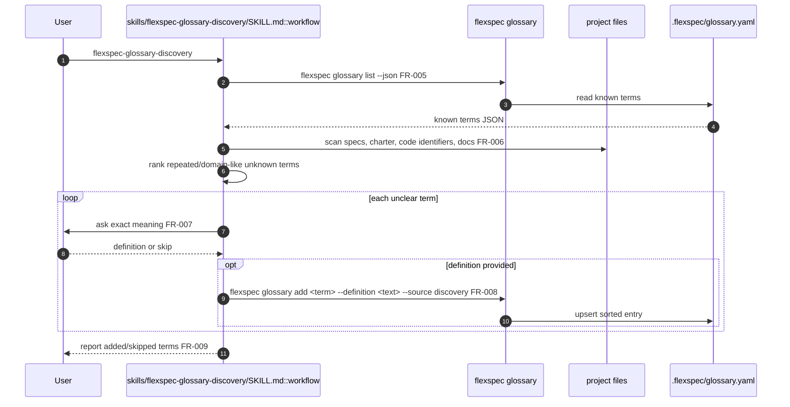
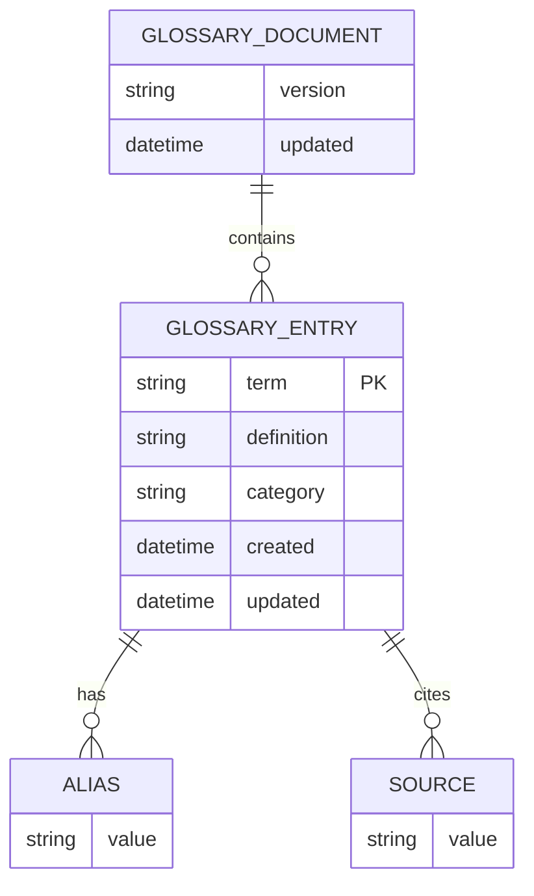
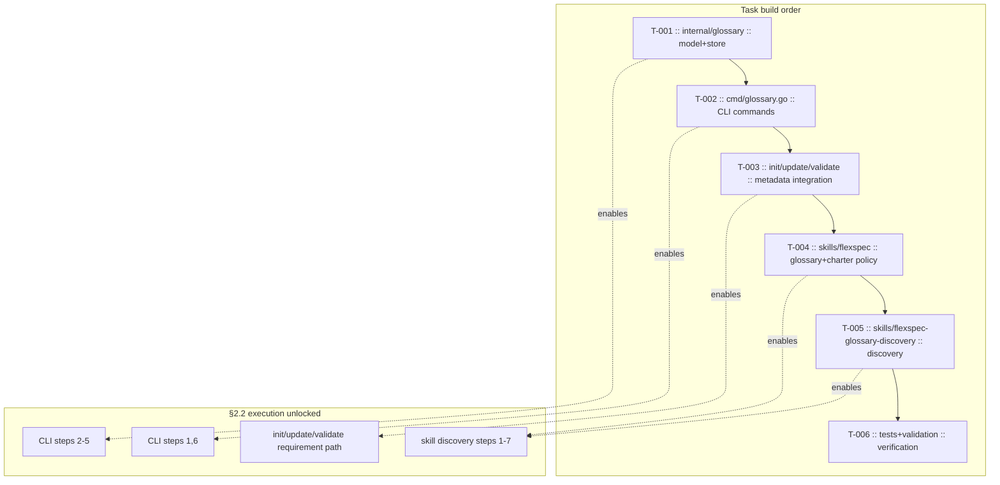

# CLI glossary

> **Status**: complete · **Priority**: high · **Created**: 2026-06-06 · **Tasks**: 6

## 1. Summary

FlexSpec projects need a fast way for humans and AI agents to preserve company, industry, and project-specific vocabulary. Today the charter has a small static domain glossary, but there is no dedicated `.flexspec/` artifact or CLI surface for discovering, recording, listing, and searching project terms.

This feature adds a first-class glossary stored under `.flexspec/glossary.yaml`, a `flexspec glossary` command group for listing/querying/upserting terms, validation and update support for the new metadata file, and skill changes so agents watch for unfamiliar project-specific terms. When a term is unclear, the skill interviews the user for the exact meaning; when a term is clear, it can be recorded directly. A new `flexspec-glossary-discovery` skill scans a project for candidate terms and drives the same clarification workflow.

**In scope:** glossary file schema and helpers; `flexspec glossary list`, `query`, and `add` command behavior; init/update/validate integration; `/flexspec` skill charter policy change so charter updates happen without asking; `/flexspec` glossary awareness; new `flexspec-glossary-discovery` skill; charter sync for the new glossary capability.

**Out of scope:** hosted glossary services, embeddings/vector search, UI pages, automatic LLM-based definition generation without user confirmation for unclear terms, and modifying project docs outside `.flexspec/` or the configured specs directory.

## 2. Design

### 2.1 Architecture / Technical Plan

Store glossary entries in `.flexspec/glossary.yaml` with deterministic ordering by term. The CLI uses a new `internal/glossary` package for load/save/search/upsert behavior. `flexspec init` creates an empty glossary file without clobbering user edits; `flexspec update --migrate` backfills the file for existing projects; `flexspec validate` reports schema errors. Human-readable glossary output follows the existing aligned table convention; `--json` returns scriptable results.

The `/flexspec` skill changes its charter freshness behavior: when a spec implies charter updates, the skill updates `.flexspec/charter.md` directly and records the change in the spec instead of asking first. The same skill also checks `.flexspec/glossary.yaml` during authoring and implementation, asks when an unfamiliar project-specific term is ambiguous, and records clear/confirmed terms. The new `flexspec-glossary-discovery` skill performs a focused repository scan for repeated or domain-like terms, compares them against the glossary, and interviews the user only for definitions that cannot be inferred safely.

| File / Component | Type | Role in this spec |
| --- | --- | --- |
| `internal/glossary/glossary.go` | new | Glossary YAML model, default document, load/save/upsert/search/list helpers |
| `internal/glossary/glossary_test.go` | new | Table-driven tests for parsing, ordering, upsert, and query matching |
| `cmd/glossary.go` | new | Cobra command group: `flexspec glossary list`, `query`, `add` |
| `cmd/glossary_test.go` | new | CLI behavior tests for table/JSON output, empty state, missing args, and add/query flow |
| `cmd/init.go` | modified | Creates `.flexspec/glossary.yaml` on init without clobbering |
| `cmd/update.go` | modified | Handles absent embedded template FS safely while loading glossary migration registry in tests/update paths |
| `internal/validate/flexspec.go` | modified | Validates glossary file presence and schema |
| `internal/update/migrations/*` | modified/new | Adds migration to create `.flexspec/glossary.yaml` when missing |
| `templates/glossary.yaml` | new | Seed glossary document copied by init/update |
| `skills/flexspec/SKILL.md` | modified | Charter updates are automatic; glossary watch/record rules added to lifecycle workflow |
| `skills/flexspec-glossary-discovery/SKILL.md` | new | Discovery skill workflow for scanning terms and interviewing the user |
| `.flexspec/charter.md` | modified | Charter documents planned glossary capability and automatic charter update policy |

### 2.2 Code Map

#### CLI glossary query path

| Step | Location | Executes | Input / condition | Output / side effect | FR/NF |
| --- | --- | --- | --- | --- | --- |
| 1 | `cmd/glossary.go :: queryGlossaryCmd` | Cobra RunE | `flexspec glossary query "test"` | resolves cwd and validates args | FR-002 |
| 2 | `internal/glossary/glossary.go :: Load` | load glossary | project root | reads `.flexspec/glossary.yaml` | NF-001 |
| 3 | `.flexspec/glossary.yaml` | filesystem read | file exists/missing/invalid | bytes or missing state | NF-001 |
| 4 | `Load` | parse/default | YAML result | document or schema error | NF-003 |
| 5 | `internal/glossary/glossary.go :: Query` | search entries | document + query | ordered matching entries | FR-002 |
| 6 | `cmd/glossary.go :: writeResults` | render output | matches + `--json` flag | table/JSON and exit code | FR-004, NF-002 |

#### Skill discovery path

| Step | Location | Executes | Input / condition | Output / side effect | FR/NF |
| --- | --- | --- | --- | --- | --- |
| 1 | `skills/flexspec-glossary-discovery/SKILL.md :: workflow` | skill trigger | user asks for glossary discovery | starts scan flow | FR-005 |
| 2 | `flexspec glossary list --json` | CLI list | project root | known terms JSON | FR-001 |
| 3 | `project files` | repository scan | specs, charter, code, docs | candidate terms | FR-006 |
| 4 | `workflow :: rank` | filter candidates | known terms + candidates | unknown likely project terms | FR-006 |
| 5 | `workflow :: interview` | ask user | unclear term | exact definition or skip | FR-007 |
| 6 | `flexspec glossary add` | upsert entry | confirmed term definition | `.flexspec/glossary.yaml` updated | FR-003, FR-008 |
| 7 | `workflow :: report` | summarize | added/skipped list | final report | FR-009 |

### 2.3 Data Model

| Entity | Change | Key fields | Notes |
| --- | --- | --- | --- |
| `.flexspec/glossary.yaml` | new | `version`, `updated`, `terms[]` | YAML metadata file under `.flexspec/`; committed with project metadata |
| `terms[]` | new | `term`, `definition`, `aliases`, `category`, `sources`, `created`, `updated` | Sorted case-insensitively by `term`; definitions are required for persisted entries |

### 2.4 External Interfaces

| Interface | Type | Contract / Shape | Notes |
| --- | --- | --- | --- |
| `flexspec glossary list [--json]` | CLI | no args -> all entries as aligned table or JSON | Empty glossary exits 0 with clear empty state |
| `flexspec glossary query <text> [--json]` | CLI | query term/alias/substrings -> matching entries | Exact term and alias matches rank before substring matches |
| `flexspec glossary add <term> --definition <text> [--alias <a>] [--category <c>] [--source <s>]` | CLI | upsert one entry | Used by skills after clear inference or user confirmation |
| `.flexspec/glossary.yaml` | file | YAML document with version + terms array | Created by init/update and validated by `flexspec validate` |
| `flexspec-glossary-discovery` | skill | scans project, interviews user, writes via CLI | No web lookup required |
| `/flexspec` lifecycle | skill | watches glossary terms and updates charter automatically | Charter delta questions are removed |
| `/flexspec-charter` | skill | invokes glossary discovery during charter creation/update | Glossary discovery remains standalone |

### 2.5 Requirements

**Functional**

- **FR-001** — `flexspec glossary list` lists all glossary terms from `.flexspec/glossary.yaml` in aligned table output, and `--json` emits a machine-readable document.
- **FR-002** — `flexspec glossary query <text>` searches term, aliases, category, and definition text, returning exact term/alias matches before substring matches.
- **FR-003** — `flexspec glossary add <term> --definition <text>` upserts an entry, preserves aliases/sources unless replaced or appended, and writes entries in deterministic term order.
- **FR-004** — Empty glossary list/query commands exit 0 and produce a clear no-results message instead of an error.
- **FR-005** — `/flexspec` reads `.flexspec/glossary.yaml` during authoring/implementation and treats unknown project-specific terms as glossary candidates.
- **FR-006** — `flexspec-glossary-discovery` scans specs, charter, likely docs, and code identifiers for repeated/domain-specific terms not already in the glossary.
- **FR-007** — Skills ask the user for the exact meaning when a candidate term is project-specific but unclear.
- **FR-008** — Skills add clear or user-confirmed terms through `flexspec glossary add`, including at least one source marker.
- **FR-009** — Discovery reports added, skipped, and still-ambiguous terms at the end of each run.
- **FR-010** — `flexspec init` and `flexspec update --migrate` create `.flexspec/glossary.yaml` for projects that do not have it, without overwriting existing glossary content.
- **FR-011** — `flexspec validate` checks glossary YAML shape and reports errors for malformed entries.
- **FR-012** — `/flexspec` automatically updates `.flexspec/charter.md` when specs imply charter changes; it must not ask a charter delta question before making in-scope charter updates.
- **FR-013** — `/flexspec-charter` invokes the glossary discovery workflow during charter creation, full refresh, or terminology-heavy updates so the glossary is built alongside the charter, while the glossary discovery skill remains runnable standalone.

**Non-Functional**

- **NF-001** — Missing glossary files are handled predictably: read commands use an empty document, while init/update create the file.
- **NF-002** — Human-readable output uses existing `internal/clioutput` aligned table conventions; JSON output is stable for agent use.
- **NF-003** — Glossary parse/schema errors include the file path and enough detail to fix the entry.
- **NF-004** — Glossary work stays local to `.flexspec/`, configured specs, CLI internals, and skill files; no hosted service or network lookup.
- **NF-005** — Skill guidance avoids fabricated definitions: unclear meanings require user confirmation before being persisted.

## 3. Implementation Plan

### 3.1 Implementation Code Map

| Task | Build after | Implements §2.2 steps | Symbols added/changed | Execution unlocked |
| --- | --- | --- | --- | --- |
| T-001 | — | CLI 2-5 | `internal/glossary.Load`, `Save`, `Query`, `Upsert` | glossary file read/search/write behavior |
| T-002 | T-001 | CLI 1,6; discovery 2,6 | `cmd/glossary.go` command group | user/skill CLI access to glossary |
| T-003 | T-002 | metadata paths for FR-010/FR-011 | `init`, `validate`, `update` integration | glossary exists and validates in FlexSpec projects |
| T-004 | T-003 | discovery 1,5-7; FR-012, FR-013 | `skills/flexspec/SKILL.md`, `skills/flexspec-charter/SKILL.md` | lifecycle and charter skills watch terms and update charter/glossary workflows |
| T-005 | T-004 | discovery 1-7; FR-013 | `skills/flexspec-glossary-discovery/SKILL.md` | project vocabulary discovery workflow, including standalone/manual trigger aliases |
| T-006 | T-005 | all paths asserted | tests and `flexspec validate` | review-ready implementation |

### 3.2 Task List

| Task | File | Satisfies | Depends on | Summary |
| --- | --- | --- | --- | --- |
| **T-001** | `tasks/T-001-glossary-store.md` | FR-002, FR-003, NF-001, NF-003 | — | Add glossary YAML model and deterministic load/save/search/upsert helpers; owns CLI §2.2 steps 2-5. |
| **T-002** | `tasks/T-002-glossary-cli.md` | FR-001, FR-002, FR-003, FR-004, NF-002 | T-001 | Add `flexspec glossary list/query/add` commands; owns CLI §2.2 steps 1 and 6. |
| **T-003** | `tasks/T-003-metadata-integration.md` | FR-010, FR-011, NF-001, NF-003 | T-002 | Add template, init, update migration, update command guard, and validate support for `.flexspec/glossary.yaml`. |
| **T-004** | `tasks/T-004-flexspec-skill-glossary.md` | FR-005, FR-007, FR-008, FR-012, FR-013, NF-004, NF-005 | T-003 | Update `/flexspec` and `/flexspec-charter` skills for glossary awareness and automatic charter/glossary updates. |
| **T-005** | `tasks/T-005-glossary-discovery-skill.md` | FR-006, FR-007, FR-008, FR-009, FR-013, NF-004, NF-005 | T-004 | Add `flexspec-glossary-discovery` skill for project term scanning, user interviews, and standalone/manual runs. |
| **T-006** | `tasks/T-006-verification.md` | FR-001-FR-013, NF-001-NF-005 | T-005 | Add/run focused tests and `flexspec validate`; update charter for delivered capability. |

## 4. Testing Criteria

| Test ID | Verifies | Implemented by | Description | Type |
| --- | --- | --- | --- | --- |
| TC-001 | FR-002, FR-003, NF-001, NF-003 | T-001 | Table-driven `internal/glossary` tests cover missing file, malformed YAML, deterministic sort, upsert preservation, and query ranking. | unit |
| TC-002 | FR-001, FR-002, FR-004, NF-002 | T-002 | `cmd/glossary_test.go` verifies table and JSON output for list/query, empty state, and missing query argument errors. | unit |
| TC-003 | FR-003, FR-008 | T-002 | CLI add followed by query returns the inserted definition, aliases, category, and source. | integration |
| TC-004 | FR-010, FR-011 | T-003 | Init creates glossary, existing file is not clobbered, update migration backfills missing glossary, and validate catches malformed entries. | unit/integration |
| TC-005 | FR-005, FR-007, FR-008, FR-012, FR-013, NF-005 | T-004 | Manual review confirms `/flexspec` reads glossary, `/flexspec-charter` invokes discovery during charter work, unclear terms require user confirmation, confirmed terms persist through CLI, and charter updates happen without asking. | manual review |
| TC-006 | FR-006, FR-007, FR-008, FR-009, FR-013 | T-005 | Manual review confirms discovery skill scans likely sources, filters known terms, interviews for unclear terms, writes through CLI, reports outcomes, and remains runnable standalone. | manual review |
| TC-007 | FR-001-FR-013 | T-006 | `go test ./...`, `go vet ./...`, `gofmt`, and `flexspec validate` pass after implementation. | verification |

## 5. Other

- **Charter delta resolved by user on 2026-06-06:** update `.flexspec/charter.md` for glossary capability and the new automatic charter update policy. Future `/flexspec` runs should update charter files without asking when a spec implies in-scope charter changes.
- **Additional user request on 2026-06-06:** `/flexspec-charter` should invoke glossary discovery while creating/updating the charter, and the glossary discovery skill should remain available for standalone/manual runs.
- **Assumption:** glossary entries are YAML, not markdown, because CLI list/query/add need structured fields and deterministic updates.
- **Assumption:** `query` uses deterministic lexical/rule-based matching, not embeddings or network calls.
- **Risk:** automated term detection can produce noisy candidates; mitigate by ranking repeated/domain-like terms and asking the user before saving unclear definitions.
