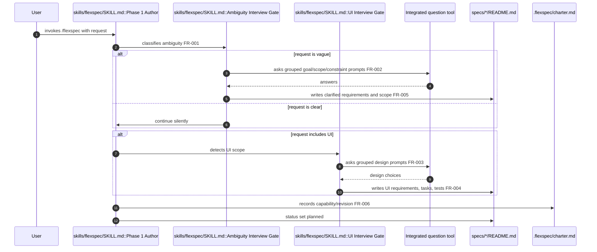

# Deepen UI and ambiguity interviews

> **Status**: complete · **Priority**: high · **Created**: 2026-06-14 · **Tasks**: 3

## 1. Summary

**Problem:** `/flexspec` already runs a UI interview gate, but it covers a narrow set of UI topics and does nothing for non-UI specs that arrive vague or underspecified. Agents still default to assumptions when a request is ambiguous, which produces specs that miss success criteria, scope boundaries, or design intent.

**Outcome:** The FlexSpec skill gains two reinforced question-asking behaviors:
1. An **Ambiguity Interview Gate** that runs for any vague request — UI or not — before a spec reaches `planned`.
2. A **deeper UI Interview Gate** that asks structured questions across visual identity, layout system, component library, motion/feedback, UX flows/content, and accessibility/input.

Answers from both gates must be translated into concrete requirements, tasks, tests, and §5 assumptions/risks.

**In scope:** `skills/flexspec/SKILL.md` Phase 1 workflow and interview gates; `.flexspec/charter.md` capability/revision notes.

**Out of scope:** Changing FlexSpec templates, adding new CLI commands, implementing vendor-specific question adapters, or modifying the management UI code.

## 2. Design

### 2.1 Architecture / Technical Plan

Update `skills/flexspec/SKILL.md` so Phase 1 performs classification before authoring. If the user's request is ambiguous — missing goals, scope, success criteria, constraints, or key unknowns — the agent runs the Ambiguity Interview Gate using the same structured-question contract as the UI gate. If the request also creates or changes user-facing UI, the agent then runs the expanded UI Interview Gate.

| File / Component | Type | Role in this spec |
| --- | --- | --- |
| `skills/flexspec/SKILL.md` | modified | Add Ambiguity Interview Gate and expand UI Interview Gate |
| `.flexspec/charter.md` | modified | Record strengthened interview capabilities and revision history |
| `specs/004-enhance-ui-interviews/README.md` | reference | Prior UI interview work this spec extends |

### 2.2 Code Map

| Step | Location | Executes | Input / condition | Output / side effect | FR/NF |
| --- | --- | --- | --- | --- | --- |
| 1 | `skills/flexspec/SKILL.md :: Phase 1 Author` | request classification | User request | Routes to ambiguity gate before planning | FR-001 |
| 2 | `skills/flexspec/SKILL.md :: Ambiguity Interview Gate` | ambiguity detection | Missing goals/scope/constraints/success criteria | Triggers structured question round | FR-001, FR-002 |
| 3 | Integrated question tool | question roundtrip | Grouped ambiguity prompts | Returns clarified choices | FR-002 |
| 4 | `specs/*/README.md` | spec authoring | Ambiguity answers | Records requirements, scope, tasks, tests, assumptions | FR-005 |
| 5 | `skills/flexspec/SKILL.md :: UI Interview Gate` | UI scope detection | UI-bearing request | Triggers expanded design prompts | FR-003 |
| 6 | Integrated question tool | question roundtrip | Expanded UI design prompts | Returns design choices | FR-003 |
| 7 | `specs/*/README.md` | spec authoring | UI design answers | Records UI requirements, tasks, tests, assumptions | FR-004 |
| 8 | `.flexspec/charter.md` | charter update | New capability delta | Adds capability/revision note | FR-006 |

### 2.3 Requirements

**Functional**

- **FR-001** — `/flexspec` must classify every request for ambiguity before planning and run the Ambiguity Interview Gate when goals, scope, success criteria, constraints, or key unknowns are missing or vague.
- **FR-002** — The Ambiguity Interview Gate must use the integrated structured question tool when available, with grouped multiple-choice prompts covering goals, scope boundaries, success criteria, constraints, and open unknowns.
- **FR-003** — The UI Interview Gate must expand to cover visual identity, layout system, component library, motion/feedback, UX flows/content, and accessibility/input, using grouped multiple-choice prompts.
- **FR-004** — `/flexspec` must require UI interview answers to be translated into FR/NF requirements, §2.1 file/component choices, §3 tasks, §4 tests, and §5 assumptions/risks before `status: planned`.
- **FR-005** — `/flexspec` must require Ambiguity Interview Gate answers to be translated into clarified goals, scope, success criteria, constraints, tasks, tests, and assumptions/risks before `status: planned`.
- **FR-006** — Tiny or obviously trivial edits may skip the gates, but the agent must record the skip rationale in §5 Other.

**Non-Functional**

- **NF-001** — Question-tool guidance must stay runtime-agnostic; name Cursor `AskQuestion`, Claude/Codex equivalents only as examples.
- **NF-002** — Additions must stay concise and preserve existing lifecycle, charter-gate, scope, and token-budget rules.

## 3. Implementation Plan

§3.1 omitted: linear 3-task skill/charter update with a single execution path; §3.2 conveys build order and §2.2 linkage.

### 3.2 Task List

- **T-001** — Add an Ambiguity Interview Gate to `skills/flexspec/SKILL.md`, including trigger conditions, question groups, structured-tool usage, and answer-to-spec mapping. _(satisfies: FR-001, FR-002, FR-005, NF-001, NF-002)_
- **T-002** — Expand the UI Interview Gate in `skills/flexspec/SKILL.md` with design areas for visual identity, layout system, component library, motion/feedback, UX flows/content, and accessibility/input. _(satisfies: FR-003, FR-004, NF-001, NF-002)_
- **T-003** — Update `.flexspec/charter.md` capabilities and revision history for the strengthened ambiguity and UI interview gates; run `flexspec validate`. _(satisfies: FR-006, NF-002)_

## 4. Testing Criteria

| Test ID | Verifies | Description | Type |
| --- | --- | --- | --- |
| TC-001 | FR-001, FR-002 | `skills/flexspec/SKILL.md` defines Ambiguity Interview Gate trigger conditions and question groups | manual read |
| TC-002 | FR-003, FR-004 | `skills/flexspec/SKILL.md` lists all six expanded UI design areas and requires answer mapping into requirements/tasks/tests/assumptions | manual read |
| TC-003 | FR-005 | Ambiguity gate requires answer mapping into goals, scope, success criteria, constraints, tasks, tests, and assumptions | manual read |
| TC-004 | FR-006 | Skill documents gate-skip rationale for tiny edits in §5 Other | manual read |
| TC-005 | NF-001 | Question-tool guidance remains runtime-agnostic with named examples only | manual read |
| TC-006 | NF-002 | Existing lifecycle, charter-gate, and token-budget rules remain intact | manual read |
| TC-007 | FR-001–FR-006 | `flexspec validate` succeeds | CLI |

## 5. Other

**Assumptions**

- The current agent runtime already exposes a structured multiple-choice question tool, so the skill can rely on the same contract established in spec 004.
- "Tiny or obviously trivial edits" means one-line copy changes, single-color tweaks, or similarly scoped one-file fixes with no behavior change.
- Charter delta for strengthened interview capabilities is in scope and will be applied automatically.

**Risks**

- Over-questioning could fatigue users on repeated small requests. Mitigate by allowing documented skips for trivial edits and grouping prompts.
- Too many UI design areas could exceed token budgets. Mitigate by asking only the groups relevant to the feature.

**Charter updates applied automatically**

- `.flexspec/charter.md` §4 capabilities will be updated to mention the Ambiguity Interview Gate and expanded UI design interview.
- `.flexspec/charter.md` §11 revision history will record this spec.
