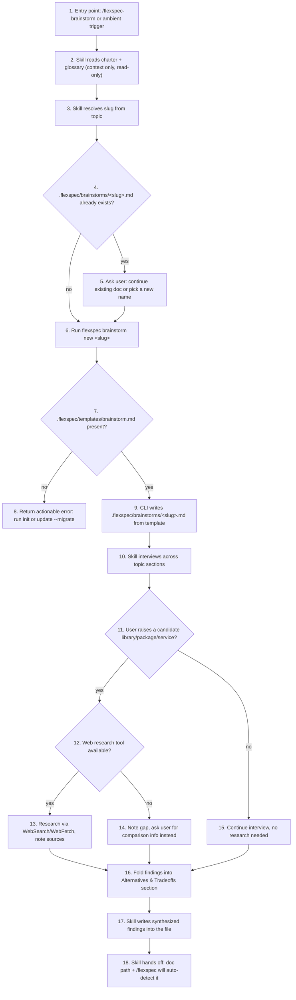
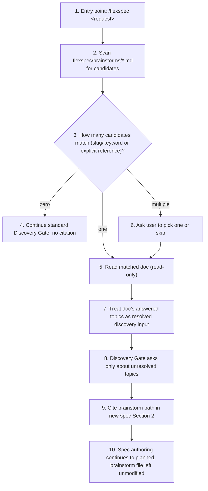

# Brainstorm skill and CLI scaffolding

> **Status**: draft · **Priority**: medium · **Type**: feature · **Created**: 2026-07-01 · **Tasks**: 6

## 1. Summary

- **Problem**: Users have no dedicated space to think through a feature idea (goals, edge cases, security, performance, alternatives) before `/flexspec` Phase 1 authoring. Today the only pre-spec option is the live chat itself, which is lost on `/clear`, compaction, or a new session, and `/flexspec`'s Discovery Gate has no way to reuse earlier exploration.
- **Target outcome**: A new `/flexspec-brainstorm` skill runs an in-depth, non-blocking interview and persists the discussion to `.flexspec/brainstorms/<slug>.md`. `/flexspec` Phase 1 automatically detects a matching brainstorm doc, ingests it as already-answered discovery context, cites it in the new spec, and only asks about what's still unresolved.
- **Affected users/systems**: solo developers and teams using FlexSpec skills; the `flexspec` CLI (new `brainstorm new` subcommand); the `/flexspec` skill (Phase 1 workflow); the embedded template set.
- **In scope**: new embedded template (`templates/brainstorm.md`), new `internal/brainstorm` package, new `flexspec brainstorm new <name>` CLI command, new `flexspec-brainstorm` skill, a Phase 1 addition to `skills/flexspec/SKILL.md` for auto-detect/ingest, template docs update; the brainstorm skill researching candidate libraries/packages/services the user raises during the interview using the runtime's existing web research tools (e.g. `WebSearch`/`WebFetch`, when available), with findings recorded in the doc's Alternatives & Tradeoffs section.
- **Out of scope**: any lifecycle status/frontmatter tracking for brainstorm docs; listing brainstorm docs in `flexspec list`, `flexspec validate`, or the management UI board; deleting or auto-archiving brainstorm docs; a `flexspec brainstorm list` subcommand (agents/skills read the flat `.flexspec/brainstorms/` directory directly); writing back to a brainstorm doc from `/flexspec` (read-only ingestion); building new research/scraping tooling — the skill only uses whatever web research tools the runtime already provides.

## 2. Reasons For Change

- **Driver**: direct user request for a brainstorming capability that precedes spec/plan creation, with in-depth interviews covering security, edge cases, performance, and similar topics, whose output the user can reference when later running `/flexspec`.
- **Value**: de-risks feature ideas before they're locked into a spec; reduces repeated discovery questions across sessions; keeps exploratory thinking durable (file-based) rather than trapped in an ephemeral chat session, consistent with FlexSpec's file-first philosophy.
- **If unchanged**: users either skip structured exploration or repeat it verbally each time they open `/flexspec`, and any exploration done in chat is lost on `/clear`, compaction, or a new session.
- **Assumptions**: brainstorm docs are single flat files (no per-brainstorm sub-directory or numbering) because they are pre-spec exploration notes, not tracked work items; `/flexspec-brainstorm` auto-triggers on ambient brainstorming requests, matching the `/flexspec-charter` and `/flexspec-migrate` convention (no `disable-model-invocation`); the skill reads `.flexspec/charter.md` and `.flexspec/glossary.yaml` for context only and never writes to either; `flexspec validate`'s `requiredTemplates` list is intentionally NOT extended to include `brainstorm.md`, so existing projects are not forced onto `flexspec update --migrate` just to pass validation; the skill researches libraries/packages/services only when the user's own interview answers raise a specific candidate (the user's words are the trigger — no separate permission gate, unlike `/flexspec-migrate`'s tool-detection-failure trigger), using whatever web research tool the runtime already exposes, and never fabricates findings when no such tool is available.
- **Risks**: matching a user's current request to an existing brainstorm doc is heuristic (slug/keyword based); an ambiguous or wrong match could cite the wrong doc. Mitigated by only auto-ingesting on an unambiguous single match, and asking the user to choose when multiple docs match (see Section 3, Section 6.2).
- **Charter updates applied automatically**: `.flexspec/charter.md` §4 (CLI bullet + Agent skills bullet) and §9 (two new glossary rows: "Brainstorm doc", "Brainstorm skill") updated to document the new capability; §11 revision row added citing `016-flexspec-brainstorm-skill`.
- **Glossary updates**: `.flexspec/glossary.yaml` gains "Brainstorm doc" and "Brainstorm skill" entries via `flexspec glossary add` (recorded during Phase 1 glossary gate, not hand-edited).
- **Open questions**: None.

## 3. Intended Use Case

- **Actor(s)**: a solo developer or team member exploring a feature idea before writing a spec; the `/flexspec` agent during Phase 1 authoring of a later, unrelated or related spec.
- **Entry point(s)**: `/flexspec-brainstorm [topic]` slash invocation; ambient chat triggers ("let's brainstorm X", "help me think through Y before I spec it"); `flexspec brainstorm new <name>` CLI command (invoked by the skill, or directly by a user/agent).
- **Preconditions**: `.flexspec/` initialized (`flexspec init`); for existing projects created before this feature shipped, `.flexspec/templates/brainstorm.md` must exist — backfilled automatically by the existing `templates-resync` migration the next time `flexspec update --migrate` runs (no new migration code needed, see Section 7).
- **Primary flow**: user triggers the brainstorm skill with a topic -> skill reads charter/glossary for context -> skill resolves a slug and runs `flexspec brainstorm new <slug>` to scaffold `.flexspec/brainstorms/<slug>.md` from the project-local template -> skill interviews the user across the template's topic sections (problem/goal, users/context, workflow & edge cases, data & interfaces, security & abuse cases, failure handling & concurrency, performance & scale, operational considerations, alternatives & tradeoffs, open questions & risks, decisions & direction) -> when the user raises a candidate library, package, or service, skill researches it with the runtime's available web tools and folds findings (with sources) into the alternatives section -> skill writes synthesized findings into the scaffolded file -> skill tells the user the doc path and that a later `/flexspec` run will auto-detect it.
- **Alternate flows**: a brainstorm doc for the resolved slug already exists -> skill asks whether to continue/refine that doc or start a new one under a different name (does not silently overwrite); user declines to continue an interview partway through -> skill leaves whatever sections were completed in the file (partial docs are valid; nothing blocks on incomplete brainstorming, this is intentionally exploratory, not a Definition-of-Ready gate); no web research tool is available at runtime -> skill notes the gap in the alternatives section and asks the user to supply comparison info manually instead of fabricating results; later, `/flexspec` finds zero matching brainstorm docs -> proceeds with the normal Discovery Gate, no citation; `/flexspec` finds exactly one matching doc -> ingests it, cites it in Section 2, and skips discovery questions already answered in it; `/flexspec` finds multiple candidate docs -> asks the user to pick one (or skip) before continuing; user explicitly names a brainstorm doc/topic in their `/flexspec` request -> that reference is used directly, bypassing the matching heuristic.
- **Security and abuse cases**: skill and CLI write only inside `.flexspec/brainstorms/`; `flexspec brainstorm new` refuses to overwrite an existing file unless `--force` is passed, preventing silent loss of prior exploration; `/flexspec` ingestion of a brainstorm doc is strictly read-only (Section 7.1) so a compromised or malformed brainstorm file cannot cause `/flexspec` to corrupt other project files; slug generation reuses the existing `spec.Slugify` sanitizer, so brainstorm filenames cannot escape `.flexspec/brainstorms/` via path traversal.
- **Data edge cases**: empty/whitespace-only topic name (rejected, same as `flexspec new`'s slug validation); a `.flexspec/brainstorms/` directory that doesn't exist yet (created on demand, matching the `specs_dir` convention); a brainstorm doc with malformed or missing frontmatter (matching is filename/slug based, not frontmatter-based, so this does not block detection — `/flexspec` still reads the body for context); multiple brainstorm docs whose slugs are all substrings of the request (ambiguous match -> ask, per alternate flows above).
- **Operational cases**: existing projects need `flexspec update --migrate` to receive `.flexspec/templates/brainstorm.md` before `flexspec brainstorm new` works (the pre-existing `templates-resync` migration handles this automatically once the new template file ships in the embedded tree — no new migration ID); `flexspec brainstorm new` fails with an actionable error (naming both `flexspec init` and `flexspec update --migrate` as remedies) when the template is missing, mirroring `spec.Create`'s existing "run `flexspec init` first" error pattern.

## 6. Workflow Graph

### 6.1 Brainstorm creation and interview

| Step | Boundary | What Happens | Input / Condition | Outcome | FR/NF |
| --- | --- | --- | --- | --- | --- |
| 1 | `/flexspec-brainstorm` skill | User starts a brainstorm session | slash command or ambient phrase | interview begins | FR-003 |
| 2 | charter.md / glossary.yaml | Skill loads product context | files present or absent | context loaded (or noted as unavailable) | FR-004 |
| 3 | skill logic | Resolve slug from topic text | user-provided topic string | candidate slug | FR-001 |
| 4 | `.flexspec/brainstorms/` | Check for existing doc at that slug | filesystem stat | exists / not exists branch | FR-001 |
| 5 | skill <-> user | Disambiguate before overwriting | existing doc found | user picks continue or rename | FR-001, NF-001 |
| 6 | `flexspec brainstorm new` CLI | Scaffold command invoked | resolved slug | CLI runs | FR-001 |
| 7 | `.flexspec/templates/brainstorm.md` | CLI checks template availability | filesystem stat | present / missing branch | FR-002 |
| 8 | CLI error path | Missing template handled | template absent | actionable error, no partial write | FR-002, NF-001 |
| 9 | `.flexspec/brainstorms/<slug>.md` | File scaffolded from template | template bytes | new file on disk | FR-001, NF-001 |
| 10 | `/flexspec-brainstorm` skill | Structured interview runs | template's topic sections | answers gathered | FR-003 |
| 11 | skill logic | Detect a candidate library/package/service in the user's answers | interview content | research-needed / not-needed branch | FR-008 |
| 12 | runtime tool availability | Check for a web research tool (e.g. `WebSearch`/`WebFetch`) | agent runtime capabilities | available / unavailable branch | FR-008 |
| 13 | `WebSearch`/`WebFetch` (runtime) | Research candidate options | library/package/service name | findings + sources | FR-008 |
| 14 | skill <-> user | No web tool available | research-needed but unavailable | gap noted, user asked for comparison info | FR-008 |
| 15 | skill logic | No research needed this round | no candidate raised | interview continues unchanged | FR-008 |
| 16 | `.flexspec/brainstorms/<slug>.md` (in-memory draft) | Findings merged | research output or user-supplied info | Alternatives & Tradeoffs section populated | FR-008 |
| 17 | `.flexspec/brainstorms/<slug>.md` | Skill writes findings | interview answers + research | file populated | FR-003, NF-001 |
| 18 | skill <-> user | Handoff summary | completed/partial doc | user knows doc path + next step | FR-003 |

### 6.2 `/flexspec` Phase 1 ingestion of a brainstorm doc

| Step | Boundary | What Happens | Input / Condition | Outcome | FR/NF |
| --- | --- | --- | --- | --- | --- |
| 1 | `/flexspec` skill | User starts spec authoring | slash command + request text | Phase 1 begins | FR-005 |
| 2 | `.flexspec/brainstorms/` | Directory scanned | dir present or absent | candidate list (possibly empty) | FR-005 |
| 3 | matching logic | Candidates evaluated | slug/keyword match, explicit reference | zero/one/multiple branch | FR-005 |
| 4 | Discovery Gate | No brainstorm context available | zero candidates | standard exhaustive/lite gate per type | FR-005 |
| 5 | `.flexspec/brainstorms/<slug>.md` | Single match read | one candidate | doc content loaded | FR-005, FR-006 |
| 6 | `/flexspec` <-> user | Ambiguity resolved | multiple candidates | user selection or explicit skip | FR-005 |
| 7 | spec authoring context | Doc content mapped to discovery areas | doc sections | pre-answered topics recorded | FR-005 |
| 8 | Discovery Gate | Remaining unknowns asked | unresolved topics only | fewer/no duplicate questions | FR-005 |
| 9 | new spec Section 2 | Citation written | brainstorm file path | traceable reference in spec | FR-005 |
| 10 | `.flexspec/brainstorms/<slug>.md` | File left untouched | ingestion complete | no write-back | FR-006 |

## 7. Implementation Plan

### 7.1 Files and Interfaces

| File / Component | Type | Role in this spec |
| --- | --- | --- |
| `templates/brainstorm.md` | new | Embedded brainstorm template; sections mirror the Discovery Gate's topic areas so `/flexspec` can map ingested content directly. |
| `templates/README.md` | modified | Document the new template row, `flexspec brainstorm new` CLI command, and `.flexspec/brainstorms/` location. |
| `internal/brainstorm/brainstorm.go` | new | `Create(root, slug string, force bool) (Result, error)` — reads `.flexspec/templates/brainstorm.md`, creates `.flexspec/brainstorms/` on demand, writes `<slug>.md`, refuses overwrite unless `force`. Reuses `spec.Slugify` (exported) rather than duplicating slug logic. |
| `internal/brainstorm/brainstorm_test.go` | new | Table-driven tests: creates file from template, refuses overwrite without force, succeeds with force, missing-template error, directory-created-on-demand. |
| `cmd/brainstorm.go` | new | Cobra command group: `brainstorm` (parent) + `new <name>` subcommand with `--force` flag, mirroring `cmd/glossary.go`'s group pattern and `cmd/new.go`'s output style. |
| `cmd/brainstorm_test.go` | new | End-to-end command test: creates `.flexspec/templates/brainstorm.md` + runs the command in a temp project dir, asserts the output file and CLI output text; asserts `--force` and missing-name-arg behavior. |
| `skills/flexspec-brainstorm/SKILL.md` | new | The `/flexspec-brainstorm` skill: interview workflow, rules (ask/don't assume, read-only charter/glossary, writes only inside `.flexspec/brainstorms/`), auto-trigger convention. |
| `skills/flexspec/SKILL.md` | modified | Phase 1 workflow gains a brainstorm auto-detect/ingest step (Section 6.2 behavior) inserted before the Discovery Gate runs. |
| `.flexspec/charter.md` | modified | §4 (CLI + Agent skills bullets), §9 (two glossary rows), §11 (revision row) — applied automatically per Section 2. |
| `.flexspec/glossary.yaml` | modified | "Brainstorm doc" and "Brainstorm skill" entries via `flexspec glossary add` (not hand-edited). |

### 7.2 Data Model / Persistence

None - no persistent data changes. Brainstorm docs are flat markdown files with minimal frontmatter (`name`, `created`); no database, no structured record beyond the file itself.

### 7.3 External Interfaces

| Interface | Type | Contract / Shape | Auth / Errors / Notes |
| --- | --- | --- | --- |
| `flexspec brainstorm new <name> [--force]` | CLI | `<name>` -> creates `.flexspec/brainstorms/<slug>.md` from `.flexspec/templates/brainstorm.md`; prints created path | No auth (local CLI). Errors: empty/invalid slug (same validation as `flexspec new`); file already exists without `--force`; template missing (names `flexspec init` / `flexspec update --migrate` as remedies). |
| `/flexspec-brainstorm [topic]` | skill | topic text -> interview -> populated brainstorm doc | No destructive actions; never overwrites an existing doc without asking; never writes outside `.flexspec/brainstorms/`. |

### 7.4 Ordered Steps

| Step | Action | Files / Symbols | Depends on | Requirements |
| --- | --- | --- | --- | --- |
| 1 | Author embedded brainstorm template with topic sections mirroring the Discovery Gate areas; update template docs | `templates/brainstorm.md`, `templates/README.md` | - | FR-002 |
| 2 | Implement `internal/brainstorm.Create` (project-local template read, on-demand dir creation, overwrite guard) + tests | `internal/brainstorm/brainstorm.go :: Create`, `internal/brainstorm/brainstorm_test.go` | Step 1 | FR-001, NF-001, NF-002 |
| 3 | Wire `flexspec brainstorm new` Cobra command + test | `cmd/brainstorm.go`, `cmd/brainstorm_test.go` | Step 2 | FR-001, TC-001–TC-004 |
| 4 | Author `/flexspec-brainstorm` skill (interview workflow, rules, auto-trigger, library/package/service research step) | `skills/flexspec-brainstorm/SKILL.md` | Step 3 | FR-003, FR-004, FR-007, FR-008 |
| 5 | Add Phase 1 auto-detect/ingest step to `/flexspec` skill | `skills/flexspec/SKILL.md` | Step 4 | FR-005, FR-006 |
| 6 | Verify: `go test -race`, `gofmt`, `go vet`, `golangci-lint`, `flexspec validate`, manual CLI smoke test (`flexspec brainstorm new`, `flexspec update --check` picks up the new template for a pre-existing `.flexspec/`) | repo-wide; `internal/brainstorm`, `cmd` | Steps 1–5 | NF-003, TC-005 |

## 8. Test Plan

| Test ID | Verifies | Implemented by | Type | Location / Command | Assertion |
| --- | --- | --- | --- | --- | --- |
| TC-001 | FR-001 | T-002 | unit | `internal/brainstorm/brainstorm_test.go` | `Create` writes `.flexspec/brainstorms/<slug>.md` with the template's content, creating the `brainstorms/` dir on demand. |
| TC-002 | FR-001, NF-001 | T-002 | unit | `internal/brainstorm/brainstorm_test.go` | `Create` returns an error and does not modify the existing file when the target already exists and `force` is false; succeeds and overwrites when `force` is true. |
| TC-003 | FR-002 | T-002 | unit | `internal/brainstorm/brainstorm_test.go` | `Create` returns an actionable error (mentioning `init`/`update --migrate`) when `.flexspec/templates/brainstorm.md` is missing. |
| TC-004 | FR-001 | T-003 | integration | `cmd/brainstorm_test.go` | Running `flexspec brainstorm new <name>` in a temp project (with `.flexspec/templates/brainstorm.md` present) creates the expected file and prints the created path; a second run without `--force` errors; with `--force` it succeeds. |
| TC-005 | FR-002, NF-003 | T-006 | manual | `flexspec update --check` in a project initialized before this change (no `.flexspec/templates/brainstorm.md`) | Command reports the `templates-resync` migration as pending for `brainstorm.md`; `flexspec update --migrate` creates it; no new migration code was needed. |

Sections 3, 6.1's research branch, and 6.2's ingestion behavior (FR-005, FR-006, FR-008) live in `skills/flexspec/SKILL.md` and `skills/flexspec-brainstorm/SKILL.md` — agent-instruction files with no automated test harness in this repo (consistent with how `skills/flexspec-charter/SKILL.md` and `skills/flexspec-migrate/SKILL.md` are verified: manual review of the skill instructions against the Section 6.1/6.2 trace tables, exercised in a live agent session).

## 9. Functional and Non-Functional Requirements

**Functional**

- **FR-001** - `flexspec brainstorm new <name> [--force]` creates `.flexspec/brainstorms/<slug>.md` from `.flexspec/templates/brainstorm.md`, creating the `brainstorms/` directory on demand, and refuses to overwrite an existing file unless `--force` is passed.
- **FR-002** - The embedded `templates/brainstorm.md` is scaffolded into `.flexspec/templates/brainstorm.md` by `flexspec init` (existing `copyTemplates` walk, no code change needed beyond adding the file) and backfilled into pre-existing projects by `flexspec update --migrate` (existing `templates-resync` migration, no new migration ID needed).
- **FR-003** - The `flexspec-brainstorm` skill runs an in-depth interview covering problem/goal, users/context, workflow & edge cases, data & interfaces, security & abuse cases, failure handling & concurrency, performance & scale, operational considerations, alternatives/tradeoffs, and open questions/risks, and writes synthesized findings into the scaffolded brainstorm file. It auto-triggers on ambient brainstorming requests (no `disable-model-invocation`), matching the `/flexspec-charter`/`/flexspec-migrate` convention.
- **FR-004** - The `flexspec-brainstorm` skill reads `.flexspec/charter.md` and `.flexspec/glossary.yaml` for context only; it never writes to either file, and never writes any file outside `.flexspec/brainstorms/`.
- **FR-005** - `/flexspec` Phase 1 scans `.flexspec/brainstorms/*.md` for a doc matching the current request (by slug/keyword or an explicit user reference) before running the Discovery Gate; on exactly one match it ingests the doc as resolved discovery context and cites its path in the new spec's Section 2, asking only about topics not already answered in it; on multiple matches it asks the user to pick one or skip; on zero matches it proceeds with the standard Discovery Gate unchanged.
- **FR-006** - `/flexspec`'s ingestion of a brainstorm doc is strictly read-only; the brainstorm file is never modified or deleted by `/flexspec` or any other command.
- **FR-007** - Brainstorm docs carry no CLI-managed lifecycle `status` field, are not returned by `flexspec list`, and are not surfaced in the management UI board.
- **FR-008** - When the interview surfaces a candidate library, package, or service the user is considering, the `flexspec-brainstorm` skill uses the runtime's available web research tools (e.g. `WebSearch`/`WebFetch`) to research and compare options, writing findings and sources into the brainstorm doc's "Alternatives & Tradeoffs Considered" section; if no web research tool is available, the skill notes the gap and asks the user for comparison info instead of fabricating findings. No new research tooling is built for this — only existing runtime tools are used.

**Non-Functional**

- **NF-001** - Brainstorm scaffolding and ingestion never create, modify, or delete anything under `<specs_dir>` or `.flexspec/charter.md`/`.flexspec/glossary.yaml` (matches charter §8 boundary that skills write only inside `.flexspec/` and the configured spec directory).
- **NF-002** - `internal/brainstorm` and `cmd/brainstorm.go` are cross-platform (path handling via `filepath`) and covered by table-driven tests, one test file per source file, consistent with charter §7 testing standards.
- **NF-003** - CI remains green: `go test -race`, `gofmt` clean, `go vet`, `golangci-lint`.
- **NF-004** - `flexspec validate`'s `requiredTemplates` list is not extended to include `brainstorm.md`; validation does not error on projects that haven't yet run `flexspec update --migrate` to receive the new template.

## 10. Tasks

| Task | File | Name | Description | Blocks | Blocked by | Requirements |
| --- | --- | --- | --- | --- | --- | --- |
| **T-001** | `tasks/T-001-brainstorm-template.md` | Embedded brainstorm template + docs | Author `templates/brainstorm.md` and update `templates/README.md` | T-002 | - | FR-002 |
| **T-002** | `tasks/T-002-brainstorm-package.md` | `internal/brainstorm` package | Implement `Create` (scaffold, overwrite guard, missing-template error) + unit tests | T-003 | T-001 | FR-001, NF-001, NF-002, TC-001, TC-002, TC-003 |
| **T-003** | `tasks/T-003-brainstorm-cli-command.md` | `flexspec brainstorm new` CLI command | Wire Cobra command group + integration test | T-004 | T-002 | FR-001, TC-004 |
| **T-004** | `tasks/T-004-brainstorm-skill.md` | `/flexspec-brainstorm` skill | Author the interview skill (workflow, rules, auto-trigger, library/package/service research step) | T-005 | T-003 | FR-003, FR-004, FR-007, FR-008 |
| **T-005** | `tasks/T-005-flexspec-phase1-ingestion.md` | `/flexspec` Phase 1 ingestion step | Add brainstorm auto-detect/ingest step to `skills/flexspec/SKILL.md` | T-006 | T-004 | FR-005, FR-006 |
| **T-006** | `tasks/T-006-verification.md` | Verification pass | Run CI checks, `flexspec validate`, manual CLI + migration smoke tests | - | T-005 | NF-003, NF-004, TC-005 |
